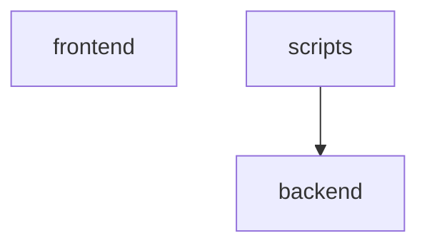

# Dependencies

Internal module dependency graph and external package reconciliation.

## Module graph

<!-- Collapsed to top-level packages; the full module list is in the Fan-in / Fan-out table below. -->

## Cycles

> Import cycles are legal but complicate load order — review the modules below.

- [TaskFiltersBar](modules/TaskFiltersBar.md) ⇄ [taskFilterDefaults](modules/taskFilterDefaults.md)
- [types_task](modules/types_task.md) ⇄ [types_triage](modules/types_triage.md)

> These groups reach each other only from inside functions or under `TYPE_CHECKING`, so nothing is imported while they load and their order is well defined. They are listed because they are cyclic on paper, not because they need fixing.

- [authority](modules/authority.md) ⇄ [commands](modules/commands.md) ⇄ [app_database](modules/app_database.md) ⇄ [models_agent](modules/models_agent.md) ⇄ [models_calendar](modules/models_calendar.md) ⇄ [models_external_link](modules/models_external_link.md) ⇄ [models_github](modules/models_github.md) ⇄ [models_identity](modules/models_identity.md) ⇄ [models_iteration](modules/models_iteration.md) ⇄ [models_label](modules/models_label.md) ⇄ [models_outbound_webhook](modules/models_outbound_webhook.md) ⇄ [models_plan_share](modules/models_plan_share.md) ⇄ [models_project](modules/models_project.md) ⇄ [recovery](modules/recovery.md) ⇄ [models_release](modules/models_release.md) ⇄ [models_request_source](modules/models_request_source.md) ⇄ [models_saved_view](modules/models_saved_view.md) ⇄ [models_system_settings](modules/models_system_settings.md) ⇄ [models_task](modules/models_task.md) ⇄ [models_task_brief](modules/models_task_brief.md) ⇄ [task_status_log](modules/task_status_log.md) ⇄ [team_member](modules/team_member.md) ⇄ [models_template](modules/models_template.md) ⇄ [models_triage](modules/models_triage.md) ⇄ [user_session](modules/user_session.md) ⇄ [observability](modules/observability.md) ⇄ [agent_readiness](modules/agent_readiness.md) ⇄ [calendar_service](modules/calendar_service.md) ⇄ [email_settings_service](modules/email_settings_service.md) ⇄ [external_link_service](modules/external_link_service.md) ⇄ [github_status_automation_service](modules/github_status_automation_service.md) ⇄ [identity_service](modules/identity_service.md) ⇄ [iteration_service](modules/iteration_service.md) ⇄ [label_service](modules/label_service.md) ⇄ [language_service](modules/language_service.md) ⇄ [notification_service](modules/notification_service.md) ⇄ [outbound_webhook_service](modules/outbound_webhook_service.md) ⇄ [saved_view_service](modules/saved_view_service.md) ⇄ [snapshot_service](modules/snapshot_service.md) ⇄ [system_settings_service](modules/system_settings_service.md) ⇄ [task_brief_service](modules/task_brief_service.md) ⇄ [task_context_revision_service](modules/task_context_revision_service.md) ⇄ [task_service](modules/task_service.md) ⇄ [team_service](modules/team_service.md) ⇄ [template_service](modules/template_service.md) ⇄ [upgrade_service](modules/upgrade_service.md)

## Fan-in / Fan-out

| Module | Fan-in | Fan-out |
|--------|--------|---------|
| [app_database](modules/app_database.md) | 72 | 5 |
| [Button](modules/Button.md) | 62 | 0 |
| [models_task](modules/models_task.md) | 61 | 9 |
| [time](modules/time.md) | 61 | 0 |
| [commands](modules/commands.md) | 60 | 8 |
| [types_task](modules/types_task.md) | 57 | 2 |
| [config](modules/config.md) | 51 | 1 |
| [QueryState](modules/QueryState.md) | 50 | 2 |
| [renderWithProviders](modules/renderWithProviders.md) | 48 | 1 |
| [models_agent](modules/models_agent.md) | 46 | 5 |
| [apiError](modules/apiError.md) | 37 | 0 |
| [task_service](modules/task_service.md) | 36 | 16 |
| [models_iteration](modules/models_iteration.md) | 34 | 6 |
| [team_member](modules/team_member.md) | 34 | 6 |
| [i18n](modules/i18n.md) | 33 | 1 |
| [formatDate](modules/formatDate.md) | 28 | 1 |
| [Input](modules/Input.md) | 27 | 0 |
| [api](modules/api.md) | 25 | 2 |
| [schemas_task](modules/schemas_task.md) | 24 | 5 |
| [models_project](modules/models_project.md) | 22 | 9 |
| [user_session](modules/user_session.md) | 22 | 6 |
| [agent_service](modules/agent_service.md) | 22 | 13 |
| [index](modules/index.md) | 22 | 0 |
| [authority](modules/authority.md) | 21 | 5 |
| [taskService](modules/taskService.md) | 20 | 3 |
| [types_agent](modules/types_agent.md) | 20 | 1 |
| [autonomy_canonical](modules/autonomy_canonical.md) | 19 | 0 |
| [schemas_agent](modules/schemas_agent.md) | 19 | 8 |
| [upgrade_service](modules/upgrade_service.md) | 19 | 12 |
| [toast](modules/toast.md) | 19 | 0 |
| [types_team](modules/types_team.md) | 19 | 0 |
| [models_calendar](modules/models_calendar.md) | 17 | 2 |
| [query_limits](modules/query_limits.md) | 17 | 0 |
| [Modal](modules/Modal.md) | 17 | 1 |
| [teamService](modules/teamService.md) | 17 | 2 |
| [types_iteration](modules/types_iteration.md) | 17 | 1 |
| [schemas_common](modules/schemas_common.md) | 16 | 0 |
| [schemas_team](modules/schemas_team.md) | 16 | 1 |
| [language_service](modules/language_service.md) | 16 | 2 |
| [iterationService](modules/iterationService.md) | 16 | 2 |
| [schemas_agent_planning](modules/schemas_agent_planning.md) | 15 | 0 |
| [agent_routing](modules/agent_routing.md) | 15 | 1 |
| [agent_routing_policy](modules/agent_routing_policy.md) | 15 | 0 |
| [app_main](modules/app_main.md) | 14 | 41 |
| [models_identity](modules/models_identity.md) | 14 | 2 |
| [outbound_webhook_service](modules/outbound_webhook_service.md) | 14 | 11 |
| [tone](modules/tone.md) | 14 | 1 |
| [schemas_triage](modules/schemas_triage.md) | 13 | 3 |
| [Checkbox](modules/Checkbox.md) | 13 | 0 |
| [projectService](modules/projectService.md) | 13 | 4 |
| [iterationStore](modules/iterationStore.md) | 13 | 0 |
| [database_migration_manifest](modules/database_migration_manifest.md) | 12 | 0 |
| [iteration_service](modules/iteration_service.md) | 12 | 8 |
| [snapshot_service](modules/snapshot_service.md) | 12 | 6 |
| [schemas_iteration](modules/schemas_iteration.md) | 11 | 2 |
| [agent_routing_service](modules/agent_routing_service.md) | 11 | 16 |
| [agent_work_service](modules/agent_work_service.md) | 11 | 20 |
| [useConfirmDialog](modules/useConfirmDialog.md) | 11 | 1 |
| [seedDisplay](modules/seedDisplay.md) | 11 | 5 |
| [adminAccess](modules/adminAccess.md) | 11 | 1 |
| [models_triage](modules/models_triage.md) | 10 | 7 |
| [runtime_telemetry](modules/runtime_telemetry.md) | 10 | 0 |
| [schemas_task_brief](modules/schemas_task_brief.md) | 10 | 0 |
| [security](modules/security.md) | 10 | 1 |
| [identity_service](modules/identity_service.md) | 10 | 7 |
| [url_policy](modules/url_policy.md) | 10 | 1 |
| [mcp_agent_tools](modules/mcp_agent_tools.md) | 9 | 48 |
| [routers_agent](modules/routers_agent.md) | 9 | 23 |
| [team_service](modules/team_service.md) | 9 | 8 |
| [ConfirmDialog](modules/ConfirmDialog.md) | 9 | 2 |
| [useAdminAccess](modules/useAdminAccess.md) | 9 | 2 |
| [types_gantt](modules/types_gantt.md) | 9 | 2 |
| [types_project](modules/types_project.md) | 9 | 3 |
| [savedView](modules/savedView.md) | 9 | 0 |
| [load_common](modules/load_common.md) | 9 | 1 |
| [postgresql___init__](modules/postgresql___init__.md) | 8 | 1 |
| [maintenance](modules/maintenance.md) | 8 | 2 |
| [models___init__](modules/models___init__.md) | 8 | 24 |
| [recovery](modules/recovery.md) | 8 | 3 |
| [schemas_project](modules/schemas_project.md) | 8 | 3 |
| [agent_routing_rollout](modules/agent_routing_rollout.md) | 8 | 1 |
| [session_service](modules/session_service.md) | 8 | 9 |
| [system_settings_service](modules/system_settings_service.md) | 8 | 5 |
| [triage_service](modules/triage_service.md) | 8 | 17 |
| [planningMasters_masters](modules/planningMasters_masters.md) | 8 | 2 |
| [types_label](modules/types_label.md) | 8 | 0 |
| [schedulingRules](modules/schedulingRules.md) | 8 | 0 |
| [protectedQueries](modules/protectedQueries.md) | 8 | 1 |
| [agent_contract](modules/agent_contract.md) | 7 | 0 |
| [database_config](modules/database_config.md) | 7 | 0 |
| [agent_team_setup](modules/agent_team_setup.md) | 7 | 1 |
| [calendar_service](modules/calendar_service.md) | 7 | 4 |
| [project_service](modules/project_service.md) | 7 | 12 |
| [task_brief_service](modules/task_brief_service.md) | 7 | 5 |
| [sql_semantics](modules/sql_semantics.md) | 7 | 0 |
| [CollapsibleSection](modules/CollapsibleSection.md) | 7 | 0 |
| [TaskFiltersBar](modules/TaskFiltersBar.md) | 7 | 9 |
| [taskEditorContract](modules/taskEditorContract.md) | 7 | 2 |
| [planningTaskIssues](modules/planningTaskIssues.md) | 7 | 2 |
| [agentService](modules/agentService.md) | 7 | 2 |
| [types_template](modules/types_template.md) | 7 | 0 |
| [evidence](modules/evidence.md) | 6 | 2 |
| [signing](modules/signing.md) | 6 | 1 |
| [catalog](modules/catalog.md) | 6 | 2 |
| [source](modules/source.md) | 6 | 4 |
| [mcp_server](modules/mcp_server.md) | 6 | 14 |
| [models_external_link](modules/models_external_link.md) | 6 | 2 |
| [models_outbound_webhook](modules/models_outbound_webhook.md) | 6 | 2 |
| [models_request_source](modules/models_request_source.md) | 6 | 5 |
| [models_saved_view](modules/models_saved_view.md) | 6 | 3 |
| [models_task_brief](modules/models_task_brief.md) | 6 | 2 |
| [schemas_system_settings](modules/schemas_system_settings.md) | 6 | 0 |
| [task_domain_service](modules/task_domain_service.md) | 6 | 12 |
| [services_work_metrics](modules/services_work_metrics.md) | 6 | 8 |
| [usePlanningReadiness](modules/usePlanningReadiness.md) | 6 | 12 |
| [savedViewService](modules/savedViewService.md) | 6 | 2 |
| [systemSettings](modules/systemSettings.md) | 6 | 0 |
| [charter](modules/charter.md) | 5 | 2 |
| [database_migration_cutover](modules/database_migration_cutover.md) | 5 | 2 |
| [task_status_log](modules/task_status_log.md) | 5 | 3 |
| [routers_agent_planning](modules/routers_agent_planning.md) | 5 | 16 |
| [agent_skill_bundle](modules/agent_skill_bundle.md) | 5 | 0 |
| [schemas_request_source](modules/schemas_request_source.md) | 5 | 1 |
| [schemas_saved_view](modules/schemas_saved_view.md) | 5 | 0 |
| [schemas_task_domain](modules/schemas_task_domain.md) | 5 | 0 |
| [schemas_work_metrics](modules/schemas_work_metrics.md) | 5 | 0 |
| [agent_model_catalog_service](modules/agent_model_catalog_service.md) | 5 | 6 |
| [agent_planning_service](modules/agent_planning_service.md) | 5 | 19 |
| [agent_profile_catalog_service](modules/agent_profile_catalog_service.md) | 5 | 3 |
| [agent_team_setup_service](modules/agent_team_setup_service.md) | 5 | 12 |
| [assignee_recommendation_service](modules/assignee_recommendation_service.md) | 5 | 5 |
| [saved_view_service](modules/saved_view_service.md) | 5 | 4 |
| [scheduler_service](modules/scheduler_service.md) | 5 | 9 |
| [task_context_revision_service](modules/task_context_revision_service.md) | 5 | 5 |
| [support___init__](modules/support___init__.md) | 5 | 4 |
| [test_delivery_scenarios](modules/test_delivery_scenarios.md) | 5 | 9 |
| [PlanReturnBar](modules/PlanReturnBar.md) | 5 | 1 |
| [SlideOverDrawer](modules/SlideOverDrawer.md) | 5 | 1 |
| [dateLocale](modules/dateLocale.md) | 5 | 1 |
| [workspaces](modules/workspaces.md) | 5 | 0 |
| [labelService](modules/labelService.md) | 5 | 2 |
| [triageService](modules/triageService.md) | 5 | 3 |
| [singleKeyShortcutPreference](modules/singleKeyShortcutPreference.md) | 5 | 0 |
| [teamMemberLabels](modules/teamMemberLabels.md) | 5 | 2 |
| [result](modules/result.md) | 5 | 1 |
| [build_identity](modules/build_identity.md) | 4 | 1 |
| [transfer](modules/transfer.md) | 4 | 8 |
| [database_runtime](modules/database_runtime.md) | 4 | 1 |
| [models_autonomy](modules/models_autonomy.md) | 4 | 2 |
| [models_label](modules/models_label.md) | 4 | 2 |
| [models_plan_share](modules/models_plan_share.md) | 4 | 4 |
| [models_system_settings](modules/models_system_settings.md) | 4 | 2 |
| [schemas_external_link](modules/schemas_external_link.md) | 4 | 1 |
| [schemas_gantt](modules/schemas_gantt.md) | 4 | 3 |
| [schemas_github](modules/schemas_github.md) | 4 | 0 |
| [schemas_label](modules/schemas_label.md) | 4 | 0 |
| [planning_inputs](modules/planning_inputs.md) | 4 | 0 |
| [schemas_release](modules/schemas_release.md) | 4 | 1 |
| [schemas_template](modules/schemas_template.md) | 4 | 1 |
| [agent_routing_observability](modules/agent_routing_observability.md) | 4 | 5 |
| [agent_skill_bundle_service](modules/agent_skill_bundle_service.md) | 4 | 1 |
| [email_settings_service](modules/email_settings_service.md) | 4 | 5 |
| [external_link_service](modules/external_link_service.md) | 4 | 6 |
| [label_service](modules/label_service.md) | 4 | 6 |
| [request_source_service](modules/request_source_service.md) | 4 | 9 |
| [support_database](modules/support_database.md) | 4 | 0 |
| [dialogLayer](modules/dialogLayer.md) | 4 | 0 |
| [Breadcrumbs](modules/Breadcrumbs.md) | 4 | 0 |
| [PlanningWorkbenchFrame](modules/PlanningWorkbenchFrame.md) | 4 | 2 |
| [projectStatusStyles](modules/projectStatusStyles.md) | 4 | 2 |
| [RequestSourceLinksPanel](modules/RequestSourceLinksPanel.md) | 4 | 6 |
| [TaskForm](modules/TaskForm.md) | 4 | 29 |
| [WorkMetricsLine](modules/WorkMetricsLine.md) | 4 | 1 |
| [useDraftDismissal](modules/useDraftDismissal.md) | 4 | 0 |
| [identityContext](modules/identityContext.md) | 4 | 1 |
| [planningReturn](modules/planningReturn.md) | 4 | 0 |
| [usePlanningNavigationSummary](modules/usePlanningNavigationSummary.md) | 4 | 4 |
| [useAgentAccess](modules/useAgentAccess.md) | 4 | 1 |
| [useSingleKeyShortcutPreference](modules/useSingleKeyShortcutPreference.md) | 4 | 1 |
| [routeModules](modules/routeModules.md) | 4 | 0 |
| [templateService](modules/templateService.md) | 4 | 2 |
| [types_github](modules/types_github.md) | 4 | 1 |
| [types_release](modules/types_release.md) | 4 | 2 |
| [types_triage](modules/types_triage.md) | 4 | 1 |
| [workMetrics](modules/workMetrics.md) | 4 | 0 |
| [agentAccess](modules/agentAccess.md) | 4 | 0 |
| [modelRouting](modules/modelRouting.md) | 4 | 1 |
| [taskFilterDefaults](modules/taskFilterDefaults.md) | 4 | 1 |
| [loader](modules/loader.md) | 3 | 1 |
| [status](modules/status.md) | 3 | 3 |
| [models_release](modules/models_release.md) | 3 | 5 |
| [models_template](modules/models_template.md) | 3 | 2 |
| [observability](modules/observability.md) | 3 | 8 |
| [agent_skill_bundles](modules/agent_skill_bundles.md) | 3 | 5 |
| [export](modules/export.md) | 3 | 13 |
| [routers_gantt](modules/routers_gantt.md) | 3 | 12 |
| [tasks](modules/tasks.md) | 3 | 17 |
| [schemas_calendar](modules/schemas_calendar.md) | 3 | 1 |
| [schemas_intake](modules/schemas_intake.md) | 3 | 0 |
| [schemas_llm](modules/schemas_llm.md) | 3 | 1 |
| [schemas_outbound_webhook](modules/schemas_outbound_webhook.md) | 3 | 1 |
| [backlog_snapshot_service](modules/backlog_snapshot_service.md) | 3 | 8 |
| [github_status_automation_service](modules/github_status_automation_service.md) | 3 | 7 |
| [llm_service](modules/llm_service.md) | 3 | 6 |
| [task_detail_service](modules/task_detail_service.md) | 3 | 4 |
| [template_service](modules/template_service.md) | 3 | 3 |
| [transactions](modules/transactions.md) | 3 | 0 |
| [IterationForm](modules/IterationForm.md) | 3 | 9 |
| [LabelSelector](modules/LabelSelector.md) | 3 | 5 |
| [AppSidebar](modules/AppSidebar.md) | 3 | 5 |
| [CommandMenu](modules/CommandMenu.md) | 3 | 5 |
| [commandMenuEvents](modules/commandMenuEvents.md) | 3 | 0 |
| [AdminAccessGate](modules/AdminAccessGate.md) | 3 | 2 |
| [AdminAccessPanel](modules/AdminAccessPanel.md) | 3 | 4 |
| [GuardedTaskModal](modules/GuardedTaskModal.md) | 3 | 4 |
| [TaskAgentReadinessBadge](modules/TaskAgentReadinessBadge.md) | 3 | 2 |
| [TaskBriefEditor](modules/TaskBriefEditor.md) | 3 | 3 |
| [TaskEditorDrawer](modules/TaskEditorDrawer.md) | 3 | 8 |
| [TaskList](modules/TaskList.md) | 3 | 18 |
| [MasterProgress](modules/MasterProgress.md) | 3 | 0 |
| [agentTeamSetup_masters](modules/agentTeamSetup_masters.md) | 3 | 1 |
| [overviewTaskThread](modules/overviewTaskThread.md) | 3 | 0 |
| [resources.en](modules/resources.en.md) | 3 | 0 |
| [ganttService](modules/ganttService.md) | 3 | 3 |
| [releaseService](modules/releaseService.md) | 3 | 2 |
| [systemSettingsService](modules/systemSettingsService.md) | 3 | 2 |
| [accessibilityInvariants](modules/accessibilityInvariants.md) | 3 | 0 |
| [emailSettings](modules/emailSettings.md) | 3 | 1 |
| [outboundWebhook](modules/outboundWebhook.md) | 3 | 0 |
| [focusLifecycle](modules/focusLifecycle.md) | 3 | 0 |
| [safeUrl](modules/safeUrl.md) | 3 | 0 |
| [taskFilters](modules/taskFilters.md) | 3 | 4 |
| [templateDefaults](modules/templateDefaults.md) | 3 | 0 |
| [visibleWork](modules/visibleWork.md) | 3 | 4 |
| [leases](modules/leases.md) | 2 | 4 |
| [preflight](modules/preflight.md) | 2 | 5 |
| [autonomy_server_acceptance](modules/autonomy_server_acceptance.md) | 2 | 3 |
| [database_migration_canonical](modules/database_migration_canonical.md) | 2 | 2 |
| [database_migration_closeout](modules/database_migration_closeout.md) | 2 | 2 |
| [http_authority](modules/http_authority.md) | 2 | 10 |
| [models_database_migration](modules/models_database_migration.md) | 2 | 2 |
| [models_github](modules/models_github.md) | 2 | 2 |
| [calendars](modules/calendars.md) | 2 | 4 |
| [routers_email_settings](modules/routers_email_settings.md) | 2 | 5 |
| [routers_github](modules/routers_github.md) | 2 | 7 |
| [routers_intake](modules/routers_intake.md) | 2 | 6 |
| [iterations](modules/iterations.md) | 2 | 5 |
| [labels](modules/labels.md) | 2 | 4 |
| [routers_llm](modules/routers_llm.md) | 2 | 7 |
| [outbound_webhooks](modules/outbound_webhooks.md) | 2 | 6 |
| [projects](modules/projects.md) | 2 | 14 |
| [request_sources](modules/request_sources.md) | 2 | 4 |
| [saved_views](modules/saved_views.md) | 2 | 7 |
| [routers_scheduling_rules](modules/routers_scheduling_rules.md) | 2 | 4 |
| [routers_session](modules/routers_session.md) | 2 | 5 |
| [snapshots](modules/snapshots.md) | 2 | 12 |
| [routers_system_settings](modules/routers_system_settings.md) | 2 | 4 |
| [routers_task_domain](modules/routers_task_domain.md) | 2 | 15 |
| [routers_team](modules/routers_team.md) | 2 | 4 |
| [templates](modules/templates.md) | 2 | 4 |
| [routers_triage](modules/routers_triage.md) | 2 | 9 |
| [schemas_autonomy](modules/schemas_autonomy.md) | 2 | 0 |
| [schemas_plan_share](modules/schemas_plan_share.md) | 2 | 0 |
| [task_detail](modules/task_detail.md) | 2 | 1 |
| [agent_readiness](modules/agent_readiness.md) | 2 | 5 |
| [github_status_service](modules/github_status_service.md) | 2 | 6 |
| [hierarchy_repair_service](modules/hierarchy_repair_service.md) | 2 | 7 |
| [notification_service](modules/notification_service.md) | 2 | 3 |
| [plan_share_service](modules/plan_share_service.md) | 2 | 6 |
| [release_service](modules/release_service.md) | 2 | 10 |
| [scheduling_rules_service](modules/scheduling_rules_service.md) | 2 | 0 |
| [delivery](modules/delivery.md) | 2 | 8 |
| [UserSessionBadge](modules/UserSessionBadge.md) | 2 | 3 |
| [RoutingCandidateComparison](modules/RoutingCandidateComparison.md) | 2 | 2 |
| [TaskRoutingPanel](modules/TaskRoutingPanel.md) | 2 | 14 |
| [FullscreenWorkspace](modules/FullscreenWorkspace.md) | 2 | 1 |
| [ToastProvider](modules/ToastProvider.md) | 2 | 2 |
| [WorkFreshness](modules/WorkFreshness.md) | 2 | 1 |
| [GanttChart](modules/GanttChart.md) | 2 | 11 |
| [TaskEditModal](modules/TaskEditModal.md) | 2 | 9 |
| [IterationSelector](modules/IterationSelector.md) | 2 | 4 |
| [AppShell](modules/AppShell.md) | 2 | 6 |
| [AppTopNav](modules/AppTopNav.md) | 2 | 9 |
| [ContextHelp](modules/ContextHelp.md) | 2 | 8 |
| [DocumentMetadata](modules/DocumentMetadata.md) | 2 | 1 |
| [SidebarIterationCard](modules/SidebarIterationCard.md) | 2 | 1 |
| [PlanningWorkflowGuide](modules/PlanningWorkflowGuide.md) | 2 | 2 |
| [ProjectForm](modules/ProjectForm.md) | 2 | 13 |
| [ReleaseForm](modules/ReleaseForm.md) | 2 | 9 |
| [AgentAccessPanel](modules/AgentAccessPanel.md) | 2 | 7 |
| [AgentModelAdministration](modules/AgentModelAdministration.md) | 2 | 13 |
| [EffortModifierCard](modules/EffortModifierCard.md) | 2 | 4 |
| [EmailSettingsPanel](modules/EmailSettingsPanel.md) | 2 | 11 |
| [GitHubSettingsPanel](modules/GitHubSettingsPanel.md) | 2 | 11 |
| [OutboundWebhooksPanel](modules/OutboundWebhooksPanel.md) | 2 | 12 |
| [RuntimeConfigSettings](modules/RuntimeConfigSettings.md) | 2 | 10 |
| [SchedulingRulesSettings](modules/SchedulingRulesSettings.md) | 2 | 12 |
| [TemplateLabelSettings](modules/TemplateLabelSettings.md) | 2 | 11 |
| [DraftDismissalDialog](modules/DraftDismissalDialog.md) | 2 | 2 |
| [KanbanBoard](modules/KanbanBoard.md) | 2 | 14 |
| [KanbanCard](modules/KanbanCard.md) | 2 | 2 |
| [TaskDependencySelector](modules/TaskDependencySelector.md) | 2 | 5 |
| [TaskTimelinePanel](modules/TaskTimelinePanel.md) | 2 | 8 |
| [TaskWorkPanel](modules/TaskWorkPanel.md) | 2 | 7 |
| [AssigneeRecommendationsPanel](modules/AssigneeRecommendationsPanel.md) | 2 | 4 |
| [ImportTeamModal](modules/ImportTeamModal.md) | 2 | 4 |
| [TeamForm](modules/TeamForm.md) | 2 | 7 |
| [TeamProfileManager](modules/TeamProfileManager.md) | 2 | 7 |
| [agentTeamSetup_manifest](modules/agentTeamSetup_manifest.md) | 2 | 1 |
| [statusScopes](modules/statusScopes.md) | 2 | 1 |
| [IdentityProvider](modules/IdentityProvider.md) | 2 | 9 |
| [identityService](modules/identityService.md) | 2 | 1 |
| [attentionRanking](modules/attentionRanking.md) | 2 | 1 |
| [planningNavigationInvalidation](modules/planningNavigationInvalidation.md) | 2 | 1 |
| [workQueryFreshness](modules/workQueryFreshness.md) | 2 | 0 |
| [resources.ru](modules/resources.ru.md) | 2 | 0 |
| [schedulingDisplay](modules/schedulingDisplay.md) | 2 | 2 |
| [exportService](modules/exportService.md) | 2 | 1 |
| [planShareService](modules/planShareService.md) | 2 | 1 |
| [sessionService](modules/sessionService.md) | 2 | 1 |
| [themeStore](modules/themeStore.md) | 2 | 0 |
| [modelAwareRouting](modules/modelAwareRouting.md) | 2 | 1 |
| [types_calendar](modules/types_calendar.md) | 2 | 0 |
| [requestSource](modules/requestSource.md) | 2 | 0 |
| [copyText](modules/copyText.md) | 2 | 0 |
| [selectWorkNowTasks](modules/selectWorkNowTasks.md) | 2 | 1 |
| [topology](modules/topology.md) | 1 | 1 |
| [execution_mode](modules/execution_mode.md) | 1 | 0 |
| [handoff](modules/handoff.md) | 1 | 5 |
| [orchestration](modules/orchestration.md) | 1 | 2 |
| [providers](modules/providers.md) | 1 | 2 |
| [cli_closeout](modules/cli_closeout.md) | 1 | 3 |
| [cli_cutover](modules/cli_cutover.md) | 1 | 2 |
| [cli_server_acceptance](modules/cli_server_acceptance.md) | 1 | 2 |
| [upgrade](modules/upgrade.md) | 1 | 2 |
| [worker](modules/worker.md) | 1 | 3 |
| [agent_catalog](modules/agent_catalog.md) | 1 | 11 |
| [routers_identity](modules/routers_identity.md) | 1 | 13 |
| [plan_shares](modules/plan_shares.md) | 1 | 6 |
| [schemas_email_settings](modules/schemas_email_settings.md) | 1 | 1 |
| [schemas_scheduling_rules](modules/schemas_scheduling_rules.md) | 1 | 0 |
| [schemas_session](modules/schemas_session.md) | 1 | 0 |
| [snapshot](modules/snapshot.md) | 1 | 0 |
| [autonomy_work_package_service](modules/autonomy_work_package_service.md) | 1 | 7 |
| [github_webhook_service](modules/github_webhook_service.md) | 1 | 14 |
| [task_bulk_operation_service](modules/task_bulk_operation_service.md) | 1 | 8 |
| [task_status_service](modules/task_status_service.md) | 1 | 9 |
| [web_intake_service](modules/web_intake_service.md) | 1 | 4 |
| [text_similarity](modules/text_similarity.md) | 1 | 0 |
| [test_cutover_evidence](modules/test_cutover_evidence.md) | 1 | 2 |
| [factories](modules/factories.md) | 1 | 0 |
| [faults](modules/faults.md) | 1 | 0 |
| [schema](modules/schema.md) | 1 | 0 |
| [test_agent_routing_wave6_qualification](modules/test_agent_routing_wave6_qualification.md) | 1 | 14 |
| [test_agent_team_setup](modules/test_agent_team_setup.md) | 1 | 14 |
| [test_authority_migrations](modules/test_authority_migrations.md) | 1 | 3 |
| [test_managed_authority](modules/test_managed_authority.md) | 1 | 12 |
| [test_task_domain](modules/test_task_domain.md) | 1 | 25 |
| [App](modules/App.md) | 1 | 3 |
| [TaskStatusFlow](modules/TaskStatusFlow.md) | 1 | 3 |
| [InteractiveCalendar](modules/InteractiveCalendar.md) | 1 | 1 |
| [SavedViewDashboardCards](modules/SavedViewDashboardCards.md) | 1 | 4 |
| [ScheduleExplanationDetails](modules/ScheduleExplanationDetails.md) | 1 | 4 |
| [IterationList](modules/IterationList.md) | 1 | 9 |
| [RouteErrorBoundary](modules/RouteErrorBoundary.md) | 1 | 1 |
| [NotificationsPanel](modules/NotificationsPanel.md) | 1 | 3 |
| [OverviewTaskReturnBar](modules/OverviewTaskReturnBar.md) | 1 | 1 |
| [InitiativeForm](modules/InitiativeForm.md) | 1 | 9 |
| [ProjectIterationsSection](modules/ProjectIterationsSection.md) | 1 | 9 |
| [ProjectTaskTree](modules/ProjectTaskTree.md) | 1 | 5 |
| [ConstraintsPanel](modules/ConstraintsPanel.md) | 1 | 3 |
| [InterfaceLanguageSettings](modules/InterfaceLanguageSettings.md) | 1 | 7 |
| [SchedulingPassCard](modules/SchedulingPassCard.md) | 1 | 4 |
| [SettingsGoalHelpContent](modules/SettingsGoalHelpContent.md) | 1 | 0 |
| [SystemHealthPanel](modules/SystemHealthPanel.md) | 1 | 2 |
| [ImportTasksModal](modules/ImportTasksModal.md) | 1 | 5 |
| [KanbanColumn](modules/KanbanColumn.md) | 1 | 4 |
| [SavedViewsControl](modules/SavedViewsControl.md) | 1 | 13 |
| [StatusChangeControl](modules/StatusChangeControl.md) | 1 | 7 |
| [TaskBulkOperationsPanel](modules/TaskBulkOperationsPanel.md) | 1 | 9 |
| [TaskContextSummary](modules/TaskContextSummary.md) | 1 | 4 |
| [TaskTextEditorModal](modules/TaskTextEditorModal.md) | 1 | 4 |
| [TaskWorkflowGuide](modules/TaskWorkflowGuide.md) | 1 | 2 |
| [taskDraftStorage](modules/taskDraftStorage.md) | 1 | 1 |
| [TeamList](modules/TeamList.md) | 1 | 8 |
| [VacationManager](modules/VacationManager.md) | 1 | 8 |
| [OverflowMenu](modules/OverflowMenu.md) | 1 | 0 |
| [useAgentTeamReadiness](modules/useAgentTeamReadiness.md) | 1 | 2 |
| [SystemLanguageProvider](modules/SystemLanguageProvider.md) | 1 | 4 |
| [helpContexts](modules/helpContexts.md) | 1 | 2 |
| [AgentPipelinePage](modules/AgentPipelinePage.md) | 1 | 13 |
| [AgentTeamSetupMasterPage](modules/AgentTeamSetupMasterPage.md) | 1 | 11 |
| [GanttPage](modules/GanttPage.md) | 1 | 21 |
| [OverviewPage](modules/OverviewPage.md) | 1 | 17 |
| [PlanMasterPage](modules/PlanMasterPage.md) | 1 | 13 |
| [PlanPage](modules/PlanPage.md) | 1 | 5 |
| [PlanSharePage](modules/PlanSharePage.md) | 1 | 7 |
| [ProjectsPage](modules/ProjectsPage.md) | 1 | 16 |
| [RoadmapPage](modules/RoadmapPage.md) | 1 | 11 |
| [SettingsPage](modules/SettingsPage.md) | 1 | 17 |
| [TasksPage](modules/TasksPage.md) | 1 | 23 |
| [calendarService](modules/calendarService.md) | 1 | 2 |
| [emailSettingsService](modules/emailSettingsService.md) | 1 | 2 |
| [githubService](modules/githubService.md) | 1 | 2 |
| [healthService](modules/healthService.md) | 1 | 0 |
| [outboundWebhookService](modules/outboundWebhookService.md) | 1 | 2 |
| [requestSourceService](modules/requestSourceService.md) | 1 | 2 |
| [schedulingRulesService](modules/schedulingRulesService.md) | 1 | 2 |
| [snapshotService](modules/snapshotService.md) | 1 | 1 |
| [autonomy___init__](modules/autonomy___init__.md) | 0 | 1 |
| [contracts___init__](modules/contracts___init__.md) | 0 | 1 |
| [agent_preflight](modules/agent_preflight.md) | 0 | 3 |
| [cli_database_migration](modules/cli_database_migration.md) | 0 | 4 |
| [database_migration___init__](modules/database_migration___init__.md) | 0 | 2 |
| [migrations_env](modules/migrations_env.md) | 0 | 4 |
| [20260506_0000_legacy_core_baseline](modules/20260506_0000_legacy_core_baseline.md) | 0 | 0 |
| [20260507_0001_agentic_tracing](modules/20260507_0001_agentic_tracing.md) | 0 | 0 |
| [20260507_0002_create_projects](modules/20260507_0002_create_projects.md) | 0 | 0 |
| [20260507_0003_link_tasks_projects](modules/20260507_0003_link_tasks_projects.md) | 0 | 0 |
| [20260508_0004_create_triage_items](modules/20260508_0004_create_triage_items.md) | 0 | 0 |
| [20260508_0005_create_work_templates](modules/20260508_0005_create_work_templates.md) | 0 | 0 |
| [20260508_0006_add_work_template_seed_key](modules/20260508_0006_add_work_template_seed_key.md) | 0 | 0 |
| [20260509_0007_create_label_groups](modules/20260509_0007_create_label_groups.md) | 0 | 0 |
| [20260509_0008_create_saved_views](modules/20260509_0008_create_saved_views.md) | 0 | 0 |
| [20260509_0009_add_saved_view_seed_key](modules/20260509_0009_add_saved_view_seed_key.md) | 0 | 0 |
| [20260509_0010_create_project_updates](modules/20260509_0010_create_project_updates.md) | 0 | 0 |
| [20260509_0011_create_project_milestones](modules/20260509_0011_create_project_milestones.md) | 0 | 0 |
| [20260509_0012_link_tasks_milestones](modules/20260509_0012_link_tasks_milestones.md) | 0 | 0 |
| [20260509_0013_create_initiatives](modules/20260509_0013_create_initiatives.md) | 0 | 0 |
| [20260509_0014_create_external_links](modules/20260509_0014_create_external_links.md) | 0 | 0 |
| [20260509_0015_create_github_status_automation_rules](modules/20260509_0015_create_github_status_automation_rules.md) | 0 | 0 |
| [20260509_0016_create_releases](modules/20260509_0016_create_releases.md) | 0 | 0 |
| [20260509_0017_create_request_sources](modules/20260509_0017_create_request_sources.md) | 0 | 0 |
| [20260509_0018_create_triage_classification_suggestions](modules/20260509_0018_create_triage_classification_suggestions.md) | 0 | 0 |
| [20260509_0019_create_outbound_webhooks](modules/20260509_0019_create_outbound_webhooks.md) | 0 | 0 |
| [20260509_0020_add_triage_metadata_json](modules/20260509_0020_add_triage_metadata_json.md) | 0 | 0 |
| [20260510_0021_create_team_member_profiles](modules/20260510_0021_create_team_member_profiles.md) | 0 | 0 |
| [20260510_0022_create_system_settings](modules/20260510_0022_create_system_settings.md) | 0 | 0 |
| [20260510_0023_create_user_sessions](modules/20260510_0023_create_user_sessions.md) | 0 | 0 |
| [20260515_0024_move_portfolio_ownership_to_profiles](modules/20260515_0024_move_portfolio_ownership_to_profiles.md) | 0 | 0 |
| [20260516_0025_add_project_scope_to_iterations](modules/20260516_0025_add_project_scope_to_iterations.md) | 0 | 0 |
| [20260709_0026_add_opaque_browser_sessions](modules/20260709_0026_add_opaque_browser_sessions.md) | 0 | 0 |
| [20260709_0027_add_durable_outbound_delivery_queue](modules/20260709_0027_add_durable_outbound_delivery_queue.md) | 0 | 0 |
| [20260711_0028_add_agent_skill_control_plane](modules/20260711_0028_add_agent_skill_control_plane.md) | 0 | 0 |
| [20260718_0029_add_agent_model_catalog](modules/20260718_0029_add_agent_model_catalog.md) | 0 | 0 |
| [20260718_0030_add_task_routing_assessments](modules/20260718_0030_add_task_routing_assessments.md) | 0 | 0 |
| [20260718_0031_align_postgresql_types](modules/20260718_0031_align_postgresql_types.md) | 0 | 0 |
| [20260718_0032_add_database_migration_gate](modules/20260718_0032_add_database_migration_gate.md) | 0 | 1 |
| [20260719_0033_add_autonomy_control_plane](modules/20260719_0033_add_autonomy_control_plane.md) | 0 | 1 |
| [20260727_0034_add_agent_run_model_trust](modules/20260727_0034_add_agent_run_model_trust.md) | 0 | 0 |
| [20260728_0035_add_agent_team_setup](modules/20260728_0035_add_agent_team_setup.md) | 0 | 1 |
| [20260802_0036_add_plan_shares](modules/20260802_0036_add_plan_shares.md) | 0 | 1 |
| [20260915_0037_add_authority_and_recovery](modules/20260915_0037_add_authority_and_recovery.md) | 0 | 1 |
| [20260915_0038_canonical_task_domain](modules/20260915_0038_canonical_task_domain.md) | 0 | 1 |
| [20260916_0039_task_deletion_fences](modules/20260916_0039_task_deletion_fences.md) | 0 | 0 |
| [routers___init__](modules/routers___init__.md) | 0 | 23 |
| [schemas___init__](modules/schemas___init__.md) | 0 | 19 |
| [task_import_service](modules/task_import_service.md) | 0 | 7 |
| [task_recovery_service](modules/task_recovery_service.md) | 0 | 5 |
| [exceptions](modules/exceptions.md) | 0 | 1 |
| [import_parser](modules/import_parser.md) | 0 | 1 |
| [test_autonomy_foundation](modules/test_autonomy_foundation.md) | 0 | 12 |
| [test_autonomy_migrations](modules/test_autonomy_migrations.md) | 0 | 3 |
| [test_server_acceptance](modules/test_server_acceptance.md) | 0 | 6 |
| [test_work_package_service](modules/test_work_package_service.md) | 0 | 7 |
| [conftest](modules/conftest.md) | 0 | 10 |
| [test_database_configuration](modules/test_database_configuration.md) | 0 | 3 |
| [test_deployment_topology](modules/test_deployment_topology.md) | 0 | 0 |
| [test_observability](modules/test_observability.md) | 0 | 3 |
| [test_postgresql_concurrency](modules/test_postgresql_concurrency.md) | 0 | 15 |
| [test_postgresql_documentation](modules/test_postgresql_documentation.md) | 0 | 0 |
| [test_query_boundaries](modules/test_query_boundaries.md) | 0 | 8 |
| [test_runtime_policy](modules/test_runtime_policy.md) | 0 | 4 |
| [test_schema_behavior](modules/test_schema_behavior.md) | 0 | 6 |
| [test_postgresql_closeout](modules/test_postgresql_closeout.md) | 0 | 3 |
| [test_postgresql_transfer](modules/test_postgresql_transfer.md) | 0 | 11 |
| [test_source_preflight](modules/test_source_preflight.md) | 0 | 3 |
| [test_transfer_catalog](modules/test_transfer_catalog.md) | 0 | 1 |
| [postgresql_migrations_env](modules/postgresql_migrations_env.md) | 0 | 0 |
| [0001_wave0_probe](modules/0001_wave0_probe.md) | 0 | 0 |
| [test_postgresql_migrations](modules/test_postgresql_migrations.md) | 0 | 7 |
| [test_sqlite_migrations](modules/test_sqlite_migrations.md) | 0 | 5 |
| [test_load_seed_postgresql](modules/test_load_seed_postgresql.md) | 0 | 1 |
| [test_load_tooling](modules/test_load_tooling.md) | 0 | 1 |
| [test_agent_model_catalog_api](modules/test_agent_model_catalog_api.md) | 0 | 18 |
| [test_agent_routing_contract](modules/test_agent_routing_contract.md) | 0 | 7 |
| [test_agent_routing_data](modules/test_agent_routing_data.md) | 0 | 8 |
| [test_agent_routing_harness](modules/test_agent_routing_harness.md) | 0 | 5 |
| [test_agent_routing_history_surfaces](modules/test_agent_routing_history_surfaces.md) | 0 | 6 |
| [test_agent_routing_migrations](modules/test_agent_routing_migrations.md) | 0 | 3 |
| [test_agent_routing_observability](modules/test_agent_routing_observability.md) | 0 | 6 |
| [test_agent_routing_rollout](modules/test_agent_routing_rollout.md) | 0 | 15 |
| [test_agent_routing_service](modules/test_agent_routing_service.md) | 0 | 10 |
| [test_agent_routing_wave3_contract](modules/test_agent_routing_wave3_contract.md) | 0 | 2 |
| [test_agent_run_trust_compatibility](modules/test_agent_run_trust_compatibility.md) | 0 | 4 |
| [test_agent_skill_routing_guidance](modules/test_agent_skill_routing_guidance.md) | 0 | 7 |
| [test_agent_team_setup_cli](modules/test_agent_team_setup_cli.md) | 0 | 0 |
| [test_agent_team_setup_qualification](modules/test_agent_team_setup_qualification.md) | 0 | 12 |
| [test_agent_work_routing_lineage](modules/test_agent_work_routing_lineage.md) | 0 | 6 |
| [test_capacity_contract](modules/test_capacity_contract.md) | 0 | 1 |
| [test_client_contract](modules/test_client_contract.md) | 0 | 5 |
| [test_database_harness](modules/test_database_harness.md) | 0 | 5 |
| [test_identity_lifecycle](modules/test_identity_lifecycle.md) | 0 | 14 |
| [test_plan_shares](modules/test_plan_shares.md) | 0 | 6 |
| [test_postgresql_lifecycle](modules/test_postgresql_lifecycle.md) | 0 | 0 |
| [test_process_roles](modules/test_process_roles.md) | 0 | 3 |
| [test_runtime_boundaries](modules/test_runtime_boundaries.md) | 0 | 9 |
| [test_saved_view_service](modules/test_saved_view_service.md) | 0 | 3 |
| [test_task_domain_integrity](modules/test_task_domain_integrity.md) | 0 | 20 |
| [test_task_domain_migrations](modules/test_task_domain_migrations.md) | 0 | 2 |
| [test_work_correctness](modules/test_work_correctness.md) | 0 | 23 |
| [eslint.config](modules/eslint.config.md) | 0 | 0 |
| [postcss.config](modules/postcss.config.md) | 0 | 0 |
| [UserSessionBadge.test](modules/UserSessionBadge.test.md) | 0 | 2 |
| [RoutingCandidateComparison.test](modules/RoutingCandidateComparison.test.md) | 0 | 4 |
| [TaskRoutingPanel.test](modules/TaskRoutingPanel.test.md) | 0 | 6 |
| [Button.test](modules/Button.test.md) | 0 | 1 |
| [Input.test](modules/Input.test.md) | 0 | 1 |
| [GanttChart.test](modules/GanttChart.test.md) | 0 | 5 |
| [IterationForm.test](modules/IterationForm.test.md) | 0 | 3 |
| [AppShell.test](modules/AppShell.test.md) | 0 | 2 |
| [AppSidebar.test](modules/AppSidebar.test.md) | 0 | 3 |
| [AppTopNav.test](modules/AppTopNav.test.md) | 0 | 2 |
| [CommandMenu.test](modules/CommandMenu.test.md) | 0 | 3 |
| [ContextHelp.test](modules/ContextHelp.test.md) | 0 | 4 |
| [SidebarIterationCard.test](modules/SidebarIterationCard.test.md) | 0 | 2 |
| [PlanReturnBar.test](modules/PlanReturnBar.test.md) | 0 | 3 |
| [PlanningWorkbenchFrame.test](modules/PlanningWorkbenchFrame.test.md) | 0 | 3 |
| [PlanningWorkflowGuide.test](modules/PlanningWorkflowGuide.test.md) | 0 | 2 |
| [projectStatusStyles.test](modules/projectStatusStyles.test.md) | 0 | 1 |
| [RequestSourceLinksPanel.test](modules/RequestSourceLinksPanel.test.md) | 0 | 2 |
| [AdminAccessPanel.test](modules/AdminAccessPanel.test.md) | 0 | 3 |
| [AgentAccessPanel.test](modules/AgentAccessPanel.test.md) | 0 | 3 |
| [AgentModelAdministration.test](modules/AgentModelAdministration.test.md) | 0 | 3 |
| [EffortModifierCard.test](modules/EffortModifierCard.test.md) | 0 | 3 |
| [EmailSettingsPanel.test](modules/EmailSettingsPanel.test.md) | 0 | 3 |
| [GitHubSettingsPanel.test](modules/GitHubSettingsPanel.test.md) | 0 | 3 |
| [OutboundWebhooksPanel.test](modules/OutboundWebhooksPanel.test.md) | 0 | 3 |
| [RuntimeConfigSettings.test](modules/RuntimeConfigSettings.test.md) | 0 | 3 |
| [SchedulingRulesSettings.test](modules/SchedulingRulesSettings.test.md) | 0 | 3 |
| [TemplateLabelSettings.test](modules/TemplateLabelSettings.test.md) | 0 | 3 |
| [KanbanBoard.test](modules/KanbanBoard.test.md) | 0 | 4 |
| [SortableTaskItem](modules/SortableTaskItem.md) | 0 | 0 |
| [TaskAgentReadinessBadge.test](modules/TaskAgentReadinessBadge.test.md) | 0 | 2 |
| [TaskBriefEditor.test](modules/TaskBriefEditor.test.md) | 0 | 3 |
| [TaskForm.test](modules/TaskForm.test.md) | 0 | 4 |
| [TaskList.test](modules/TaskList.test.md) | 0 | 3 |
| [TaskTimelinePanel.test](modules/TaskTimelinePanel.test.md) | 0 | 3 |
| [TaskWorkPanel.test](modules/TaskWorkPanel.test.md) | 0 | 4 |
| [useDraftDismissal.test](modules/useDraftDismissal.test.md) | 0 | 1 |
| [ImportTeamModal.test](modules/ImportTeamModal.test.md) | 0 | 3 |
| [TeamForm.test](modules/TeamForm.test.md) | 0 | 3 |
| [TeamProfileManager.test](modules/TeamProfileManager.test.md) | 0 | 3 |
| [InlineEmptyState](modules/InlineEmptyState.md) | 0 | 0 |
| [MasterProgress.test](modules/MasterProgress.test.md) | 0 | 1 |
| [OverflowMenu.test](modules/OverflowMenu.test.md) | 0 | 2 |
| [PageLayout](modules/PageLayout.md) | 0 | 0 |
| [Pill](modules/Pill.md) | 0 | 1 |
| [SectionCard](modules/SectionCard.md) | 0 | 0 |
| [StatusSegmentStrip](modules/StatusSegmentStrip.md) | 0 | 1 |
| [StickyRail](modules/StickyRail.md) | 0 | 0 |
| [tone.test](modules/tone.test.md) | 0 | 1 |
| [agentTeamSetup_masters.test](modules/agentTeamSetup_masters.test.md) | 0 | 3 |
| [statusScopes.test](modules/statusScopes.test.md) | 0 | 2 |
| [attentionRanking.test](modules/attentionRanking.test.md) | 0 | 2 |
| [planningMasters_masters.test](modules/planningMasters_masters.test.md) | 0 | 1 |
| [planningNavigationInvalidation.test](modules/planningNavigationInvalidation.test.md) | 0 | 2 |
| [planningTaskIssues.test](modules/planningTaskIssues.test.md) | 0 | 2 |
| [usePlanningReadiness.test](modules/usePlanningReadiness.test.md) | 0 | 6 |
| [useSingleKeyShortcutPreference.test](modules/useSingleKeyShortcutPreference.test.md) | 0 | 3 |
| [i18n.test](modules/i18n.test.md) | 0 | 3 |
| [src_main](modules/src_main.md) | 0 | 6 |
| [workspaces.test](modules/workspaces.test.md) | 0 | 1 |
| [AgentPipelinePage.test](modules/AgentPipelinePage.test.md) | 0 | 5 |
| [AgentTeamSetupMasterPage.test](modules/AgentTeamSetupMasterPage.test.md) | 0 | 5 |
| [AnalyticsPage](modules/AnalyticsPage.md) | 0 | 10 |
| [CalendarPage](modules/CalendarPage.md) | 0 | 14 |
| [GanttPage.test](modules/GanttPage.test.md) | 0 | 6 |
| [IterationsPage](modules/IterationsPage.md) | 0 | 8 |
| [LandingPage](modules/LandingPage.md) | 0 | 0 |
| [NotFoundPage](modules/NotFoundPage.md) | 0 | 2 |
| [OverviewPage.test](modules/OverviewPage.test.md) | 0 | 6 |
| [PlanMasterPage.test](modules/PlanMasterPage.test.md) | 0 | 10 |
| [PlanPage.test](modules/PlanPage.test.md) | 0 | 3 |
| [PlanSharePage.test](modules/PlanSharePage.test.md) | 0 | 2 |
| [ProjectDetailPage](modules/ProjectDetailPage.md) | 0 | 24 |
| [ProjectReleaseDetailPage](modules/ProjectReleaseDetailPage.md) | 0 | 13 |
| [ProjectsPage.test](modules/ProjectsPage.test.md) | 0 | 3 |
| [RoadmapPage.test](modules/RoadmapPage.test.md) | 0 | 2 |
| [SettingsPage.test](modules/SettingsPage.test.md) | 0 | 5 |
| [TasksPage.test](modules/TasksPage.test.md) | 0 | 3 |
| [TeamPage](modules/TeamPage.md) | 0 | 11 |
| [TriagePage](modules/TriagePage.md) | 0 | 33 |
| [agentService.test](modules/agentService.test.md) | 0 | 3 |
| [planning-masters.test](modules/planning-masters.test.md) | 0 | 0 |
| [accessibilityInvariants.test](modules/accessibilityInvariants.test.md) | 0 | 1 |
| [renderWithProviders.test](modules/renderWithProviders.test.md) | 0 | 2 |
| [setup](modules/setup.md) | 0 | 1 |
| [focusLifecycle.test](modules/focusLifecycle.test.md) | 0 | 1 |
| [modelRouting.test](modules/modelRouting.test.md) | 0 | 2 |
| [taskFilters.test](modules/taskFilters.test.md) | 0 | 3 |
| [visibleWork.test](modules/visibleWork.test.md) | 0 | 3 |
| [tailwind.config](modules/tailwind.config.md) | 0 | 0 |
| [vite.config](modules/vite.config.md) | 0 | 0 |
| [vitest.config](modules/vitest.config.md) | 0 | 0 |
| [create_agent_actor](modules/create_agent_actor.md) | 0 | 0 |
| [generate_workchord_keys](modules/generate_workchord_keys.md) | 0 | 0 |
| [setup_agent_team](modules/setup_agent_team.md) | 0 | 0 |
| [build_agent_skills](modules/build_agent_skills.md) | 0 | 0 |
| [check_model_aware_routing_closeout](modules/check_model_aware_routing_closeout.md) | 0 | 3 |
| [check_postgresql_documentation](modules/check_postgresql_documentation.md) | 0 | 0 |
| [installed_wheel_postgresql_qualification](modules/installed_wheel_postgresql_qualification.md) | 0 | 13 |
| [postgres_runtime](modules/postgres_runtime.md) | 0 | 0 |
| [run_android_checks](modules/run_android_checks.md) | 0 | 0 |
| [run_disposable_checks](modules/run_disposable_checks.md) | 0 | 0 |
| [serve_disposable_api](modules/serve_disposable_api.md) | 0 | 6 |
| [serve_disposable_oidc](modules/serve_disposable_oidc.md) | 0 | 1 |
| [test_native_runtimes](modules/test_native_runtimes.md) | 0 | 0 |
| [generate_agent_team_contract](modules/generate_agent_team_contract.md) | 0 | 1 |
| [generate_agent_team_report_contract](modules/generate_agent_team_report_contract.md) | 0 | 1 |
| [generate_client_contract](modules/generate_client_contract.md) | 0 | 1 |
| [collect](modules/collect.md) | 0 | 1 |
| [compare](modules/compare.md) | 0 | 2 |
| [finalize](modules/finalize.md) | 0 | 2 |
| [qualify](modules/qualify.md) | 0 | 2 |
| [resilience](modules/resilience.md) | 0 | 2 |
| [run](modules/run.md) | 0 | 2 |
| [seal](modules/seal.md) | 0 | 1 |
| [seed](modules/seed.md) | 0 | 2 |

## External dependencies

### python

- **Used:** `aiosmtplib`, `alembic`, `cryptography`, `fastapi`, `httpx`, `jsonschema`, `mcp`, `postgres-runtime`, `psycopg`, `pydantic`, `pydantic-settings`, `pyjwt`, `pytest`, `pytest-asyncio`, `pyyaml`, `run-android-checks`, `run-disposable-checks`, `scripts`, `sqlalchemy`, `starlette`, `uvicorn`, `workchord-backend`
- ⚠️ **Undeclared:** `alembic`, `cryptography`, `fastapi`, `httpx`, `jsonschema`, `mcp`, `postgres-runtime`, `psycopg`, `pyjwt`, `pytest`, `pytest-asyncio`, `pyyaml`, `run-android-checks`, `run-disposable-checks`, `scripts`, `sqlalchemy`, `starlette`, `uvicorn`, `workchord-backend`
- **Unused (declared, not imported):** `aiosqlite`, `email-validator`, `psycopg`, `python-dotenv`, `python-multipart`, `uvicorn`

### typescript

- **Used:** `@dnd-kit/core`, `@dnd-kit/sortable`, `@dnd-kit/utilities`, `@eslint/js`, `@tanstack/react-query`, `@tanstack/react-virtual`, `@testing-library/dom`, `@testing-library/react`, `@testing-library/user-event`, `@vitejs/plugin-react`, `axios`, `clsx`, `date-fns`, `dom-accessibility-api`, `eslint`, `eslint-plugin-jsx-a11y`, `eslint-plugin-react-hooks`, `eslint-plugin-react-refresh`, `framer-motion`, `globals`, `i18next`, `lucide-react`, `react`, `react-dom`, `react-i18next`, `react-router-dom`, `tailwind-merge`, `typescript-eslint`, `vite`, `vitest`, `zustand`
- **Unused (declared, not imported):** `@fontsource-variable/inter`

## Notes

This page reflects statically observed imports and declared dependencies. Dynamic or conditional imports and runtime-loaded integrations may not appear in the generated sections.

The authority and command modules are cross-cutting runtime boundaries. Intentional late imports connect the model registry, task services, recovery and identity without treating static cycles as proof of runtime order. The extraction remains bounded; unsupported Kotlin/shell sources and unsupported YAML candidates require direct source evidence.

Task, brief, status and recovery services use deliberate late imports to share command ownership without eager initialization cycles. The triage draft projection invokes the canonical renderer at serialization time. Bounded UI detail remains separate from the full graph used for assigned execution and scheduling.

Recovery models register the task deletion hook; the task recovery helper imports TaskService lazily to reuse command version reservations. This keeps the model-registration side effect explicit without treating static import order as runtime execution order.
