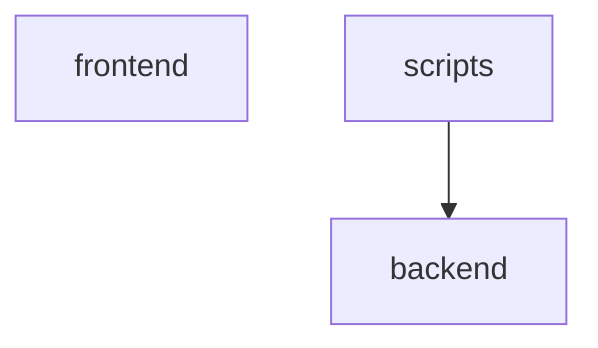

# Dependencies

Internal module dependency graph and external package reconciliation.

## Module graph

This is the full coupling graph, including type dependencies. Runtime startup cycles and explicit type dependencies are distinguished below.

<!-- Collapsed to top-level packages; the full module list is in the Fan-in / Fan-out table below. -->

```mermaid
flowchart TD
    n0["backend"]
    n1["frontend"]
    n2["scripts"]
    n2 --> n0
```

## Cycles

*No runtime import cycles detected.*

> These additional coupling groups include deferred, `TYPE_CHECKING`, or erased TypeScript imports. Startup cycles, including any smaller cycles within these groups, are listed above.

- [authority](modules/authority.md) ⇄ [commands](modules/commands.md) ⇄ [app_database](modules/app_database.md) ⇄ [models_agent](modules/models_agent.md) ⇄ [models_autonomy](modules/models_autonomy.md) ⇄ [models_calendar](modules/models_calendar.md) ⇄ [models_capacity](modules/models_capacity.md) ⇄ [delivery_dependency](modules/delivery_dependency.md) ⇄ [models_discussion](modules/models_discussion.md) ⇄ [models_external_link](modules/models_external_link.md) ⇄ [models_github](modules/models_github.md) ⇄ [models_identity](modules/models_identity.md) ⇄ [models_iteration](modules/models_iteration.md) ⇄ [models_label](modules/models_label.md) ⇄ [models_outbound_webhook](modules/models_outbound_webhook.md) ⇄ [models_plan_share](modules/models_plan_share.md) ⇄ [models_project](modules/models_project.md) ⇄ [recovery](modules/recovery.md) ⇄ [models_release](modules/models_release.md) ⇄ [models_request_source](modules/models_request_source.md) ⇄ [models_saved_view](modules/models_saved_view.md) ⇄ [models_system_settings](modules/models_system_settings.md) ⇄ [models_task](modules/models_task.md) ⇄ [models_task_brief](modules/models_task_brief.md) ⇄ [task_status_log](modules/task_status_log.md) ⇄ [team_member](modules/team_member.md) ⇄ [models_template](modules/models_template.md) ⇄ [models_triage](modules/models_triage.md) ⇄ [user_session](modules/user_session.md) ⇄ [observability](modules/observability.md) ⇄ [export](modules/export.md) ⇄ [snapshots](modules/snapshots.md) ⇄ [schemas_agent](modules/schemas_agent.md) ⇄ [schemas_triage](modules/schemas_triage.md) ⇄ [agent_model_catalog_service](modules/agent_model_catalog_service.md) ⇄ [agent_planning_service](modules/agent_planning_service.md) ⇄ [agent_profile_catalog_service](modules/agent_profile_catalog_service.md) ⇄ [agent_readiness](modules/agent_readiness.md) ⇄ [agent_routing_observability](modules/agent_routing_observability.md) ⇄ [agent_routing_service](modules/agent_routing_service.md) ⇄ [agent_service](modules/agent_service.md) ⇄ [agent_team_setup_service](modules/agent_team_setup_service.md) ⇄ [agent_work_service](modules/agent_work_service.md) ⇄ [allocation_removal](modules/allocation_removal.md) ⇄ [backlog_snapshot_service](modules/backlog_snapshot_service.md) ⇄ [calendar_rules](modules/calendar_rules.md) ⇄ [calendar_service](modules/calendar_service.md) ⇄ [capacity_service](modules/capacity_service.md) ⇄ [delivery_dependency_service](modules/delivery_dependency_service.md) ⇄ [discussion_service](modules/discussion_service.md) ⇄ [email_settings_service](modules/email_settings_service.md) ⇄ [execution_planning_window](modules/execution_planning_window.md) ⇄ [execution_reconciliation](modules/execution_reconciliation.md) ⇄ [external_link_service](modules/external_link_service.md) ⇄ [github_status_automation_service](modules/github_status_automation_service.md) ⇄ [github_status_service](modules/github_status_service.md) ⇄ [hierarchy_repair_service](modules/hierarchy_repair_service.md) ⇄ [identity_service](modules/identity_service.md) ⇄ [import_planning_service](modules/import_planning_service.md) ⇄ [iteration_service](modules/iteration_service.md) ⇄ [label_service](modules/label_service.md) ⇄ [language_service](modules/language_service.md) ⇄ [llm_service](modules/llm_service.md) ⇄ [notification_service](modules/notification_service.md) ⇄ [outbound_webhook_service](modules/outbound_webhook_service.md) ⇄ [planning_input_context](modules/planning_input_context.md) ⇄ [planning_window_reconciliation](modules/planning_window_reconciliation.md) ⇄ [project_service](modules/project_service.md) ⇄ [request_source_service](modules/request_source_service.md) ⇄ [retained_planning_output](modules/retained_planning_output.md) ⇄ [services_review_evidence](modules/services_review_evidence.md) ⇄ [review_provenance](modules/review_provenance.md) ⇄ [saved_view_service](modules/saved_view_service.md) ⇄ [scheduler_service](modules/scheduler_service.md) ⇄ [snapshot_service](modules/snapshot_service.md) ⇄ [system_settings_service](modules/system_settings_service.md) ⇄ [task_brief_service](modules/task_brief_service.md) ⇄ [task_context_revision_service](modules/task_context_revision_service.md) ⇄ [task_domain_service](modules/task_domain_service.md) ⇄ [task_hierarchy_service](modules/task_hierarchy_service.md) ⇄ [task_import_service](modules/task_import_service.md) ⇄ [task_recovery_service](modules/task_recovery_service.md) ⇄ [task_service](modules/task_service.md) ⇄ [task_status_service](modules/task_status_service.md) ⇄ [task_timeline_service](modules/task_timeline_service.md) ⇄ [team_service](modules/team_service.md) ⇄ [template_service](modules/template_service.md) ⇄ [triage_service](modules/triage_service.md) ⇄ [upgrade_service](modules/upgrade_service.md) ⇄ [services_work_metrics](modules/services_work_metrics.md) ⇄ [import_parser](modules/import_parser.md)
- [AssigneeSelect](modules/AssigneeSelect.md) ⇄ [TaskRow](modules/TaskRow.md)
- [TaskFiltersBar](modules/TaskFiltersBar.md) ⇄ [taskFilterDefaults](modules/taskFilterDefaults.md)

### Explicit type dependencies

Type-only bindings and declaration-file dependencies remain part of the coupling graph. Declaration-level `import type` is erased. Specifier-only type imports can retain module evaluation depending on compiler settings; see each module's Imports table.

| From | To |
|------|----|
| [UserSessionBadge](modules/UserSessionBadge.md) | [sessionService](modules/sessionService.md) |
| [AssignedAgentsSummary.test](modules/AssignedAgentsSummary.test.md) | [types_agent](modules/types_agent.md) |
| [AssignedAgentsSummary](modules/AssignedAgentsSummary.md) | [types_agent](modules/types_agent.md) |
| [RoutingCandidateComparison](modules/RoutingCandidateComparison.md) | [types_agent](modules/types_agent.md) |
| [TaskRoutingPanel.test](modules/TaskRoutingPanel.test.md) | [types_agent](modules/types_agent.md) |
| [TaskRoutingPanel.test](modules/TaskRoutingPanel.test.md) | [types_task](modules/types_task.md) |
| [TaskRoutingPanel](modules/TaskRoutingPanel.md) | [types_agent](modules/types_agent.md) |
| [TaskRoutingPanel](modules/TaskRoutingPanel.md) | [types_task](modules/types_task.md) |
| [DeliveryAnalytics.test](modules/DeliveryAnalytics.test.md) | [deliveryMetrics](modules/deliveryMetrics.md) |
| [DeliveryAnalytics](modules/DeliveryAnalytics.md) | [deliveryMetrics](modules/deliveryMetrics.md) |
| [ExecutionUsagePanel.test](modules/ExecutionUsagePanel.test.md) | [executionUsage](modules/executionUsage.md) |
| [ExecutionUsagePanel](modules/ExecutionUsagePanel.md) | [analyticsScope](modules/analyticsScope.md) |
| [IterationOutlook.test](modules/IterationOutlook.test.md) | [types_iteration](modules/types_iteration.md) |
| [OnTrackSummary](modules/OnTrackSummary.md) | [types_iteration](modules/types_iteration.md) |
| [StatusDistribution](modules/StatusDistribution.md) | [types_iteration](modules/types_iteration.md) |
| [StatusDistribution](modules/StatusDistribution.md) | [types_task](modules/types_task.md) |
| [useAnalyticsScope](modules/useAnalyticsScope.md) | [analyticsScope](modules/analyticsScope.md) |
| [CapacitySection.test](modules/CapacitySection.test.md) | [types_iteration](modules/types_iteration.md) |
| [CapacitySection.test](modules/CapacitySection.test.md) | [types_team](modules/types_team.md) |
| [CapacitySection](modules/CapacitySection.md) | [types_iteration](modules/types_iteration.md) |
| [CapacitySection](modules/CapacitySection.md) | [types_team](modules/types_team.md) |
| [CapacityTable](modules/CapacityTable.md) | [types_team](modules/types_team.md) |
| [PlanQuickAddCapacity.test](modules/PlanQuickAddCapacity.test.md) | [types_iteration](modules/types_iteration.md) |
| [PlanQuickAddCapacity.test](modules/PlanQuickAddCapacity.test.md) | [types_team](modules/types_team.md) |
| [PlanQuickAddCapacity](modules/PlanQuickAddCapacity.md) | [types_iteration](modules/types_iteration.md) |
| [PlanQuickAddCapacity](modules/PlanQuickAddCapacity.md) | [types_team](modules/types_team.md) |
| [TeamForm.test](modules/TeamForm.test.md) | [types_team](modules/types_team.md) |
| [TeamForm](modules/TeamForm.md) | [mutationFeedback](modules/mutationFeedback.md) |
| [TeamForm](modules/TeamForm.md) | [planningInputService](modules/planningInputService.md) |
| [TeamForm](modules/TeamForm.md) | [types_team](modules/types_team.md) |
| [TeamList.test](modules/TeamList.test.md) | [types_team](modules/types_team.md) |
| [TeamList](modules/TeamList.md) | [mutationFeedback](modules/mutationFeedback.md) |
| [TeamList](modules/TeamList.md) | [planningInputService](modules/planningInputService.md) |
| [TeamList](modules/TeamList.md) | [types_team](modules/types_team.md) |
| [VacationManager](modules/VacationManager.md) | [mutationFeedback](modules/mutationFeedback.md) |
| [VacationManager](modules/VacationManager.md) | [planningInputService](modules/planningInputService.md) |
| [VacationManager](modules/VacationManager.md) | [types_team](modules/types_team.md) |
| [capacityMutations](modules/capacityMutations.md) | [types_team](modules/types_team.md) |
| [Button](modules/Button.md) | [buttonStyles](modules/buttonStyles.md) |
| [ButtonLink](modules/ButtonLink.md) | [buttonStyles](modules/buttonStyles.md) |
| [useConfirmDialog](modules/useConfirmDialog.md) | [ConfirmDialog](modules/ConfirmDialog.md) |
| [ToastProvider](modules/ToastProvider.md) | [toast](modules/toast.md) |
| [GanttBarInputs](modules/GanttBarInputs.md) | [types_gantt](modules/types_gantt.md) |
| [GanttChart.test](modules/GanttChart.test.md) | [types_gantt](modules/types_gantt.md) |
| [GanttChart](modules/GanttChart.md) | [OverflowMenu](modules/OverflowMenu.md) |
| [GanttChart](modules/GanttChart.md) | [types_gantt](modules/types_gantt.md) |
| [ScheduleExplanationDetails](modules/ScheduleExplanationDetails.md) | [types_gantt](modules/types_gantt.md) |
| [TaskEditDrawer.test](modules/TaskEditDrawer.test.md) | [types_gantt](modules/types_gantt.md) |
| [TaskEditDrawer.test](modules/TaskEditDrawer.test.md) | [types_task](modules/types_task.md) |
| [TaskEditDrawer](modules/TaskEditDrawer.md) | [types_gantt](modules/types_gantt.md) |
| [TaskEditDrawer](modules/TaskEditDrawer.md) | [types_task](modules/types_task.md) |
| [UnscheduledTasks](modules/UnscheduledTasks.md) | [types_gantt](modules/types_gantt.md) |
| [AllIterationsDrawer](modules/AllIterationsDrawer.md) | [types_iteration](modules/types_iteration.md) |
| [AnnualCalendarFields](modules/AnnualCalendarFields.md) | [types_calendar](modules/types_calendar.md) |
| [IterationEditorDrawer](modules/IterationEditorDrawer.md) | [types_iteration](modules/types_iteration.md) |
| [IterationForm.test](modules/IterationForm.test.md) | [types_iteration](modules/types_iteration.md) |
| [IterationForm](modules/IterationForm.md) | [planningInputService](modules/planningInputService.md) |
| [IterationForm](modules/IterationForm.md) | [types_iteration](modules/types_iteration.md) |
| [IterationImportDialog](modules/IterationImportDialog.md) | [planningInputService](modules/planningInputService.md) |
| [IterationList](modules/IterationList.md) | [planningInputService](modules/planningInputService.md) |
| [IterationList](modules/IterationList.md) | [types_iteration](modules/types_iteration.md) |
| [LabelSelector](modules/LabelSelector.md) | [types_label](modules/types_label.md) |
| [AppSidebar](modules/AppSidebar.md) | [destinations](modules/destinations.md) |
| [CommandMenu](modules/CommandMenu.md) | [workScope](modules/workScope.md) |
| [CommandMenu](modules/CommandMenu.md) | [savedView](modules/savedView.md) |
| [ContextHelp](modules/ContextHelp.md) | [helpContexts](modules/helpContexts.md) |
| [ScopeBar](modules/ScopeBar.md) | [ScopePicker](modules/ScopePicker.md) |
| [ScopeBar](modules/ScopeBar.md) | [workScope](modules/workScope.md) |
| [ScopeBar](modules/ScopeBar.md) | [types_iteration](modules/types_iteration.md) |
| [ScopeBar](modules/ScopeBar.md) | [types_project](modules/types_project.md) |
| [planProgressPlacement.test](modules/planProgressPlacement.test.md) | [types_iteration](modules/types_iteration.md) |
| [PlanBlockersSection](modules/PlanBlockersSection.md) | [types_task](modules/types_task.md) |
| [PlanBlockersSection](modules/PlanBlockersSection.md) | [types_team](modules/types_team.md) |
| [PlanIterationCheckpoint](modules/PlanIterationCheckpoint.md) | [types_iteration](modules/types_iteration.md) |
| [PlanIterationDrawers](modules/PlanIterationDrawers.md) | [types_iteration](modules/types_iteration.md) |
| [PlanReviewSection](modules/PlanReviewSection.md) | [types_gantt](modules/types_gantt.md) |
| [PlanReviewSection](modules/PlanReviewSection.md) | [types_iteration](modules/types_iteration.md) |
| [PlanReviewSection](modules/PlanReviewSection.md) | [types_team](modules/types_team.md) |
| [PlanScheduleSection](modules/PlanScheduleSection.md) | [types_gantt](modules/types_gantt.md) |
| [PlanScheduleSection](modules/PlanScheduleSection.md) | [types_iteration](modules/types_iteration.md) |
| [PlanScheduleSection](modules/PlanScheduleSection.md) | [types_task](modules/types_task.md) |
| [PlanScheduleSection](modules/PlanScheduleSection.md) | [types_team](modules/types_team.md) |
| [PlanShareSection.test](modules/PlanShareSection.test.md) | [planShareService](modules/planShareService.md) |
| [PlanShareSection](modules/PlanShareSection.md) | [planShareService](modules/planShareService.md) |
| [PlanWorkSection](modules/PlanWorkSection.md) | [types_iteration](modules/types_iteration.md) |
| [PlanWorkSection](modules/PlanWorkSection.md) | [types_task](modules/types_task.md) |
| [PlanningInputBoundary](modules/PlanningInputBoundary.md) | [planningInputService](modules/planningInputService.md) |
| [AddMilestoneModal](modules/AddMilestoneModal.md) | [mutationFeedback](modules/mutationFeedback.md) |
| [AddMilestoneModal](modules/AddMilestoneModal.md) | [types_project](modules/types_project.md) |
| [InitiativeForm](modules/InitiativeForm.md) | [mutationFeedback](modules/mutationFeedback.md) |
| [InitiativeForm](modules/InitiativeForm.md) | [types_project](modules/types_project.md) |
| [InitiativeGroupHeader](modules/InitiativeGroupHeader.md) | [projectPortfolio](modules/projectPortfolio.md) |
| [InitiativeGroupHeader](modules/InitiativeGroupHeader.md) | [types_project](modules/types_project.md) |
| [MilestoneFormDrawer](modules/MilestoneFormDrawer.md) | [projectDetailShared](modules/projectDetailShared.md) |
| [MilestoneFormDrawer](modules/MilestoneFormDrawer.md) | [types_project](modules/types_project.md) |
| [MilestonesSection](modules/MilestonesSection.md) | [types_project](modules/types_project.md) |
| [PostUpdateDrawer](modules/PostUpdateDrawer.md) | [projectDetailShared](modules/projectDetailShared.md) |
| [PostUpdateDrawer](modules/PostUpdateDrawer.md) | [types_project](modules/types_project.md) |
| [ProjectForm.test](modules/ProjectForm.test.md) | [types_project](modules/types_project.md) |
| [ProjectForm](modules/ProjectForm.md) | [mutationFeedback](modules/mutationFeedback.md) |
| [ProjectForm](modules/ProjectForm.md) | [planningInputService](modules/planningInputService.md) |
| [ProjectForm](modules/ProjectForm.md) | [types_project](modules/types_project.md) |
| [ProjectForm](modules/ProjectForm.md) | [types_template](modules/types_template.md) |
| [ProjectHeaderFields](modules/ProjectHeaderFields.md) | [planningInputService](modules/planningInputService.md) |
| [ProjectHeaderFields](modules/ProjectHeaderFields.md) | [types_project](modules/types_project.md) |
| [ProjectIterationsSection](modules/ProjectIterationsSection.md) | [planningInputService](modules/planningInputService.md) |
| [ProjectIterationsSection](modules/ProjectIterationsSection.md) | [types_iteration](modules/types_iteration.md) |
| [ProjectReleasesTab](modules/ProjectReleasesTab.md) | [types_release](modules/types_release.md) |
| [ProjectSummaryTab](modules/ProjectSummaryTab.md) | [types_project](modules/types_project.md) |
| [ProjectTaskTree.test](modules/ProjectTaskTree.test.md) | [types_task](modules/types_task.md) |
| [ProjectTaskTree](modules/ProjectTaskTree.md) | [types_task](modules/types_task.md) |
| [ProjectTasksTab](modules/ProjectTasksTab.md) | [types_task](modules/types_task.md) |
| [ProjectUpdatesTab](modules/ProjectUpdatesTab.md) | [types_project](modules/types_project.md) |
| [RoadmapView.test](modules/RoadmapView.test.md) | [types_project](modules/types_project.md) |
| [RoadmapView](modules/RoadmapView.md) | [projectPortfolio](modules/projectPortfolio.md) |
| [RoadmapView](modules/RoadmapView.md) | [types_project](modules/types_project.md) |
| [SetDatesPopover](modules/SetDatesPopover.md) | [mutationFeedback](modules/mutationFeedback.md) |
| [SetDatesPopover](modules/SetDatesPopover.md) | [planningInputService](modules/planningInputService.md) |
| [SetDatesPopover](modules/SetDatesPopover.md) | [types_project](modules/types_project.md) |
| [projectDetailShared](modules/projectDetailShared.md) | [types_project](modules/types_project.md) |
| [projectDetailShared](modules/projectDetailShared.md) | [types_release](modules/types_release.md) |
| [projectPortfolio](modules/projectPortfolio.md) | [types_project](modules/types_project.md) |
| [projectStatusStyles](modules/projectStatusStyles.md) | [tone](modules/tone.md) |
| [projectStatusStyles](modules/projectStatusStyles.md) | [types_project](modules/types_project.md) |
| [ReleaseForm](modules/ReleaseForm.md) | [mutationFeedback](modules/mutationFeedback.md) |
| [ReleaseForm](modules/ReleaseForm.md) | [types_release](modules/types_release.md) |
| [ReleaseForm](modules/ReleaseForm.md) | [types_task](modules/types_task.md) |
| [RequestSourceLinksPanel](modules/RequestSourceLinksPanel.md) | [requestSource](modules/requestSource.md) |
| [AdminAccessGate.test](modules/AdminAccessGate.test.md) | [identityService](modules/identityService.md) |
| [AdminAccessPanel.test](modules/AdminAccessPanel.test.md) | [identityService](modules/identityService.md) |
| [AgentAccessPanel.test](modules/AgentAccessPanel.test.md) | [types_agent](modules/types_agent.md) |
| [AgentTeamStepList](modules/AgentTeamStepList.md) | [agentTeamSetup_masters](modules/agentTeamSetup_masters.md) |
| [AgentTeamStepList](modules/AgentTeamStepList.md) | [useAgentTeamReadiness](modules/useAgentTeamReadiness.md) |
| [ConnectedReadersPanel.test](modules/ConnectedReadersPanel.test.md) | [identityService](modules/identityService.md) |
| [ConnectedReadersPanel](modules/ConnectedReadersPanel.md) | [identityService](modules/identityService.md) |
| [ConstraintsPanel](modules/ConstraintsPanel.md) | [schedulingRules](modules/schedulingRules.md) |
| [EffortModifierCard.test](modules/EffortModifierCard.test.md) | [schedulingRules](modules/schedulingRules.md) |
| [EffortModifierCard](modules/EffortModifierCard.md) | [schedulingRules](modules/schedulingRules.md) |
| [EmailSettingsPanel.test](modules/EmailSettingsPanel.test.md) | [emailSettings](modules/emailSettings.md) |
| [EmailSettingsPanel](modules/EmailSettingsPanel.md) | [emailSettings](modules/emailSettings.md) |
| [EmailSettingsPanel](modules/EmailSettingsPanel.md) | [systemSettings](modules/systemSettings.md) |
| [GitHubSettingsPanel.test](modules/GitHubSettingsPanel.test.md) | [types_github](modules/types_github.md) |
| [GitHubSettingsPanel](modules/GitHubSettingsPanel.md) | [types_github](modules/types_github.md) |
| [GitHubSettingsPanel](modules/GitHubSettingsPanel.md) | [types_task](modules/types_task.md) |
| [InterfaceLanguageSettings](modules/InterfaceLanguageSettings.md) | [systemSettings](modules/systemSettings.md) |
| [OutboundWebhooksPanel.test](modules/OutboundWebhooksPanel.test.md) | [outboundWebhook](modules/outboundWebhook.md) |
| [OutboundWebhooksPanel](modules/OutboundWebhooksPanel.md) | [outboundWebhook](modules/outboundWebhook.md) |
| [RuntimeConfigSettings.test](modules/RuntimeConfigSettings.test.md) | [systemSettings](modules/systemSettings.md) |
| [RuntimeConfigSettings](modules/RuntimeConfigSettings.md) | [systemSettings](modules/systemSettings.md) |
| [SchedulingPassCard](modules/SchedulingPassCard.md) | [schedulingRules](modules/schedulingRules.md) |
| [SchedulingRulesSettings.test](modules/SchedulingRulesSettings.test.md) | [schedulingRules](modules/schedulingRules.md) |
| [SchedulingRulesSettings](modules/SchedulingRulesSettings.md) | [schedulingRules](modules/schedulingRules.md) |
| [TemplateLabelSettings.test](modules/TemplateLabelSettings.test.md) | [types_label](modules/types_label.md) |
| [TemplateLabelSettings](modules/TemplateLabelSettings.md) | [mutationFeedback](modules/mutationFeedback.md) |
| [TemplateLabelSettings](modules/TemplateLabelSettings.md) | [types_label](modules/types_label.md) |
| [TemplateLabelSettings](modules/TemplateLabelSettings.md) | [types_template](modules/types_template.md) |
| [WorkCalendarSettings](modules/WorkCalendarSettings.md) | [types_calendar](modules/types_calendar.md) |
| [AssigneePicker.test](modules/AssigneePicker.test.md) | [types_task](modules/types_task.md) |
| [AssigneePicker](modules/AssigneePicker.md) | [types_team](modules/types_team.md) |
| [AssigneeSelect](modules/AssigneeSelect.md) | [TaskRow](modules/TaskRow.md) |
| [AtRiskTaskReasons](modules/AtRiskTaskReasons.md) | [types_task](modules/types_task.md) |
| [CurrentTaskDrawer.test](modules/CurrentTaskDrawer.test.md) | [types_task](modules/types_task.md) |
| [DeliveryDependencies](modules/DeliveryDependencies.md) | [mutationFeedback](modules/mutationFeedback.md) |
| [DeliveryDependencies](modules/DeliveryDependencies.md) | [types_task](modules/types_task.md) |
| [GuardedTaskDrawer](modules/GuardedTaskDrawer.md) | [types_task](modules/types_task.md) |
| [ImportTasksModal](modules/ImportTasksModal.md) | [mutationFeedback](modules/mutationFeedback.md) |
| [ImportTasksModal](modules/ImportTasksModal.md) | [types_task](modules/types_task.md) |
| [KanbanBoard.test](modules/KanbanBoard.test.md) | [types_task](modules/types_task.md) |
| [KanbanBoard.test](modules/KanbanBoard.test.md) | [types_team](modules/types_team.md) |
| [KanbanBoard](modules/KanbanBoard.md) | [KanbanCard](modules/KanbanCard.md) |
| [KanbanBoard](modules/KanbanBoard.md) | [TaskFiltersBar](modules/TaskFiltersBar.md) |
| [KanbanBoard](modules/KanbanBoard.md) | [mutationFeedback](modules/mutationFeedback.md) |
| [KanbanBoard](modules/KanbanBoard.md) | [types_task](modules/types_task.md) |
| [KanbanBoard](modules/KanbanBoard.md) | [types_team](modules/types_team.md) |
| [KanbanCard](modules/KanbanCard.md) | [types_task](modules/types_task.md) |
| [KanbanColumn.test](modules/KanbanColumn.test.md) | [types_task](modules/types_task.md) |
| [KanbanColumn](modules/KanbanColumn.md) | [KanbanCard](modules/KanbanCard.md) |
| [KanbanColumn](modules/KanbanColumn.md) | [tone](modules/tone.md) |
| [KanbanColumn](modules/KanbanColumn.md) | [types_task](modules/types_task.md) |
| [MetricCount.test](modules/MetricCount.test.md) | [workMetrics](modules/workMetrics.md) |
| [MetricCount](modules/MetricCount.md) | [taskService](modules/taskService.md) |
| [PipelineTaskEvidence](modules/PipelineTaskEvidence.md) | [types_agent](modules/types_agent.md) |
| [PipelineTaskEvidence](modules/PipelineTaskEvidence.md) | [types_task](modules/types_task.md) |
| [PipelineView](modules/PipelineView.md) | [TaskFiltersBar](modules/TaskFiltersBar.md) |
| [PipelineView](modules/PipelineView.md) | [workScope](modules/workScope.md) |
| [PipelineView](modules/PipelineView.md) | [types_label](modules/types_label.md) |
| [PipelineView](modules/PipelineView.md) | [types_task](modules/types_task.md) |
| [QuickCapture](modules/QuickCapture.md) | [mutationFeedback](modules/mutationFeedback.md) |
| [QuickCapture](modules/QuickCapture.md) | [types_task](modules/types_task.md) |
| [QuickCapture](modules/QuickCapture.md) | [types_triage](modules/types_triage.md) |
| [SavedViewsControl](modules/SavedViewsControl.md) | [useSavedViewManager](modules/useSavedViewManager.md) |
| [SavedViewsControl](modules/SavedViewsControl.md) | [savedView](modules/savedView.md) |
| [StatusChangeControl](modules/StatusChangeControl.md) | [mutationFeedback](modules/mutationFeedback.md) |
| [StatusChangeControl](modules/StatusChangeControl.md) | [types_task](modules/types_task.md) |
| [TaskAgentReadinessBadge.test](modules/TaskAgentReadinessBadge.test.md) | [types_task](modules/types_task.md) |
| [TaskAgentReadinessBadge](modules/TaskAgentReadinessBadge.md) | [types_task](modules/types_task.md) |
| [TaskAssigneeDisplay](modules/TaskAssigneeDisplay.md) | [types_gantt](modules/types_gantt.md) |
| [TaskAssigneeDisplay](modules/TaskAssigneeDisplay.md) | [types_task](modules/types_task.md) |
| [TaskBriefEditor](modules/TaskBriefEditor.md) | [types_task](modules/types_task.md) |
| [TaskBulkOperationsPanel](modules/TaskBulkOperationsPanel.md) | [mutationFeedback](modules/mutationFeedback.md) |
| [TaskBulkOperationsPanel](modules/TaskBulkOperationsPanel.md) | [types_task](modules/types_task.md) |
| [TaskContextSummary](modules/TaskContextSummary.md) | [types_task](modules/types_task.md) |
| [TaskDiscussion](modules/TaskDiscussion.md) | [discussionService](modules/discussionService.md) |
| [TaskEditorDrawer.flow.test](modules/TaskEditorDrawer.flow.test.md) | [types_task](modules/types_task.md) |
| [TaskEditorDrawer.test](modules/TaskEditorDrawer.test.md) | [types_task](modules/types_task.md) |
| [TaskEditorDrawer](modules/TaskEditorDrawer.md) | [types_task](modules/types_task.md) |
| [TaskFiltersBar.test](modules/TaskFiltersBar.test.md) | [TaskFiltersBar](modules/TaskFiltersBar.md) |
| [TaskFiltersBar](modules/TaskFiltersBar.md) | [index](modules/index.md) |
| [TaskFiltersBar](modules/TaskFiltersBar.md) | [planningTaskIssues](modules/planningTaskIssues.md) |
| [TaskForm.test](modules/TaskForm.test.md) | [types_template](modules/types_template.md) |
| [TaskForm](modules/TaskForm.md) | [taskEditorContract](modules/taskEditorContract.md) |
| [TaskForm](modules/TaskForm.md) | [mutationFeedback](modules/mutationFeedback.md) |
| [TaskForm](modules/TaskForm.md) | [types_iteration](modules/types_iteration.md) |
| [TaskForm](modules/TaskForm.md) | [types_task](modules/types_task.md) |
| [TaskForm](modules/TaskForm.md) | [types_team](modules/types_team.md) |
| [TaskForm](modules/TaskForm.md) | [types_template](modules/types_template.md) |
| [TaskForm](modules/TaskForm.md) | [types_triage](modules/types_triage.md) |
| [TaskFormSections.test](modules/TaskFormSections.test.md) | [types_task](modules/types_task.md) |
| [TaskList.test](modules/TaskList.test.md) | [TaskFiltersBar](modules/TaskFiltersBar.md) |
| [TaskList.test](modules/TaskList.test.md) | [types_task](modules/types_task.md) |
| [TaskList](modules/TaskList.md) | [TaskFiltersBar](modules/TaskFiltersBar.md) |
| [TaskList](modules/TaskList.md) | [TaskRow](modules/TaskRow.md) |
| [TaskList](modules/TaskList.md) | [useAgentRowFacts](modules/useAgentRowFacts.md) |
| [TaskList](modules/TaskList.md) | [types_label](modules/types_label.md) |
| [TaskList](modules/TaskList.md) | [types_task](modules/types_task.md) |
| [TaskReadView.brief.test](modules/TaskReadView.brief.test.md) | [types_task](modules/types_task.md) |
| [TaskReadView.dispatch.test](modules/TaskReadView.dispatch.test.md) | [types_task](modules/types_task.md) |
| [TaskReadView.operatorKey.test](modules/TaskReadView.operatorKey.test.md) | [identityService](modules/identityService.md) |
| [TaskReadView.operatorKey.test](modules/TaskReadView.operatorKey.test.md) | [types_task](modules/types_task.md) |
| [TaskReadView.test](modules/TaskReadView.test.md) | [types_task](modules/types_task.md) |
| [TaskReadView](modules/TaskReadView.md) | [mutationFeedback](modules/mutationFeedback.md) |
| [TaskReadView](modules/TaskReadView.md) | [types_task](modules/types_task.md) |
| [TaskReviewer](modules/TaskReviewer.md) | [types_task](modules/types_task.md) |
| [TaskRow](modules/TaskRow.md) | [taskStateChip](modules/taskStateChip.md) |
| [TaskRow](modules/TaskRow.md) | [OverflowMenu](modules/OverflowMenu.md) |
| [TaskRow](modules/TaskRow.md) | [agentDispatch](modules/agentDispatch.md) |
| [TaskRow](modules/TaskRow.md) | [types_task](modules/types_task.md) |
| [TaskSelectionBar](modules/TaskSelectionBar.md) | [TaskBulkOperationsPanel](modules/TaskBulkOperationsPanel.md) |
| [TaskTextEditorModal](modules/TaskTextEditorModal.md) | [types_task](modules/types_task.md) |
| [TaskTimelinePanel.test](modules/TaskTimelinePanel.test.md) | [types_task](modules/types_task.md) |
| [TaskTimelinePanel](modules/TaskTimelinePanel.md) | [types_task](modules/types_task.md) |
| [TaskViewOptions](modules/TaskViewOptions.md) | [TaskList](modules/TaskList.md) |
| [TaskWorkPanel.test](modules/TaskWorkPanel.test.md) | [types_task](modules/types_task.md) |
| [TaskWorkPanel](modules/TaskWorkPanel.md) | [mutationFeedback](modules/mutationFeedback.md) |
| [TaskWorkPanel](modules/TaskWorkPanel.md) | [planningInputService](modules/planningInputService.md) |
| [TaskWorkPanel](modules/TaskWorkPanel.md) | [types_iteration](modules/types_iteration.md) |
| [TaskWorkPanel](modules/TaskWorkPanel.md) | [types_task](modules/types_task.md) |
| [TimeEntriesPanel](modules/TimeEntriesPanel.md) | [timeEntryService](modules/timeEntryService.md) |
| [WorkMetricsLine](modules/WorkMetricsLine.md) | [taskService](modules/taskService.md) |
| [WorkMetricsLine](modules/WorkMetricsLine.md) | [workMetrics](modules/workMetrics.md) |
| [assigneeDisplay.test](modules/assigneeDisplay.test.md) | [usePipeline](modules/usePipeline.md) |
| [assigneeDisplay.test](modules/assigneeDisplay.test.md) | [types_agent](modules/types_agent.md) |
| [assigneeDisplay.test](modules/assigneeDisplay.test.md) | [types_gantt](modules/types_gantt.md) |
| [assigneeDisplay.test](modules/assigneeDisplay.test.md) | [types_task](modules/types_task.md) |
| [taskDraftStorage](modules/taskDraftStorage.md) | [taskEditorContract](modules/taskEditorContract.md) |
| [taskEditorContract](modules/taskEditorContract.md) | [types_task](modules/types_task.md) |
| [taskEditorSnapshot](modules/taskEditorSnapshot.md) | [types_task](modules/types_task.md) |
| [taskRowParts](modules/taskRowParts.md) | [taskStateChip](modules/taskStateChip.md) |
| [taskRowParts](modules/taskRowParts.md) | [agentDispatch](modules/agentDispatch.md) |
| [taskRowValues](modules/taskRowValues.md) | [types_task](modules/types_task.md) |
| [taskSearchResults](modules/taskSearchResults.md) | [types_task](modules/types_task.md) |
| [taskStateChip](modules/taskStateChip.md) | [types_task](modules/types_task.md) |
| [useAgentRowFacts](modules/useAgentRowFacts.md) | [TaskRow](modules/TaskRow.md) |
| [useAgentRowFacts](modules/useAgentRowFacts.md) | [agentDispatch](modules/agentDispatch.md) |
| [useAgentRowFacts](modules/useAgentRowFacts.md) | [types_task](modules/types_task.md) |
| [useIterationRowData](modules/useIterationRowData.md) | [TaskRow](modules/TaskRow.md) |
| [useIterationRowData](modules/useIterationRowData.md) | [types_task](modules/types_task.md) |
| [usePipeline](modules/usePipeline.md) | [types_agent](modules/types_agent.md) |
| [useSavedViewManager](modules/useSavedViewManager.md) | [TaskFiltersBar](modules/TaskFiltersBar.md) |
| [useSavedViewManager](modules/useSavedViewManager.md) | [TaskList](modules/TaskList.md) |
| [useSavedViewManager](modules/useSavedViewManager.md) | [savedView](modules/savedView.md) |
| [useTaskAssigneeDisplay](modules/useTaskAssigneeDisplay.md) | [types_gantt](modules/types_gantt.md) |
| [useTaskAssigneeDisplay](modules/useTaskAssigneeDisplay.md) | [types_task](modules/types_task.md) |
| [useTaskReviewer](modules/useTaskReviewer.md) | [types_task](modules/types_task.md) |
| [useTaskRowEdits](modules/useTaskRowEdits.md) | [TaskRow](modules/TaskRow.md) |
| [useTaskRowEdits](modules/useTaskRowEdits.md) | [mutationFeedback](modules/mutationFeedback.md) |
| [useTaskRowEdits](modules/useTaskRowEdits.md) | [types_task](modules/types_task.md) |
| [useTaskRowEdits](modules/useTaskRowEdits.md) | [types_team](modules/types_team.md) |
| [AgentManifestWorkflow.test](modules/AgentManifestWorkflow.test.md) | [types_agent](modules/types_agent.md) |
| [AgentManifestWorkflow](modules/AgentManifestWorkflow.md) | [manifestLocations](modules/manifestLocations.md) |
| [AgentManifestWorkflow](modules/AgentManifestWorkflow.md) | [statusScopes](modules/statusScopes.md) |
| [AgentManifestWorkflow](modules/AgentManifestWorkflow.md) | [types_agent](modules/types_agent.md) |
| [AgentModelAdministration.test](modules/AgentModelAdministration.test.md) | [types_agent](modules/types_agent.md) |
| [AgentModelAdministration](modules/AgentModelAdministration.md) | [OverflowMenu](modules/OverflowMenu.md) |
| [AgentModelAdministration](modules/AgentModelAdministration.md) | [types_agent](modules/types_agent.md) |
| [ConnectAgentSteps.test](modules/ConnectAgentSteps.test.md) | [types_agent](modules/types_agent.md) |
| [ConnectAgentSteps](modules/ConnectAgentSteps.md) | [connectAgent](modules/connectAgent.md) |
| [ConnectAgentSteps](modules/ConnectAgentSteps.md) | [types_agent](modules/types_agent.md) |
| [ConnectionSteps](modules/ConnectionSteps.md) | [types_agent](modules/types_agent.md) |
| [ImportTeamModal.test](modules/ImportTeamModal.test.md) | [types_team](modules/types_team.md) |
| [ImportTeamModal](modules/ImportTeamModal.md) | [mutationFeedback](modules/mutationFeedback.md) |
| [ModelBindings](modules/ModelBindings.md) | [types_agent](modules/types_agent.md) |
| [ModelCatalog](modules/ModelCatalog.md) | [types_agent](modules/types_agent.md) |
| [TeamDirectory](modules/TeamDirectory.md) | [directoryModel](modules/directoryModel.md) |
| [TeamDirectory](modules/TeamDirectory.md) | [index](modules/index.md) |
| [TeamProfileManager.test](modules/TeamProfileManager.test.md) | [directoryModel](modules/directoryModel.md) |
| [TeamProfileManager.test](modules/TeamProfileManager.test.md) | [types_agent](modules/types_agent.md) |
| [TeamProfileManager.test](modules/TeamProfileManager.test.md) | [types_team](modules/types_team.md) |
| [TeamProfileManager](modules/TeamProfileManager.md) | [directoryModel](modules/directoryModel.md) |
| [TeamProfileManager](modules/TeamProfileManager.md) | [mutationFeedback](modules/mutationFeedback.md) |
| [TeamProfileManager](modules/TeamProfileManager.md) | [planningInputService](modules/planningInputService.md) |
| [TeamProfileManager](modules/TeamProfileManager.md) | [types_agent](modules/types_agent.md) |
| [TeamProfileManager](modules/TeamProfileManager.md) | [types_team](modules/types_team.md) |
| [VacationCsvImport](modules/VacationCsvImport.md) | [planningInputService](modules/planningInputService.md) |
| [directoryModel.test](modules/directoryModel.test.md) | [types_agent](modules/types_agent.md) |
| [directoryModel.test](modules/directoryModel.test.md) | [types_team](modules/types_team.md) |
| [directoryModel](modules/directoryModel.md) | [types_agent](modules/types_agent.md) |
| [directoryModel](modules/directoryModel.md) | [types_team](modules/types_team.md) |
| [ConvertTriageDrawer](modules/ConvertTriageDrawer.md) | [types_iteration](modules/types_iteration.md) |
| [ConvertTriageDrawer](modules/ConvertTriageDrawer.md) | [types_project](modules/types_project.md) |
| [ConvertTriageDrawer](modules/ConvertTriageDrawer.md) | [types_team](modules/types_team.md) |
| [ConvertTriageDrawer](modules/ConvertTriageDrawer.md) | [types_triage](modules/types_triage.md) |
| [CreateTriageDrawer](modules/CreateTriageDrawer.md) | [types_iteration](modules/types_iteration.md) |
| [CreateTriageDrawer](modules/CreateTriageDrawer.md) | [types_project](modules/types_project.md) |
| [CreateTriageDrawer](modules/CreateTriageDrawer.md) | [types_template](modules/types_template.md) |
| [CreateTriageDrawer](modules/CreateTriageDrawer.md) | [types_triage](modules/types_triage.md) |
| [StatusPill](modules/StatusPill.md) | [types_triage](modules/types_triage.md) |
| [TriageActionModal](modules/TriageActionModal.md) | [triageUtils](modules/triageUtils.md) |
| [TriageActionModal](modules/TriageActionModal.md) | [types_iteration](modules/types_iteration.md) |
| [TriageActionModal](modules/TriageActionModal.md) | [types_triage](modules/types_triage.md) |
| [TriageConvertSource](modules/TriageConvertSource.md) | [types_triage](modules/types_triage.md) |
| [TriageDetailPanel](modules/TriageDetailPanel.md) | [triageUtils](modules/triageUtils.md) |
| [TriageDetailPanel](modules/TriageDetailPanel.md) | [types_triage](modules/types_triage.md) |
| [TriageDraftPreview](modules/TriageDraftPreview.md) | [types_task](modules/types_task.md) |
| [TriageDraftPreview](modules/TriageDraftPreview.md) | [types_triage](modules/types_triage.md) |
| [TriageList.test](modules/TriageList.test.md) | [types_triage](modules/types_triage.md) |
| [TriageList](modules/TriageList.md) | [types_triage](modules/types_triage.md) |
| [TriageRow](modules/TriageRow.md) | [types_triage](modules/types_triage.md) |
| [TriageSuggestions](modules/TriageSuggestions.md) | [types_triage](modules/types_triage.md) |
| [triageUtils](modules/triageUtils.md) | [savedView](modules/savedView.md) |
| [triageUtils](modules/triageUtils.md) | [types_task](modules/types_task.md) |
| [triageUtils](modules/triageUtils.md) | [types_triage](modules/types_triage.md) |
| [FilterBar.test](modules/FilterBar.test.md) | [FilterBar](modules/FilterBar.md) |
| [OverflowMenu](modules/OverflowMenu.md) | [buttonStyles](modules/buttonStyles.md) |
| [PageLayout](modules/PageLayout.md) | [OverflowMenu](modules/OverflowMenu.md) |
| [Pill](modules/Pill.md) | [tone](modules/tone.md) |
| [StatusSegmentStrip](modules/StatusSegmentStrip.md) | [tone](modules/tone.md) |
| [ViewSwitch](modules/ViewSwitch.md) | [SegmentedControl](modules/SegmentedControl.md) |
| [tone](modules/tone.md) | [types_task](modules/types_task.md) |
| [MutationSuccessFeedback](modules/MutationSuccessFeedback.md) | [mutationFeedback](modules/mutationFeedback.md) |
| [agentDispatch.test](modules/agentDispatch.test.md) | [agentDispatch](modules/agentDispatch.md) |
| [agentDispatch](modules/agentDispatch.md) | [types_task](modules/types_task.md) |
| [connectAgent](modules/connectAgent.md) | [types_agent](modules/types_agent.md) |
| [agentTeamSetup_manifest](modules/agentTeamSetup_manifest.md) | [types_agent](modules/types_agent.md) |
| [agentTeamSetup_masters.test](modules/agentTeamSetup_masters.test.md) | [types_agent](modules/types_agent.md) |
| [agentTeamSetup_masters](modules/agentTeamSetup_masters.md) | [types_agent](modules/types_agent.md) |
| [statusScopes.test](modules/statusScopes.test.md) | [types_agent](modules/types_agent.md) |
| [statusScopes](modules/statusScopes.md) | [types_agent](modules/types_agent.md) |
| [CreateProjectModal](modules/CreateProjectModal.md) | [mutationFeedback](modules/mutationFeedback.md) |
| [CreateProjectModal](modules/CreateProjectModal.md) | [types_project](modules/types_project.md) |
| [GetStartedFlow.test](modules/GetStartedFlow.test.md) | [identityService](modules/identityService.md) |
| [GetStartedFlow.test](modules/GetStartedFlow.test.md) | [types_iteration](modules/types_iteration.md) |
| [GetStartedFlow.test](modules/GetStartedFlow.test.md) | [types_project](modules/types_project.md) |
| [GetStartedFlow.test](modules/GetStartedFlow.test.md) | [types_task](modules/types_task.md) |
| [GetStartedFlow.test](modules/GetStartedFlow.test.md) | [types_team](modules/types_team.md) |
| [GetStartedPanel.test](modules/GetStartedPanel.test.md) | [identityService](modules/identityService.md) |
| [GetStartedPanel.test](modules/GetStartedPanel.test.md) | [types_iteration](modules/types_iteration.md) |
| [GetStartedPanel.test](modules/GetStartedPanel.test.md) | [types_project](modules/types_project.md) |
| [GetStartedPanel](modules/GetStartedPanel.md) | [firstRunSteps](modules/firstRunSteps.md) |
| [GetStartedPanel](modules/GetStartedPanel.md) | [useFirstRunProgress](modules/useFirstRunProgress.md) |
| [NextStepEmptyState.test](modules/NextStepEmptyState.test.md) | [firstRunSteps](modules/firstRunSteps.md) |
| [NextStepEmptyState](modules/NextStepEmptyState.md) | [useNextSetupAction](modules/useNextSetupAction.md) |
| [SampleProjectAction](modules/SampleProjectAction.md) | [sampleProject](modules/sampleProject.md) |
| [SampleProjectAction](modules/SampleProjectAction.md) | [workScope](modules/workScope.md) |
| [firstRunSteps](modules/firstRunSteps.md) | [planningReturn](modules/planningReturn.md) |
| [sampleProject.fixture](modules/sampleProject.fixture.md) | [types_task](modules/types_task.md) |
| [sampleProject.test](modules/sampleProject.test.md) | [sampleProject](modules/sampleProject.md) |
| [sampleProject.test](modules/sampleProject.test.md) | [identityService](modules/identityService.md) |
| [sampleProject.test](modules/sampleProject.test.md) | [types_project](modules/types_project.md) |
| [sampleProject](modules/sampleProject.md) | [identityService](modules/identityService.md) |
| [sampleProject](modules/sampleProject.md) | [workScope](modules/workScope.md) |
| [sampleProjectStore](modules/sampleProjectStore.md) | [sampleProject](modules/sampleProject.md) |
| [useFirstRunProgress](modules/useFirstRunProgress.md) | [firstRunSteps](modules/firstRunSteps.md) |
| [useFirstRunProgress](modules/useFirstRunProgress.md) | [types_iteration](modules/types_iteration.md) |
| [IdentityProvider](modules/IdentityProvider.md) | [identityService](modules/identityService.md) |
| [LocalProfilePicker](modules/LocalProfilePicker.md) | [identityService](modules/identityService.md) |
| [identityContext](modules/identityContext.md) | [identityService](modules/identityService.md) |
| [mutationFeedback.test](modules/mutationFeedback.test.md) | [mutationFeedback](modules/mutationFeedback.md) |
| [overviewBacklog](modules/overviewBacklog.md) | [types_task](modules/types_task.md) |
| [overviewSignals.test](modules/overviewSignals.test.md) | [types_iteration](modules/types_iteration.md) |
| [overviewSignals.test](modules/overviewSignals.test.md) | [types_task](modules/types_task.md) |
| [overviewSignals](modules/overviewSignals.md) | [TaskFiltersBar](modules/TaskFiltersBar.md) |
| [overviewSignals](modules/overviewSignals.md) | [workScope](modules/workScope.md) |
| [overviewSignals](modules/overviewSignals.md) | [types_agent](modules/types_agent.md) |
| [overviewSignals](modules/overviewSignals.md) | [types_iteration](modules/types_iteration.md) |
| [overviewSignals](modules/overviewSignals.md) | [types_task](modules/types_task.md) |
| [atRiskReasons](modules/atRiskReasons.md) | [types_task](modules/types_task.md) |
| [planningMasters_masters.test](modules/planningMasters_masters.test.md) | [planningMasters_masters](modules/planningMasters_masters.md) |
| [planningMasters_masters](modules/planningMasters_masters.md) | [planningReturn](modules/planningReturn.md) |
| [planningMasters_masters](modules/planningMasters_masters.md) | [planningTaskIssues](modules/planningTaskIssues.md) |
| [planCheckpoints.test](modules/planCheckpoints.test.md) | [types_iteration](modules/types_iteration.md) |
| [planCheckpoints](modules/planCheckpoints.md) | [planningReturn](modules/planningReturn.md) |
| [planCheckpoints](modules/planCheckpoints.md) | [types_iteration](modules/types_iteration.md) |
| [planEvidence](modules/planEvidence.md) | [planningMasters_masters](modules/planningMasters_masters.md) |
| [planEvidence](modules/planEvidence.md) | [planningReturn](modules/planningReturn.md) |
| [planEvidence](modules/planEvidence.md) | [planningTaskIssues](modules/planningTaskIssues.md) |
| [planEvidence](modules/planEvidence.md) | [types_iteration](modules/types_iteration.md) |
| [planProgress.test](modules/planProgress.test.md) | [types_iteration](modules/types_iteration.md) |
| [planningTaskIssues.test](modules/planningTaskIssues.test.md) | [types_task](modules/types_task.md) |
| [planningTaskIssues](modules/planningTaskIssues.md) | [planningReturn](modules/planningReturn.md) |
| [planningTaskIssues](modules/planningTaskIssues.md) | [types_task](modules/types_task.md) |
| [scheduleEvidence](modules/scheduleEvidence.md) | [types_gantt](modules/types_gantt.md) |
| [usePlanScheduleWorkloads](modules/usePlanScheduleWorkloads.md) | [types_team](modules/types_team.md) |
| [usePlanningNavigationSummary](modules/usePlanningNavigationSummary.md) | [types_iteration](modules/types_iteration.md) |
| [usePlanningReadiness.test](modules/usePlanningReadiness.test.md) | [types_gantt](modules/types_gantt.md) |
| [usePlanningReadiness.test](modules/usePlanningReadiness.test.md) | [types_iteration](modules/types_iteration.md) |
| [usePlanningReadiness.test](modules/usePlanningReadiness.test.md) | [types_task](modules/types_task.md) |
| [usePlanningReadiness.test](modules/usePlanningReadiness.test.md) | [types_team](modules/types_team.md) |
| [usePlanningReadiness](modules/usePlanningReadiness.md) | [planningMasters_masters](modules/planningMasters_masters.md) |
| [usePlanningReadiness](modules/usePlanningReadiness.md) | [types_gantt](modules/types_gantt.md) |
| [usePlanningReadiness](modules/usePlanningReadiness.md) | [types_iteration](modules/types_iteration.md) |
| [usePlanningReadiness](modules/usePlanningReadiness.md) | [types_task](modules/types_task.md) |
| [usePlanningReadiness](modules/usePlanningReadiness.md) | [types_team](modules/types_team.md) |
| [taskViewParams](modules/taskViewParams.md) | [TaskFiltersBar](modules/TaskFiltersBar.md) |
| [taskViewParams](modules/taskViewParams.md) | [TaskList](modules/TaskList.md) |
| [taskViewState](modules/taskViewState.md) | [TaskFiltersBar](modules/TaskFiltersBar.md) |
| [taskViewState](modules/taskViewState.md) | [TaskList](modules/TaskList.md) |
| [taskViewState](modules/taskViewState.md) | [savedView](modules/savedView.md) |
| [planningLinks.test](modules/planningLinks.test.md) | [types_iteration](modules/types_iteration.md) |
| [scopeStore](modules/scopeStore.md) | [workScope](modules/workScope.md) |
| [useScopeLink](modules/useScopeLink.md) | [scopeStore](modules/scopeStore.md) |
| [useScopeLink](modules/useScopeLink.md) | [workScope](modules/workScope.md) |
| [useWorkScope.test](modules/useWorkScope.test.md) | [useWorkScope](modules/useWorkScope.md) |
| [useWorkScope](modules/useWorkScope.md) | [scopeStore](modules/scopeStore.md) |
| [useWorkScope](modules/useWorkScope.md) | [workScope](modules/workScope.md) |
| [workScope](modules/workScope.md) | [destinations](modules/destinations.md) |
| [taskTransitions](modules/taskTransitions.md) | [types_task](modules/types_task.md) |
| [usePlanningObservation](modules/usePlanningObservation.md) | [planningInputService](modules/planningInputService.md) |
| [schedulingDisplay](modules/schedulingDisplay.md) | [schedulingRules](modules/schedulingRules.md) |
| [seedDisplay.test](modules/seedDisplay.test.md) | [types_label](modules/types_label.md) |
| [seedDisplay](modules/seedDisplay.md) | [types_github](modules/types_github.md) |
| [seedDisplay](modules/seedDisplay.md) | [types_label](modules/types_label.md) |
| [seedDisplay](modules/seedDisplay.md) | [savedView](modules/savedView.md) |
| [seedDisplay](modules/seedDisplay.md) | [types_template](modules/types_template.md) |
| [helpContexts](modules/helpContexts.md) | [destinations](modules/destinations.md) |
| [helpContexts](modules/helpContexts.md) | [routeModules](modules/routeModules.md) |
| [routeModules](modules/routeModules.md) | [destinations](modules/destinations.md) |
| [workspaces](modules/workspaces.md) | [destinations](modules/destinations.md) |
| [GanttPage.test](modules/GanttPage.test.md) | [types_gantt](modules/types_gantt.md) |
| [GanttPage.test](modules/GanttPage.test.md) | [types_iteration](modules/types_iteration.md) |
| [GanttPage](modules/GanttPage.md) | [OverflowMenu](modules/OverflowMenu.md) |
| [GanttPage](modules/GanttPage.md) | [snapshotService](modules/snapshotService.md) |
| [GanttPage](modules/GanttPage.md) | [types_gantt](modules/types_gantt.md) |
| [GanttPage](modules/GanttPage.md) | [types_iteration](modules/types_iteration.md) |
| [GanttPage](modules/GanttPage.md) | [types_task](modules/types_task.md) |
| [MyWorkPage.test](modules/MyWorkPage.test.md) | [types_task](modules/types_task.md) |
| [MyWorkPage](modules/MyWorkPage.md) | [taskStateChip](modules/taskStateChip.md) |
| [MyWorkPage](modules/MyWorkPage.md) | [types_task](modules/types_task.md) |
| [OverviewPage.test](modules/OverviewPage.test.md) | [types_agent](modules/types_agent.md) |
| [OverviewPage.test](modules/OverviewPage.test.md) | [types_iteration](modules/types_iteration.md) |
| [OverviewPage.test](modules/OverviewPage.test.md) | [types_task](modules/types_task.md) |
| [OverviewPage](modules/OverviewPage.md) | [tone](modules/tone.md) |
| [OverviewPage](modules/OverviewPage.md) | [overviewSignals](modules/overviewSignals.md) |
| [OverviewPage](modules/OverviewPage.md) | [workScope](modules/workScope.md) |
| [OverviewPage](modules/OverviewPage.md) | [types_iteration](modules/types_iteration.md) |
| [OverviewPage](modules/OverviewPage.md) | [types_task](modules/types_task.md) |
| [PipelineTaskEvidence.test](modules/PipelineTaskEvidence.test.md) | [types_agent](modules/types_agent.md) |
| [PipelineTaskEvidence.test](modules/PipelineTaskEvidence.test.md) | [types_task](modules/types_task.md) |
| [PlanIterations.test](modules/PlanIterations.test.md) | [types_iteration](modules/types_iteration.md) |
| [PlanPage.test](modules/PlanPage.test.md) | [types_gantt](modules/types_gantt.md) |
| [PlanPage.test](modules/PlanPage.test.md) | [types_iteration](modules/types_iteration.md) |
| [PlanPage.test](modules/PlanPage.test.md) | [types_task](modules/types_task.md) |
| [PlanPage.test](modules/PlanPage.test.md) | [types_team](modules/types_team.md) |
| [PlanPage](modules/PlanPage.md) | [planCheckpoints](modules/planCheckpoints.md) |
| [PlanPage](modules/PlanPage.md) | [planningReturn](modules/planningReturn.md) |
| [PlanPage](modules/PlanPage.md) | [usePlanningReadiness](modules/usePlanningReadiness.md) |
| [PlanPage](modules/PlanPage.md) | [types_iteration](modules/types_iteration.md) |
| [PlanSharePage](modules/PlanSharePage.md) | [planShareService](modules/planShareService.md) |
| [ProjectDetailPage](modules/ProjectDetailPage.md) | [projectDetailShared](modules/projectDetailShared.md) |
| [ProjectDetailPage](modules/ProjectDetailPage.md) | [mutationFeedback](modules/mutationFeedback.md) |
| [ProjectDetailPage](modules/ProjectDetailPage.md) | [planningInputService](modules/planningInputService.md) |
| [ProjectDetailPage](modules/ProjectDetailPage.md) | [types_project](modules/types_project.md) |
| [ProjectReleaseDetailPage](modules/ProjectReleaseDetailPage.md) | [mutationFeedback](modules/mutationFeedback.md) |
| [ProjectReleaseDetailPage](modules/ProjectReleaseDetailPage.md) | [types_release](modules/types_release.md) |
| [ProjectsPage](modules/ProjectsPage.md) | [projectPortfolio](modules/projectPortfolio.md) |
| [ProjectsPage](modules/ProjectsPage.md) | [index](modules/index.md) |
| [ProjectsPage](modules/ProjectsPage.md) | [mutationFeedback](modules/mutationFeedback.md) |
| [ProjectsPage](modules/ProjectsPage.md) | [types_project](modules/types_project.md) |
| [ProjectsPage](modules/ProjectsPage.md) | [savedView](modules/savedView.md) |
| [SettingsPage.labels.test](modules/SettingsPage.labels.test.md) | [settingsFieldLabels](modules/settingsFieldLabels.md) |
| [SettingsPage.labels.test](modules/SettingsPage.labels.test.md) | [identityService](modules/identityService.md) |
| [SettingsPage.labels.test](modules/SettingsPage.labels.test.md) | [types_github](modules/types_github.md) |
| [SettingsPage.labels.test](modules/SettingsPage.labels.test.md) | [types_label](modules/types_label.md) |
| [SettingsPage.labels.test](modules/SettingsPage.labels.test.md) | [outboundWebhook](modules/outboundWebhook.md) |
| [SettingsPage.labels.test](modules/SettingsPage.labels.test.md) | [schedulingRules](modules/schedulingRules.md) |
| [SettingsPage.labels.test](modules/SettingsPage.labels.test.md) | [systemSettings](modules/systemSettings.md) |
| [SettingsPage.labels.test](modules/SettingsPage.labels.test.md) | [types_template](modules/types_template.md) |
| [SettingsPage.readOnlyPanels.test](modules/SettingsPage.readOnlyPanels.test.md) | [identityService](modules/identityService.md) |
| [SettingsPage.readOnlyPanels.test](modules/SettingsPage.readOnlyPanels.test.md) | [types_github](modules/types_github.md) |
| [SettingsPage.readOnlyPanels.test](modules/SettingsPage.readOnlyPanels.test.md) | [types_label](modules/types_label.md) |
| [SettingsPage.readOnlyPanels.test](modules/SettingsPage.readOnlyPanels.test.md) | [outboundWebhook](modules/outboundWebhook.md) |
| [SettingsPage.readOnlyPanels.test](modules/SettingsPage.readOnlyPanels.test.md) | [schedulingRules](modules/schedulingRules.md) |
| [SettingsPage.readOnlyPanels.test](modules/SettingsPage.readOnlyPanels.test.md) | [systemSettings](modules/systemSettings.md) |
| [SettingsPage.readOnlyPanels.test](modules/SettingsPage.readOnlyPanels.test.md) | [types_template](modules/types_template.md) |
| [SettingsPage](modules/SettingsPage.md) | [settingsFieldLabels](modules/settingsFieldLabels.md) |
| [SettingsPage.unlock.test](modules/SettingsPage.unlock.test.md) | [identityService](modules/identityService.md) |
| [TasksPage.board.test](modules/TasksPage.board.test.md) | [types_task](modules/types_task.md) |
| [TasksPage.pipeline.test](modules/TasksPage.pipeline.test.md) | [types_agent](modules/types_agent.md) |
| [TasksPage.pipeline.test](modules/TasksPage.pipeline.test.md) | [types_task](modules/types_task.md) |
| [TasksPage.test](modules/TasksPage.test.md) | [types_task](modules/types_task.md) |
| [TasksPage.toolbar.test](modules/TasksPage.toolbar.test.md) | [savedView](modules/savedView.md) |
| [TasksPage.toolbar.test](modules/TasksPage.toolbar.test.md) | [types_task](modules/types_task.md) |
| [TasksPage](modules/TasksPage.md) | [TaskFiltersBar](modules/TaskFiltersBar.md) |
| [TasksPage](modules/TasksPage.md) | [TaskList](modules/TaskList.md) |
| [TasksPage](modules/TasksPage.md) | [workScope](modules/workScope.md) |
| [TasksPage](modules/TasksPage.md) | [savedView](modules/savedView.md) |
| [TasksPage](modules/TasksPage.md) | [types_task](modules/types_task.md) |
| [TeamPage.test](modules/TeamPage.test.md) | [types_agent](modules/types_agent.md) |
| [TeamPage.test](modules/TeamPage.test.md) | [types_team](modules/types_team.md) |
| [TeamPage.transport.test](modules/TeamPage.transport.test.md) | [types_agent](modules/types_agent.md) |
| [TeamPage.transport.test](modules/TeamPage.transport.test.md) | [types_team](modules/types_team.md) |
| [TeamPage](modules/TeamPage.md) | [AgentModelAdministration](modules/AgentModelAdministration.md) |
| [TeamPage](modules/TeamPage.md) | [TeamDirectory](modules/TeamDirectory.md) |
| [TriagePage.test](modules/TriagePage.test.md) | [types_iteration](modules/types_iteration.md) |
| [TriagePage.test](modules/TriagePage.test.md) | [types_project](modules/types_project.md) |
| [TriagePage.test](modules/TriagePage.test.md) | [types_triage](modules/types_triage.md) |
| [TriagePage](modules/TriagePage.md) | [triageUtils](modules/triageUtils.md) |
| [TriagePage](modules/TriagePage.md) | [mutationFeedback](modules/mutationFeedback.md) |
| [TriagePage](modules/TriagePage.md) | [types_triage](modules/types_triage.md) |
| [destinationEmptyStates.test](modules/destinationEmptyStates.test.md) | [identityService](modules/identityService.md) |
| [destinationEmptyStates.test](modules/destinationEmptyStates.test.md) | [types_project](modules/types_project.md) |
| [agentService.test](modules/agentService.test.md) | [types_agent](modules/types_agent.md) |
| [agentService](modules/agentService.md) | [types_agent](modules/types_agent.md) |
| [calendarService](modules/calendarService.md) | [planningInputService](modules/planningInputService.md) |
| [calendarService](modules/calendarService.md) | [types_calendar](modules/types_calendar.md) |
| [deliveryMetricsService](modules/deliveryMetricsService.md) | [analyticsScope](modules/analyticsScope.md) |
| [deliveryMetricsService](modules/deliveryMetricsService.md) | [deliveryMetrics](modules/deliveryMetrics.md) |
| [emailSettingsService](modules/emailSettingsService.md) | [emailSettings](modules/emailSettings.md) |
| [executionUsageService](modules/executionUsageService.md) | [analyticsScope](modules/analyticsScope.md) |
| [executionUsageService](modules/executionUsageService.md) | [executionUsage](modules/executionUsage.md) |
| [exportService](modules/exportService.md) | [planningInputService](modules/planningInputService.md) |
| [ganttService](modules/ganttService.md) | [types_gantt](modules/types_gantt.md) |
| [ganttService](modules/ganttService.md) | [types_task](modules/types_task.md) |
| [githubService](modules/githubService.md) | [types_github](modules/types_github.md) |
| [iterationService](modules/iterationService.md) | [planningInputService](modules/planningInputService.md) |
| [iterationService](modules/iterationService.md) | [types_iteration](modules/types_iteration.md) |
| [labelService](modules/labelService.md) | [types_label](modules/types_label.md) |
| [outboundWebhookService](modules/outboundWebhookService.md) | [outboundWebhook](modules/outboundWebhook.md) |
| [projectService](modules/projectService.md) | [planningInputService](modules/planningInputService.md) |
| [projectService](modules/projectService.md) | [types_iteration](modules/types_iteration.md) |
| [projectService](modules/projectService.md) | [types_project](modules/types_project.md) |
| [projectService](modules/projectService.md) | [types_task](modules/types_task.md) |
| [releaseService](modules/releaseService.md) | [types_release](modules/types_release.md) |
| [requestSourceService](modules/requestSourceService.md) | [requestSource](modules/requestSource.md) |
| [savedViewService](modules/savedViewService.md) | [savedView](modules/savedView.md) |
| [schedulingRulesService](modules/schedulingRulesService.md) | [schedulingRules](modules/schedulingRules.md) |
| [systemSettingsService](modules/systemSettingsService.md) | [systemSettings](modules/systemSettings.md) |
| [taskService](modules/taskService.md) | [types_task](modules/types_task.md) |
| [taskService](modules/taskService.md) | [types_team](modules/types_team.md) |
| [teamService](modules/teamService.md) | [planningInputService](modules/planningInputService.md) |
| [teamService](modules/teamService.md) | [types_team](modules/types_team.md) |
| [templateService](modules/templateService.md) | [types_template](modules/types_template.md) |
| [triageService](modules/triageService.md) | [types_team](modules/types_team.md) |
| [triageService](modules/triageService.md) | [types_triage](modules/types_triage.md) |
| [iterationStore](modules/iterationStore.md) | [scopeStore](modules/scopeStore.md) |
| [iterationStore](modules/iterationStore.md) | [workScope](modules/workScope.md) |
| [modelAwareRouting](modules/modelAwareRouting.md) | [types_agent](modules/types_agent.md) |
| [taskDetail](modules/taskDetail.md) | [types_task](modules/types_task.md) |
| [ganttChrome.test](modules/ganttChrome.test.md) | [types_gantt](modules/types_gantt.md) |
| [ganttChrome.test](modules/ganttChrome.test.md) | [types_iteration](modules/types_iteration.md) |
| [routeRegistry](modules/routeRegistry.md) | [routeModules](modules/routeModules.md) |
| [workspaceApi](modules/workspaceApi.md) | [types_task](modules/types_task.md) |
| [types_agent](modules/types_agent.md) | [types_task](modules/types_task.md) |
| [emailSettings](modules/emailSettings.md) | [systemSettings](modules/systemSettings.md) |
| [types_gantt](modules/types_gantt.md) | [types_iteration](modules/types_iteration.md) |
| [types_gantt](modules/types_gantt.md) | [types_task](modules/types_task.md) |
| [types_github](modules/types_github.md) | [types_task](modules/types_task.md) |
| [types_iteration](modules/types_iteration.md) | [workMetrics](modules/workMetrics.md) |
| [types_project](modules/types_project.md) | [types_task](modules/types_task.md) |
| [types_project](modules/types_project.md) | [types_team](modules/types_team.md) |
| [types_project](modules/types_project.md) | [workMetrics](modules/workMetrics.md) |
| [types_release](modules/types_release.md) | [types_task](modules/types_task.md) |
| [types_release](modules/types_release.md) | [workMetrics](modules/workMetrics.md) |
| [types_task](modules/types_task.md) | [types_team](modules/types_team.md) |
| [types_task](modules/types_task.md) | [types_triage](modules/types_triage.md) |
| [types_triage](modules/types_triage.md) | [types_task](modules/types_task.md) |
| [modelRouting.test](modules/modelRouting.test.md) | [types_agent](modules/types_agent.md) |
| [modelRouting](modules/modelRouting.md) | [types_agent](modules/types_agent.md) |
| [savedViewState.test](modules/savedViewState.test.md) | [savedView](modules/savedView.md) |
| [savedViewState](modules/savedViewState.md) | [TaskFiltersBar](modules/TaskFiltersBar.md) |
| [savedViewState](modules/savedViewState.md) | [savedView](modules/savedView.md) |
| [taskFilterDefaults](modules/taskFilterDefaults.md) | [TaskFiltersBar](modules/TaskFiltersBar.md) |
| [taskFilters.test](modules/taskFilters.test.md) | [types_task](modules/types_task.md) |
| [taskFilters](modules/taskFilters.md) | [TaskFiltersBar](modules/TaskFiltersBar.md) |
| [taskFilters](modules/taskFilters.md) | [types_label](modules/types_label.md) |
| [taskFilters](modules/taskFilters.md) | [types_task](modules/types_task.md) |
| [teamMemberLabels](modules/teamMemberLabels.md) | [types_team](modules/types_team.md) |
| [visibleWork.test](modules/visibleWork.test.md) | [types_task](modules/types_task.md) |
| [visibleWork](modules/visibleWork.md) | [TaskFiltersBar](modules/TaskFiltersBar.md) |
| [visibleWork](modules/visibleWork.md) | [types_label](modules/types_label.md) |
| [visibleWork](modules/visibleWork.md) | [types_task](modules/types_task.md) |

#### Type dependency cycles

- [types_task](modules/types_task.md) ⇄ [types_triage](modules/types_triage.md)

## Fan-in / Fan-out

| Module | Fan-in | Fan-out |
|--------|--------|---------|
| [Button](modules/Button.md) | 160 | 1 |
| [renderWithProviders](modules/renderWithProviders.md) | 133 | 2 |
| [models_task](modules/models_task.md) | 119 | 9 |
| [types_task](modules/types_task.md) | 106 | 2 |
| [models_agent](modules/models_agent.md) | 102 | 5 |
| [time](modules/time.md) | 100 | 0 |
| [app_database](modules/app_database.md) | 97 | 5 |
| [commands](modules/commands.md) | 95 | 16 |
| [config](modules/config.md) | 93 | 1 |
| [authority](modules/authority.md) | 79 | 6 |
| [QueryState](modules/QueryState.md) | 79 | 2 |
| [models_iteration](modules/models_iteration.md) | 78 | 6 |
| [team_member](modules/team_member.md) | 67 | 6 |
| [task_service](modules/task_service.md) | 67 | 28 |
| [apiError](modules/apiError.md) | 67 | 0 |
| [models_project](modules/models_project.md) | 64 | 9 |
| [i18n](modules/i18n.md) | 62 | 1 |
| [models_identity](modules/models_identity.md) | 57 | 2 |
| [types_iteration](modules/types_iteration.md) | 50 | 1 |
| [formatDate](modules/formatDate.md) | 50 | 1 |
| [Select](modules/Select.md) | 48 | 1 |
| [test_delivery_scenarios](modules/test_delivery_scenarios.md) | 47 | 9 |
| [app_main](modules/app_main.md) | 46 | 48 |
| [api](modules/api.md) | 46 | 2 |
| [agent_service](modules/agent_service.md) | 43 | 16 |
| [index](modules/index.md) | 42 | 0 |
| [Input](modules/Input.md) | 41 | 0 |
| [useScopeLink](modules/useScopeLink.md) | 41 | 3 |
| [taskService](modules/taskService.md) | 40 | 3 |
| [schemas_task](modules/schemas_task.md) | 39 | 5 |
| [identity_service](modules/identity_service.md) | 39 | 10 |
| [types_agent](modules/types_agent.md) | 39 | 1 |
| [types_team](modules/types_team.md) | 38 | 0 |
| [models_calendar](modules/models_calendar.md) | 36 | 2 |
| [schemas_agent](modules/schemas_agent.md) | 36 | 10 |
| [identityContext](modules/identityContext.md) | 33 | 1 |
| [teamService](modules/teamService.md) | 32 | 3 |
| [query_limits](modules/query_limits.md) | 30 | 0 |
| [user_session](modules/user_session.md) | 29 | 6 |
| [scopeStore](modules/scopeStore.md) | 29 | 1 |
| [types_project](modules/types_project.md) | 29 | 3 |
| [agent_work_service](modules/agent_work_service.md) | 28 | 35 |
| [services_work_metrics](modules/services_work_metrics.md) | 28 | 8 |
| [mutationFeedback](modules/mutationFeedback.md) | 28 | 0 |
| [iterationService](modules/iterationService.md) | 28 | 3 |
| [planningInputService](modules/planningInputService.md) | 28 | 1 |
| [upgrade_service](modules/upgrade_service.md) | 27 | 13 |
| [projectService](modules/projectService.md) | 26 | 5 |
| [recovery](modules/recovery.md) | 23 | 3 |
| [schemas_agent_planning](modules/schemas_agent_planning.md) | 23 | 0 |
| [snapshot_service](modules/snapshot_service.md) | 23 | 21 |
| [ButtonLink](modules/ButtonLink.md) | 23 | 1 |
| [toast](modules/toast.md) | 23 | 0 |
| [agent_routing](modules/agent_routing.md) | 22 | 2 |
| [agent_routing_policy](modules/agent_routing_policy.md) | 22 | 0 |
| [test_managed_authority](modules/test_managed_authority.md) | 22 | 16 |
| [useWorkScope](modules/useWorkScope.md) | 22 | 5 |
| [adminAccess](modules/adminAccess.md) | 22 | 1 |
| [autonomy_canonical](modules/autonomy_canonical.md) | 21 | 0 |
| [iteration_service](modules/iteration_service.md) | 21 | 21 |
| [Modal](modules/Modal.md) | 21 | 1 |
| [useAdminAccess](modules/useAdminAccess.md) | 21 | 2 |
| [schemas_team](modules/schemas_team.md) | 20 | 1 |
| [agent_routing_service](modules/agent_routing_service.md) | 20 | 22 |
| [task_brief_service](modules/task_brief_service.md) | 20 | 12 |
| [tone](modules/tone.md) | 20 | 1 |
| [types_gantt](modules/types_gantt.md) | 20 | 2 |
| [team_service](modules/team_service.md) | 19 | 13 |
| [mcp_server](modules/mcp_server.md) | 18 | 22 |
| [task_domain_service](modules/task_domain_service.md) | 18 | 20 |
| [types_triage](modules/types_triage.md) | 18 | 1 |
| [schemas_task_brief](modules/schemas_task_brief.md) | 17 | 1 |
| [agent_team_setup_service](modules/agent_team_setup_service.md) | 17 | 17 |
| [identityService](modules/identityService.md) | 17 | 1 |
| [planningReturn](modules/planningReturn.md) | 17 | 0 |
| [schemas_common](modules/schemas_common.md) | 16 | 0 |
| [language_service](modules/language_service.md) | 16 | 2 |
| [outbound_webhook_service](modules/outbound_webhook_service.md) | 16 | 12 |
| [workScope](modules/workScope.md) | 16 | 2 |
| [models_capacity](modules/models_capacity.md) | 15 | 2 |
| [agent_team_setup](modules/agent_team_setup.md) | 15 | 1 |
| [schemas_iteration](modules/schemas_iteration.md) | 15 | 2 |
| [project_service](modules/project_service.md) | 15 | 20 |
| [taskEditorContract](modules/taskEditorContract.md) | 15 | 2 |
| [mcp_agent_tools](modules/mcp_agent_tools.md) | 14 | 52 |
| [delivery_dependency_service](modules/delivery_dependency_service.md) | 14 | 7 |
| [scheduler_service](modules/scheduler_service.md) | 14 | 19 |
| [test_agent_team_setup_qualification](modules/test_agent_team_setup_qualification.md) | 14 | 12 |
| [TaskFiltersBar](modules/TaskFiltersBar.md) | 14 | 9 |
| [useDraftDismissal](modules/useDraftDismissal.md) | 14 | 0 |
| [firstRunSteps](modules/firstRunSteps.md) | 14 | 1 |
| [agentService](modules/agentService.md) | 14 | 2 |
| [workNumbers](modules/workNumbers.md) | 14 | 0 |
| [models_triage](modules/models_triage.md) | 13 | 7 |
| [runtime_telemetry](modules/runtime_telemetry.md) | 13 | 0 |
| [schemas_task_domain](modules/schemas_task_domain.md) | 13 | 0 |
| [schemas_triage](modules/schemas_triage.md) | 13 | 3 |
| [capacity_service](modules/capacity_service.md) | 13 | 14 |
| [review_provenance](modules/review_provenance.md) | 13 | 18 |
| [test_team_pm_dispatch](modules/test_team_pm_dispatch.md) | 13 | 12 |
| [useConfirmDialog](modules/useConfirmDialog.md) | 13 | 1 |
| [SlideOverDrawer](modules/SlideOverDrawer.md) | 13 | 1 |
| [planningTaskIssues](modules/planningTaskIssues.md) | 13 | 2 |
| [destinations](modules/destinations.md) | 13 | 0 |
| [taskFilterDefaults](modules/taskFilterDefaults.md) | 13 | 1 |
| [database_migration_manifest](modules/database_migration_manifest.md) | 12 | 0 |
| [models_outbound_webhook](modules/models_outbound_webhook.md) | 12 | 2 |
| [url_policy](modules/url_policy.md) | 12 | 1 |
| [Checkbox](modules/Checkbox.md) | 12 | 0 |
| [triageUtils](modules/triageUtils.md) | 12 | 4 |
| [NextStepEmptyState](modules/NextStepEmptyState.md) | 12 | 4 |
| [seedDisplay](modules/seedDisplay.md) | 12 | 5 |
| [types_label](modules/types_label.md) | 12 | 0 |
| [savedView](modules/savedView.md) | 12 | 0 |
| [calendar_rules](modules/calendar_rules.md) | 11 | 4 |
| [calendar_service](modules/calendar_service.md) | 11 | 8 |
| [system_settings_service](modules/system_settings_service.md) | 11 | 5 |
| [ConfirmDialog](modules/ConfirmDialog.md) | 11 | 2 |
| [usePlanningNavigationSummary](modules/usePlanningNavigationSummary.md) | 11 | 4 |
| [iterationStore](modules/iterationStore.md) | 11 | 3 |
| [pageChrome](modules/pageChrome.md) | 11 | 0 |
| [load_common](modules/load_common.md) | 11 | 1 |
| [models_task_brief](modules/models_task_brief.md) | 10 | 2 |
| [routers_agent](modules/routers_agent.md) | 10 | 30 |
| [schemas_project](modules/schemas_project.md) | 10 | 3 |
| [agent_planning_service](modules/agent_planning_service.md) | 10 | 21 |
| [backlog_snapshot_service](modules/backlog_snapshot_service.md) | 10 | 13 |
| [triage_service](modules/triage_service.md) | 10 | 18 |
| [CollapsibleSection](modules/CollapsibleSection.md) | 10 | 0 |
| [ScopeBar](modules/ScopeBar.md) | 10 | 8 |
| [schedulingRules](modules/schedulingRules.md) | 10 | 0 |
| [protectedQueries](modules/protectedQueries.md) | 10 | 1 |
| [agent_contract](modules/agent_contract.md) | 9 | 0 |
| [models_external_link](modules/models_external_link.md) | 9 | 2 |
| [models_time_entry](modules/models_time_entry.md) | 9 | 2 |
| [agent_skill_bundle_service](modules/agent_skill_bundle_service.md) | 9 | 2 |
| [execution_planning_window](modules/execution_planning_window.md) | 9 | 14 |
| [session_service](modules/session_service.md) | 9 | 9 |
| [sql_semantics](modules/sql_semantics.md) | 9 | 0 |
| [TaskRow](modules/TaskRow.md) | 9 | 9 |
| [OverflowMenu](modules/OverflowMenu.md) | 9 | 2 |
| [routeModules](modules/routeModules.md) | 9 | 2 |
| [TasksPage](modules/TasksPage.md) | 9 | 45 |
| [types_template](modules/types_template.md) | 9 | 0 |
| [postgresql___init__](modules/postgresql___init__.md) | 8 | 1 |
| [database_config](modules/database_config.md) | 8 | 0 |
| [source](modules/source.md) | 8 | 5 |
| [maintenance](modules/maintenance.md) | 8 | 2 |
| [models___init__](modules/models___init__.md) | 8 | 32 |
| [delivery_dependency](modules/delivery_dependency.md) | 8 | 3 |
| [mutation_versions](modules/mutation_versions.md) | 8 | 2 |
| [schemas_execution_usage](modules/schemas_execution_usage.md) | 8 | 0 |
| [security](modules/security.md) | 8 | 1 |
| [agent_model_catalog_service](modules/agent_model_catalog_service.md) | 8 | 6 |
| [agent_routing_rollout](modules/agent_routing_rollout.md) | 8 | 1 |
| [planning_input_context](modules/planning_input_context.md) | 8 | 11 |
| [projectDetailShared](modules/projectDetailShared.md) | 8 | 4 |
| [sharedUnlock](modules/sharedUnlock.md) | 8 | 0 |
| [useLiveWindow](modules/useLiveWindow.md) | 8 | 0 |
| [usePlanningObservation](modules/usePlanningObservation.md) | 8 | 2 |
| [resources.en](modules/resources.en.md) | 8 | 9 |
| [triageService](modules/triageService.md) | 8 | 3 |
| [systemSettings](modules/systemSettings.md) | 8 | 0 |
| [catalog](modules/catalog.md) | 7 | 2 |
| [models_request_source](modules/models_request_source.md) | 7 | 5 |
| [models_saved_view](modules/models_saved_view.md) | 7 | 3 |
| [task_status_log](modules/task_status_log.md) | 7 | 3 |
| [agent_skill_bundle](modules/agent_skill_bundle.md) | 7 | 0 |
| [schemas_work_metrics](modules/schemas_work_metrics.md) | 7 | 0 |
| [delivery_metrics_service](modules/delivery_metrics_service.md) | 7 | 9 |
| [execution_usage_service](modules/execution_usage_service.md) | 7 | 14 |
| [github_status_service](modules/github_status_service.md) | 7 | 7 |
| [task_detail_service](modules/task_detail_service.md) | 7 | 15 |
| [github_links](modules/github_links.md) | 7 | 0 |
| [LiveWindowStatus](modules/LiveWindowStatus.md) | 7 | 1 |
| [ToastProvider](modules/ToastProvider.md) | 7 | 2 |
| [AppSidebar](modules/AppSidebar.md) | 7 | 4 |
| [PlanningInputBoundary](modules/PlanningInputBoundary.md) | 7 | 4 |
| [SettingsUnsavedBar](modules/SettingsUnsavedBar.md) | 7 | 2 |
| [TaskEditorDrawer](modules/TaskEditorDrawer.md) | 7 | 11 |
| [TaskReadView](modules/TaskReadView.md) | 7 | 22 |
| [getStartedVisibility](modules/getStartedVisibility.md) | 7 | 0 |
| [LegacyRedirect](modules/LegacyRedirect.md) | 7 | 1 |
| [scopeParams](modules/scopeParams.md) | 7 | 0 |
| [labelService](modules/labelService.md) | 7 | 2 |
| [evidence](modules/evidence.md) | 6 | 2 |
| [signing](modules/signing.md) | 6 | 1 |
| [project_identity](modules/project_identity.md) | 6 | 0 |
| [models_autonomy](modules/models_autonomy.md) | 6 | 2 |
| [routers_task_domain](modules/routers_task_domain.md) | 6 | 24 |
| [schemas_calendar](modules/schemas_calendar.md) | 6 | 1 |
| [schemas_external_link](modules/schemas_external_link.md) | 6 | 1 |
| [planning_inputs](modules/planning_inputs.md) | 6 | 0 |
| [schemas_system_settings](modules/schemas_system_settings.md) | 6 | 0 |
| [execution_reconciliation](modules/execution_reconciliation.md) | 6 | 14 |
| [services_review_evidence](modules/services_review_evidence.md) | 6 | 14 |
| [support___init__](modules/support___init__.md) | 6 | 4 |
| [test_agent_routing_service](modules/test_agent_routing_service.md) | 6 | 10 |
| [test_observer_sessions](modules/test_observer_sessions.md) | 6 | 6 |
| [test_task_domain](modules/test_task_domain.md) | 6 | 25 |
| [test_team_pm_recovery](modules/test_team_pm_recovery.md) | 6 | 13 |
| [DisabledReason](modules/DisabledReason.md) | 6 | 0 |
| [buttonStyles](modules/buttonStyles.md) | 6 | 0 |
| [PlanReturnBar](modules/PlanReturnBar.md) | 6 | 3 |
| [GuardedTaskDrawer](modules/GuardedTaskDrawer.md) | 6 | 7 |
| [TaskForm](modules/TaskForm.md) | 6 | 42 |
| [TaskList](modules/TaskList.md) | 6 | 31 |
| [taskStateChip](modules/taskStateChip.md) | 6 | 1 |
| [useAgentRowFacts](modules/useAgentRowFacts.md) | 6 | 4 |
| [useFirstRunProgress](modules/useFirstRunProgress.md) | 6 | 7 |
| [IdentityProvider](modules/IdentityProvider.md) | 6 | 11 |
| [useAgentAccess](modules/useAgentAccess.md) | 6 | 1 |
| [legacyPaths](modules/legacyPaths.md) | 6 | 0 |
| [types_github](modules/types_github.md) | 6 | 1 |
| [agentAccess](modules/agentAccess.md) | 6 | 0 |
| [result](modules/result.md) | 6 | 1 |
| [charter](modules/charter.md) | 5 | 2 |
| [database_migration_cutover](modules/database_migration_cutover.md) | 5 | 2 |
| [transfer](modules/transfer.md) | 5 | 9 |
| [delivery_observation](modules/delivery_observation.md) | 5 | 6 |
| [models_execution_usage](modules/models_execution_usage.md) | 5 | 2 |
| [models_plan_share](modules/models_plan_share.md) | 5 | 4 |
| [models_release](modules/models_release.md) | 5 | 5 |
| [routers_agent_planning](modules/routers_agent_planning.md) | 5 | 16 |
| [schemas_gantt](modules/schemas_gantt.md) | 5 | 3 |
| [schemas_request_source](modules/schemas_request_source.md) | 5 | 1 |
| [schemas_saved_view](modules/schemas_saved_view.md) | 5 | 0 |
| [agent_profile_catalog_service](modules/agent_profile_catalog_service.md) | 5 | 3 |
| [assignee_recommendation_service](modules/assignee_recommendation_service.md) | 5 | 5 |
| [external_link_service](modules/external_link_service.md) | 5 | 9 |
| [label_service](modules/label_service.md) | 5 | 6 |
| [retained_planning_output](modules/retained_planning_output.md) | 5 | 12 |
| [saved_view_service](modules/saved_view_service.md) | 5 | 9 |
| [task_context_revision_service](modules/task_context_revision_service.md) | 5 | 5 |
| [settings_read](modules/settings_read.md) | 5 | 1 |
| [support_database](modules/support_database.md) | 5 | 0 |
| [transactions](modules/transactions.md) | 5 | 0 |
| [test_agent_team_setup](modules/test_agent_team_setup.md) | 5 | 16 |
| [test_review_provenance_transports](modules/test_review_provenance_transports.md) | 5 | 11 |
| [Textarea](modules/Textarea.md) | 5 | 1 |
| [projectStatusStyles](modules/projectStatusStyles.md) | 5 | 2 |
| [AdminAccessGate](modules/AdminAccessGate.md) | 5 | 4 |
| [MetricCount](modules/MetricCount.md) | 5 | 5 |
| [useTaskRowEdits](modules/useTaskRowEdits.md) | 5 | 7 |
| [directoryModel](modules/directoryModel.md) | 5 | 2 |
| [InlineEmptyState](modules/InlineEmptyState.md) | 5 | 0 |
| [agentDispatch](modules/agentDispatch.md) | 5 | 1 |
| [connectAgent](modules/connectAgent.md) | 5 | 2 |
| [agentTeamSetup_masters](modules/agentTeamSetup_masters.md) | 5 | 1 |
| [taskTransitions](modules/taskTransitions.md) | 5 | 1 |
| [dateLocale](modules/dateLocale.md) | 5 | 1 |
| [resources.ru](modules/resources.ru.md) | 5 | 13 |
| [OverviewPage](modules/OverviewPage.md) | 5 | 26 |
| [PlanPage](modules/PlanPage.md) | 5 | 24 |
| [SettingsPage](modules/SettingsPage.md) | 5 | 23 |
| [TeamPage](modules/TeamPage.md) | 5 | 6 |
| [savedViewService](modules/savedViewService.md) | 5 | 2 |
| [templateService](modules/templateService.md) | 5 | 2 |
| [outboundWebhook](modules/outboundWebhook.md) | 5 | 0 |
| [types_release](modules/types_release.md) | 5 | 2 |
| [workMetrics](modules/workMetrics.md) | 5 | 0 |
| [modelRouting](modules/modelRouting.md) | 5 | 1 |
| [singleKeyShortcutPreference](modules/singleKeyShortcutPreference.md) | 5 | 0 |
| [taskFilters](modules/taskFilters.md) | 5 | 4 |
| [teamMemberLabels](modules/teamMemberLabels.md) | 5 | 2 |
| [autonomy_server_acceptance](modules/autonomy_server_acceptance.md) | 4 | 3 |
| [build_identity](modules/build_identity.md) | 4 | 1 |
| [database_runtime](modules/database_runtime.md) | 4 | 1 |
| [http_authority](modules/http_authority.md) | 4 | 11 |
| [models_label](modules/models_label.md) | 4 | 2 |
| [models_system_settings](modules/models_system_settings.md) | 4 | 2 |
| [routers_gantt](modules/routers_gantt.md) | 4 | 13 |
| [schemas_github](modules/schemas_github.md) | 4 | 0 |
| [schemas_label](modules/schemas_label.md) | 4 | 0 |
| [schemas_release](modules/schemas_release.md) | 4 | 1 |
| [schemas_review_evidence](modules/schemas_review_evidence.md) | 4 | 0 |
| [schemas_template](modules/schemas_template.md) | 4 | 1 |
| [schemas_time_entry](modules/schemas_time_entry.md) | 4 | 0 |
| [agent_routing_observability](modules/agent_routing_observability.md) | 4 | 5 |
| [discussion_service](modules/discussion_service.md) | 4 | 11 |
| [email_settings_service](modules/email_settings_service.md) | 4 | 6 |
| [planning_issues](modules/planning_issues.md) | 4 | 0 |
| [planning_window_reconciliation](modules/planning_window_reconciliation.md) | 4 | 15 |
| [request_source_service](modules/request_source_service.md) | 4 | 9 |
| [task_hierarchy_service](modules/task_hierarchy_service.md) | 4 | 4 |
| [task_timeline_service](modules/task_timeline_service.md) | 4 | 8 |
| [time_entry_service](modules/time_entry_service.md) | 4 | 9 |
| [capacityMutations](modules/capacityMutations.md) | 4 | 3 |
| [dialogLayer](modules/dialogLayer.md) | 4 | 0 |
| [LabelSelector](modules/LabelSelector.md) | 4 | 7 |
| [AppTopNav](modules/AppTopNav.md) | 4 | 12 |
| [CommandMenu](modules/CommandMenu.md) | 4 | 17 |
| [RequestSourceLinksPanel](modules/RequestSourceLinksPanel.md) | 4 | 9 |
| [AdminAccessPanel](modules/AdminAccessPanel.md) | 4 | 9 |
| [ReadOnlyFieldset](modules/ReadOnlyFieldset.md) | 4 | 1 |
| [WithheldValuesNote](modules/WithheldValuesNote.md) | 4 | 0 |
| [settingsFieldLabels](modules/settingsFieldLabels.md) | 4 | 0 |
| [DraftDismissalDialog](modules/DraftDismissalDialog.md) | 4 | 3 |
| [KanbanCard](modules/KanbanCard.md) | 4 | 8 |
| [PersonCapacity](modules/PersonCapacity.md) | 4 | 7 |
| [TaskAssigneeDisplay](modules/TaskAssigneeDisplay.md) | 4 | 4 |
| [TaskBriefEditor](modules/TaskBriefEditor.md) | 4 | 3 |
| [TimeEntriesPanel](modules/TimeEntriesPanel.md) | 4 | 14 |
| [taskRowValues](modules/taskRowValues.md) | 4 | 1 |
| [usePipeline](modules/usePipeline.md) | 4 | 6 |
| [agentTeamSetup_manifest](modules/agentTeamSetup_manifest.md) | 4 | 1 |
| [FirstRunLanding](modules/FirstRunLanding.md) | 4 | 5 |
| [sampleProjectStore](modules/sampleProjectStore.md) | 4 | 1 |
| [overviewTaskThread](modules/overviewTaskThread.md) | 4 | 0 |
| [taskViewParams](modules/taskViewParams.md) | 4 | 4 |
| [workQueryFreshness](modules/workQueryFreshness.md) | 4 | 0 |
| [useSingleKeyShortcutPreference](modules/useSingleKeyShortcutPreference.md) | 4 | 1 |
| [AnalyticsPage](modules/AnalyticsPage.md) | 4 | 11 |
| [GanttPage](modules/GanttPage.md) | 4 | 27 |
| [calendarService](modules/calendarService.md) | 4 | 3 |
| [ganttService](modules/ganttService.md) | 4 | 3 |
| [timeEntryService](modules/timeEntryService.md) | 4 | 1 |
| [workspaceApi](modules/workspaceApi.md) | 4 | 2 |
| [analyticsScope](modules/analyticsScope.md) | 4 | 0 |
| [safeUrl](modules/safeUrl.md) | 4 | 0 |
| [visibleWork](modules/visibleWork.md) | 4 | 4 |
| [acceptance_artifacts](modules/acceptance_artifacts.md) | 3 | 1 |
| [loader](modules/loader.md) | 3 | 1 |
| [status](modules/status.md) | 3 | 3 |
| [database_migration_closeout](modules/database_migration_closeout.md) | 3 | 2 |
| [models_discussion](modules/models_discussion.md) | 3 | 3 |
| [native_connection](modules/native_connection.md) | 3 | 2 |
| [models_runtime_observation](modules/models_runtime_observation.md) | 3 | 2 |
| [models_template](modules/models_template.md) | 3 | 2 |
| [observability](modules/observability.md) | 3 | 8 |
| [agent_skill_bundles](modules/agent_skill_bundles.md) | 3 | 5 |
| [export](modules/export.md) | 3 | 14 |
| [snapshots](modules/snapshots.md) | 3 | 12 |
| [tasks](modules/tasks.md) | 3 | 21 |
| [schemas_intake](modules/schemas_intake.md) | 3 | 0 |
| [schemas_llm](modules/schemas_llm.md) | 3 | 1 |
| [schemas_outbound_webhook](modules/schemas_outbound_webhook.md) | 3 | 1 |
| [task_detail](modules/task_detail.md) | 3 | 2 |
| [agent_readiness](modules/agent_readiness.md) | 3 | 6 |
| [allocation_removal](modules/allocation_removal.md) | 3 | 10 |
| [github_status_automation_service](modules/github_status_automation_service.md) | 3 | 7 |
| [llm_service](modules/llm_service.md) | 3 | 7 |
| [release_service](modules/release_service.md) | 3 | 11 |
| [template_service](modules/template_service.md) | 3 | 3 |
| [import_parser](modules/import_parser.md) | 3 | 1 |
| [delivery](modules/delivery.md) | 3 | 8 |
| [test_review_provenance](modules/test_review_provenance.md) | 3 | 18 |
| [App](modules/App.md) | 3 | 5 |
| [OnTrackSummary](modules/OnTrackSummary.md) | 3 | 6 |
| [leaveGuardBypass](modules/leaveGuardBypass.md) | 3 | 0 |
| [GanttChart](modules/GanttChart.md) | 3 | 14 |
| [TaskEditDrawer](modules/TaskEditDrawer.md) | 3 | 4 |
| [IterationForm](modules/IterationForm.md) | 3 | 16 |
| [Breadcrumbs](modules/Breadcrumbs.md) | 3 | 1 |
| [ContextHelp](modules/ContextHelp.md) | 3 | 11 |
| [DocumentMetadata](modules/DocumentMetadata.md) | 3 | 1 |
| [commandMenuEvents](modules/commandMenuEvents.md) | 3 | 0 |
| [setupGuideEvents](modules/setupGuideEvents.md) | 3 | 0 |
| [PlanningWorkbenchFrame](modules/PlanningWorkbenchFrame.md) | 3 | 2 |
| [ProjectForm](modules/ProjectForm.md) | 3 | 19 |
| [RoadmapView](modules/RoadmapView.md) | 3 | 14 |
| [projectPortfolio](modules/projectPortfolio.md) | 3 | 1 |
| [EffortModifierCard](modules/EffortModifierCard.md) | 3 | 8 |
| [WorkCalendarSettings](modules/WorkCalendarSettings.md) | 3 | 17 |
| [protectedQueryKeys](modules/protectedQueryKeys.md) | 3 | 0 |
| [ImportTasksModal](modules/ImportTasksModal.md) | 3 | 8 |
| [PagedTaskBrowser](modules/PagedTaskBrowser.md) | 3 | 6 |
| [QuickCapture](modules/QuickCapture.md) | 3 | 8 |
| [TaskAgentReadinessBadge](modules/TaskAgentReadinessBadge.md) | 3 | 3 |
| [TaskDiscussion](modules/TaskDiscussion.md) | 3 | 9 |
| [TaskSelectionBar](modules/TaskSelectionBar.md) | 3 | 2 |
| [TaskTimelinePanel](modules/TaskTimelinePanel.md) | 3 | 9 |
| [TaskWorkPanel](modules/TaskWorkPanel.md) | 3 | 16 |
| [WorkMetricsLine](modules/WorkMetricsLine.md) | 3 | 4 |
| [taskDraftStorage](modules/taskDraftStorage.md) | 3 | 1 |
| [useTaskSelection](modules/useTaskSelection.md) | 3 | 0 |
| [ConnectAgentSteps](modules/ConnectAgentSteps.md) | 3 | 16 |
| [StatusPill](modules/StatusPill.md) | 3 | 2 |
| [SegmentedControl](modules/SegmentedControl.md) | 3 | 0 |
| [MutationSuccessFeedback](modules/MutationSuccessFeedback.md) | 3 | 3 |
| [sampleProject](modules/sampleProject.md) | 3 | 9 |
| [setupReturn](modules/setupReturn.md) | 3 | 0 |
| [AccountMenu](modules/AccountMenu.md) | 3 | 14 |
| [LocalProfilePicker](modules/LocalProfilePicker.md) | 3 | 7 |
| [OperatorIdentityNotice](modules/OperatorIdentityNotice.md) | 3 | 2 |
| [overviewSignals](modules/overviewSignals.md) | 3 | 8 |
| [atRiskReasons](modules/atRiskReasons.md) | 3 | 2 |
| [planningMasters_masters](modules/planningMasters_masters.md) | 3 | 2 |
| [usePlanningReadiness](modules/usePlanningReadiness.md) | 3 | 13 |
| [namedIteration](modules/namedIteration.md) | 3 | 1 |
| [workspaceQueryPolicy](modules/workspaceQueryPolicy.md) | 3 | 2 |
| [emptyStates](modules/emptyStates.md) | 3 | 0 |
| [planShareService](modules/planShareService.md) | 3 | 1 |
| [releaseService](modules/releaseService.md) | 3 | 2 |
| [systemSettingsService](modules/systemSettingsService.md) | 3 | 2 |
| [themeStore](modules/themeStore.md) | 3 | 0 |
| [modelAwareRouting](modules/modelAwareRouting.md) | 3 | 1 |
| [taskDetail](modules/taskDetail.md) | 3 | 1 |
| [types_calendar](modules/types_calendar.md) | 3 | 0 |
| [deliveryMetrics](modules/deliveryMetrics.md) | 3 | 0 |
| [emailSettings](modules/emailSettings.md) | 3 | 1 |
| [templateDefaults](modules/templateDefaults.md) | 3 | 0 |
| [agent_key_file](modules/agent_key_file.md) | 2 | 0 |
| [leases](modules/leases.md) | 2 | 4 |
| [preflight](modules/preflight.md) | 2 | 5 |
| [cli_server_acceptance](modules/cli_server_acceptance.md) | 2 | 3 |
| [allocation_identity](modules/allocation_identity.md) | 2 | 0 |
| [database_migration_canonical](modules/database_migration_canonical.md) | 2 | 2 |
| [models_database_migration](modules/models_database_migration.md) | 2 | 2 |
| [models_github](modules/models_github.md) | 2 | 2 |
| [routers_agent_connect](modules/routers_agent_connect.md) | 2 | 4 |
| [calendars](modules/calendars.md) | 2 | 5 |
| [routers_email_settings](modules/routers_email_settings.md) | 2 | 5 |
| [routers_github](modules/routers_github.md) | 2 | 7 |
| [routers_identity](modules/routers_identity.md) | 2 | 15 |
| [routers_intake](modules/routers_intake.md) | 2 | 6 |
| [iterations](modules/iterations.md) | 2 | 5 |
| [labels](modules/labels.md) | 2 | 4 |
| [routers_llm](modules/routers_llm.md) | 2 | 7 |
| [outbound_webhooks](modules/outbound_webhooks.md) | 2 | 6 |
| [projects](modules/projects.md) | 2 | 14 |
| [request_sources](modules/request_sources.md) | 2 | 4 |
| [saved_views](modules/saved_views.md) | 2 | 7 |
| [routers_scheduling_rules](modules/routers_scheduling_rules.md) | 2 | 4 |
| [routers_session](modules/routers_session.md) | 2 | 5 |
| [routers_system_settings](modules/routers_system_settings.md) | 2 | 4 |
| [routers_team](modules/routers_team.md) | 2 | 4 |
| [templates](modules/templates.md) | 2 | 4 |
| [routers_triage](modules/routers_triage.md) | 2 | 9 |
| [agent_run_read](modules/agent_run_read.md) | 2 | 2 |
| [schemas_autonomy](modules/schemas_autonomy.md) | 2 | 0 |
| [delivery_metrics](modules/delivery_metrics.md) | 2 | 0 |
| [schemas_email_settings](modules/schemas_email_settings.md) | 2 | 1 |
| [schemas_plan_share](modules/schemas_plan_share.md) | 2 | 0 |
| [schemas_runtime_observation](modules/schemas_runtime_observation.md) | 2 | 2 |
| [server_features](modules/server_features.md) | 2 | 0 |
| [bounded_scope_reads](modules/bounded_scope_reads.md) | 2 | 0 |
| [hierarchy_repair_service](modules/hierarchy_repair_service.md) | 2 | 8 |
| [notification_service](modules/notification_service.md) | 2 | 3 |
| [plan_checkpoints](modules/plan_checkpoints.md) | 2 | 0 |
| [plan_share_service](modules/plan_share_service.md) | 2 | 6 |
| [scheduling_rules_service](modules/scheduling_rules_service.md) | 2 | 0 |
| [task_recovery_service](modules/task_recovery_service.md) | 2 | 5 |
| [task_status_service](modules/task_status_service.md) | 2 | 19 |
| [time_report_service](modules/time_report_service.md) | 2 | 5 |
| [test_project_identity](modules/test_project_identity.md) | 2 | 8 |
| [test_agent_runtime_recovery](modules/test_agent_runtime_recovery.md) | 2 | 12 |
| [test_profile_capacity](modules/test_profile_capacity.md) | 2 | 17 |
| [UserSessionBadge](modules/UserSessionBadge.md) | 2 | 3 |
| [AssignedAgentsSummary](modules/AssignedAgentsSummary.md) | 2 | 4 |
| [RoutingCandidateComparison](modules/RoutingCandidateComparison.md) | 2 | 2 |
| [TaskRoutingPanel](modules/TaskRoutingPanel.md) | 2 | 17 |
| [DeliveryAnalytics](modules/DeliveryAnalytics.md) | 2 | 6 |
| [ExecutionUsagePanel](modules/ExecutionUsagePanel.md) | 2 | 5 |
| [StatusDistribution](modules/StatusDistribution.md) | 2 | 5 |
| [useAnalyticsScope](modules/useAnalyticsScope.md) | 2 | 2 |
| [InteractiveCalendar](modules/InteractiveCalendar.md) | 2 | 3 |
| [CapacitySection](modules/CapacitySection.md) | 2 | 15 |
| [PlanQuickAddCapacity](modules/PlanQuickAddCapacity.md) | 2 | 8 |
| [TeamForm](modules/TeamForm.md) | 2 | 12 |
| [TeamList](modules/TeamList.md) | 2 | 13 |
| [FullscreenWorkspace](modules/FullscreenWorkspace.md) | 2 | 1 |
| [UnsavedLeaveGuard](modules/UnsavedLeaveGuard.md) | 2 | 2 |
| [WorkFreshness](modules/WorkFreshness.md) | 2 | 1 |
| [WorkRefreshStatus](modules/WorkRefreshStatus.md) | 2 | 2 |
| [AllIterationsDrawer](modules/AllIterationsDrawer.md) | 2 | 6 |
| [AnnualCalendarFields](modules/AnnualCalendarFields.md) | 2 | 2 |
| [IterationCapacityLine](modules/IterationCapacityLine.md) | 2 | 4 |
| [LabelChip](modules/LabelChip.md) | 2 | 0 |
| [AppShell](modules/AppShell.md) | 2 | 9 |
| [BareLayout](modules/BareLayout.md) | 2 | 5 |
| [BrandMark](modules/BrandMark.md) | 2 | 0 |
| [RouteErrorBoundary](modules/RouteErrorBoundary.md) | 2 | 2 |
| [PlanShareSection](modules/PlanShareSection.md) | 2 | 8 |
| [PlanningWorkflowHelpContent](modules/PlanningWorkflowHelpContent.md) | 2 | 2 |
| [InitiativeGroupHeader](modules/InitiativeGroupHeader.md) | 2 | 7 |
| [ProjectTaskTree](modules/ProjectTaskTree.md) | 2 | 12 |
| [ProjectTasksTab](modules/ProjectTasksTab.md) | 2 | 8 |
| [TimeEntriesReport](modules/TimeEntriesReport.md) | 2 | 11 |
| [ReleaseForm](modules/ReleaseForm.md) | 2 | 12 |
| [AccessKeysSummary](modules/AccessKeysSummary.md) | 2 | 0 |
| [AgentAccessPanel](modules/AgentAccessPanel.md) | 2 | 7 |
| [ConnectedReadersPanel](modules/ConnectedReadersPanel.md) | 2 | 5 |
| [EmailSettingsPanel](modules/EmailSettingsPanel.md) | 2 | 13 |
| [GitHubSettingsPanel](modules/GitHubSettingsPanel.md) | 2 | 16 |
| [OutboundWebhooksPanel](modules/OutboundWebhooksPanel.md) | 2 | 17 |
| [RuntimeConfigSettings](modules/RuntimeConfigSettings.md) | 2 | 13 |
| [SchedulingPassCard](modules/SchedulingPassCard.md) | 2 | 8 |
| [SchedulingRulesSettings](modules/SchedulingRulesSettings.md) | 2 | 15 |
| [SystemHealthPanel](modules/SystemHealthPanel.md) | 2 | 2 |
| [TemplateLabelSettings](modules/TemplateLabelSettings.md) | 2 | 16 |
| [AssigneePicker](modules/AssigneePicker.md) | 2 | 5 |
| [DeliveryDependencies](modules/DeliveryDependencies.md) | 2 | 9 |
| [KanbanBoard](modules/KanbanBoard.md) | 2 | 27 |
| [KanbanColumn](modules/KanbanColumn.md) | 2 | 4 |
| [claimTime](modules/claimTime.md) | 2 | 0 |
| [PipelineTaskEvidence](modules/PipelineTaskEvidence.md) | 2 | 10 |
| [PipelineView](modules/PipelineView.md) | 2 | 16 |
| [TaskBulkOperationsPanel](modules/TaskBulkOperationsPanel.md) | 2 | 11 |
| [TaskCreateSections](modules/TaskCreateSections.md) | 2 | 1 |
| [TaskDependencySelector](modules/TaskDependencySelector.md) | 2 | 5 |
| [TaskTextEditorModal](modules/TaskTextEditorModal.md) | 2 | 5 |
| [TaskWorkflowHelpContent](modules/TaskWorkflowHelpContent.md) | 2 | 2 |
| [taskEditorSnapshot](modules/taskEditorSnapshot.md) | 2 | 2 |
| [taskRowParts](modules/taskRowParts.md) | 2 | 2 |
| [useIterationRowData](modules/useIterationRowData.md) | 2 | 5 |
| [useSavedViewManager](modules/useSavedViewManager.md) | 2 | 14 |
| [useTaskAssigneeDisplay](modules/useTaskAssigneeDisplay.md) | 2 | 6 |
| [useTaskReviewer](modules/useTaskReviewer.md) | 2 | 2 |
| [AgentManifestWorkflow](modules/AgentManifestWorkflow.md) | 2 | 17 |
| [AgentModelAdministration](modules/AgentModelAdministration.md) | 2 | 21 |
| [AssigneeRecommendationsPanel](modules/AssigneeRecommendationsPanel.md) | 2 | 4 |
| [ConnectionSteps](modules/ConnectionSteps.md) | 2 | 3 |
| [ImportTeamModal](modules/ImportTeamModal.md) | 2 | 7 |
| [TeamProfileManager](modules/TeamProfileManager.md) | 2 | 21 |
| [ConvertTriageDrawer](modules/ConvertTriageDrawer.md) | 2 | 24 |
| [TriageActionModal](modules/TriageActionModal.md) | 2 | 11 |
| [TriageDetailPanel](modules/TriageDetailPanel.md) | 2 | 11 |
| [TriageList](modules/TriageList.md) | 2 | 8 |
| [MasterProgress](modules/MasterProgress.md) | 2 | 0 |
| [ViewSwitch](modules/ViewSwitch.md) | 2 | 1 |
| [manifestLocations](modules/manifestLocations.md) | 2 | 0 |
| [statusScopes](modules/statusScopes.md) | 2 | 1 |
| [useAgentTeamReadiness](modules/useAgentTeamReadiness.md) | 2 | 2 |
| [GetStartedPanel](modules/GetStartedPanel.md) | 2 | 11 |
| [SampleProjectAction](modules/SampleProjectAction.md) | 2 | 14 |
| [sampleProject.fixture](modules/sampleProject.fixture.md) | 2 | 1 |
| [accountMenuRow](modules/accountMenuRow.md) | 2 | 0 |
| [credentialRemount](modules/credentialRemount.md) | 2 | 0 |
| [planCheckpoints](modules/planCheckpoints.md) | 2 | 2 |
| [planningNavigationInvalidation](modules/planningNavigationInvalidation.md) | 2 | 1 |
| [scheduleEvidence](modules/scheduleEvidence.md) | 2 | 1 |
| [useIterationPanels](modules/useIterationPanels.md) | 2 | 0 |
| [usePlanScheduleWorkloads](modules/usePlanScheduleWorkloads.md) | 2 | 2 |
| [useTimeEntries](modules/useTimeEntries.md) | 2 | 2 |
| [firstRun](modules/firstRun.md) | 2 | 0 |
| [pagination](modules/pagination.md) | 2 | 0 |
| [planSchedule](modules/planSchedule.md) | 2 | 0 |
| [planWork](modules/planWork.md) | 2 | 0 |
| [planningInputMessages](modules/planningInputMessages.md) | 2 | 0 |
| [schedulingDisplay](modules/schedulingDisplay.md) | 2 | 2 |
| [timeEntries](modules/timeEntries.md) | 2 | 0 |
| [helpContexts](modules/helpContexts.md) | 2 | 2 |
| [workspaces](modules/workspaces.md) | 2 | 1 |
| [MyWorkPage](modules/MyWorkPage.md) | 2 | 27 |
| [PlanSharePage](modules/PlanSharePage.md) | 2 | 9 |
| [ProjectsPage](modules/ProjectsPage.md) | 2 | 21 |
| [TriagePage](modules/TriagePage.md) | 2 | 19 |
| [adminAccessService](modules/adminAccessService.md) | 2 | 1 |
| [discussionService](modules/discussionService.md) | 2 | 1 |
| [exportService](modules/exportService.md) | 2 | 2 |
| [sessionService](modules/sessionService.md) | 2 | 1 |
| [snapshotService](modules/snapshotService.md) | 2 | 1 |
| [accessibilityInvariants](modules/accessibilityInvariants.md) | 2 | 0 |
| [routeRegistry](modules/routeRegistry.md) | 2 | 1 |
| [executionUsage](modules/executionUsage.md) | 2 | 0 |
| [requestSource](modules/requestSource.md) | 2 | 0 |
| [copyText](modules/copyText.md) | 2 | 0 |
| [focusLifecycle](modules/focusLifecycle.md) | 2 | 0 |
| [graphLimitError](modules/graphLimitError.md) | 2 | 0 |
| [savedViewState](modules/savedViewState.md) | 2 | 3 |
| [source_binding](modules/source_binding.md) | 2 | 0 |
| [topology](modules/topology.md) | 1 | 1 |
| [execution_mode](modules/execution_mode.md) | 1 | 0 |
| [handoff](modules/handoff.md) | 1 | 5 |
| [orchestration](modules/orchestration.md) | 1 | 2 |
| [providers](modules/providers.md) | 1 | 2 |
| [cli_closeout](modules/cli_closeout.md) | 1 | 3 |
| [cli_cutover](modules/cli_cutover.md) | 1 | 2 |
| [upgrade](modules/upgrade.md) | 1 | 2 |
| [worker](modules/worker.md) | 1 | 3 |
| [agent_catalog](modules/agent_catalog.md) | 1 | 17 |
| [routers_capacity](modules/routers_capacity.md) | 1 | 2 |
| [delivery_dependencies](modules/delivery_dependencies.md) | 1 | 3 |
| [routers_discussion](modules/routers_discussion.md) | 1 | 3 |
| [plan_shares](modules/plan_shares.md) | 1 | 6 |
| [time_entries](modules/time_entries.md) | 1 | 7 |
| [schemas_agent_connect](modules/schemas_agent_connect.md) | 1 | 0 |
| [schemas_scheduling_rules](modules/schemas_scheduling_rules.md) | 1 | 0 |
| [schemas_session](modules/schemas_session.md) | 1 | 0 |
| [snapshot](modules/snapshot.md) | 1 | 0 |
| [time_report](modules/time_report.md) | 1 | 0 |
| [agent_run_read_service](modules/agent_run_read_service.md) | 1 | 6 |
| [agent_team_credentials](modules/agent_team_credentials.md) | 1 | 0 |
| [autonomy_work_package_service](modules/autonomy_work_package_service.md) | 1 | 9 |
| [github_webhook_service](modules/github_webhook_service.md) | 1 | 15 |
| [import_planning_service](modules/import_planning_service.md) | 1 | 4 |
| [native_session_service](modules/native_session_service.md) | 1 | 8 |
| [runtime_observation_service](modules/runtime_observation_service.md) | 1 | 8 |
| [task_bulk_operation_service](modules/task_bulk_operation_service.md) | 1 | 8 |
| [task_import_service](modules/task_import_service.md) | 1 | 10 |
| [web_intake_service](modules/web_intake_service.md) | 1 | 5 |
| [text_similarity](modules/text_similarity.md) | 1 | 0 |
| [test_server_acceptance](modules/test_server_acceptance.md) | 1 | 6 |
| [test_cutover_evidence](modules/test_cutover_evidence.md) | 1 | 2 |
| [test_source_preflight](modules/test_source_preflight.md) | 1 | 4 |
| [factories](modules/factories.md) | 1 | 0 |
| [faults](modules/faults.md) | 1 | 0 |
| [schema](modules/schema.md) | 1 | 0 |
| [test_agent_discovery_report](modules/test_agent_discovery_report.md) | 1 | 13 |
| [test_agent_model_catalog_api](modules/test_agent_model_catalog_api.md) | 1 | 19 |
| [test_agent_routing_wave6_qualification](modules/test_agent_routing_wave6_qualification.md) | 1 | 14 |
| [test_annual_calendar_work_control](modules/test_annual_calendar_work_control.md) | 1 | 26 |
| [test_authority_migrations](modules/test_authority_migrations.md) | 1 | 2 |
| [test_execution_planning_window](modules/test_execution_planning_window.md) | 1 | 23 |
| [test_execution_usage](modules/test_execution_usage.md) | 1 | 11 |
| [test_schedule_follows_actual_dates](modules/test_schedule_follows_actual_dates.md) | 1 | 15 |
| [test_scheduler_dependencies](modules/test_scheduler_dependencies.md) | 1 | 8 |
| [test_scoped_review_evidence](modules/test_scoped_review_evidence.md) | 1 | 30 |
| [test_team_member_agent_connected](modules/test_team_member_agent_connected.md) | 1 | 6 |
| [test_time_entries](modules/test_time_entries.md) | 1 | 14 |
| [single-page-toolbar](modules/single-page-toolbar.md) | 1 | 0 |
| [CapacityTable](modules/CapacityTable.md) | 1 | 5 |
| [VacationManager](modules/VacationManager.md) | 1 | 12 |
| [GanttBarInputs](modules/GanttBarInputs.md) | 1 | 5 |
| [ScheduleExplanationDetails](modules/ScheduleExplanationDetails.md) | 1 | 4 |
| [UnscheduledTasks](modules/UnscheduledTasks.md) | 1 | 1 |
| [IterationEditorDrawer](modules/IterationEditorDrawer.md) | 1 | 4 |
| [IterationImportDialog](modules/IterationImportDialog.md) | 1 | 8 |
| [IterationList](modules/IterationList.md) | 1 | 12 |
| [ScopePicker](modules/ScopePicker.md) | 1 | 1 |
| [NotificationsPanel](modules/NotificationsPanel.md) | 1 | 5 |
| [OverviewTaskReturnBar](modules/OverviewTaskReturnBar.md) | 1 | 3 |
| [PlanBlockersSection](modules/PlanBlockersSection.md) | 1 | 13 |
| [PlanIterationCheckpoint](modules/PlanIterationCheckpoint.md) | 1 | 6 |
| [PlanIterationDrawers](modules/PlanIterationDrawers.md) | 1 | 6 |
| [PlanReviewSection](modules/PlanReviewSection.md) | 1 | 13 |
| [PlanScheduleSection](modules/PlanScheduleSection.md) | 1 | 15 |
| [PlanWorkSection](modules/PlanWorkSection.md) | 1 | 14 |
| [AddMilestoneModal](modules/AddMilestoneModal.md) | 1 | 7 |
| [InitiativeForm](modules/InitiativeForm.md) | 1 | 12 |
| [MilestoneFormDrawer](modules/MilestoneFormDrawer.md) | 1 | 6 |
| [MilestonesSection](modules/MilestonesSection.md) | 1 | 6 |
| [PostUpdateDrawer](modules/PostUpdateDrawer.md) | 1 | 6 |
| [ProjectHeaderFields](modules/ProjectHeaderFields.md) | 1 | 12 |
| [ProjectIterationsTab](modules/ProjectIterationsTab.md) | 1 | 0 |
| [ProjectReleasesTab](modules/ProjectReleasesTab.md) | 1 | 5 |
| [ProjectRequestsTab](modules/ProjectRequestsTab.md) | 1 | 1 |
| [ProjectSummaryTab](modules/ProjectSummaryTab.md) | 1 | 9 |
| [ProjectUpdatesTab](modules/ProjectUpdatesTab.md) | 1 | 5 |
| [SetDatesPopover](modules/SetDatesPopover.md) | 1 | 7 |
| [AgentTeamManifestPreview](modules/AgentTeamManifestPreview.md) | 1 | 0 |
| [AgentTeamStepList](modules/AgentTeamStepList.md) | 1 | 3 |
| [ConstraintsPanel](modules/ConstraintsPanel.md) | 1 | 3 |
| [InterfaceLanguageSettings](modules/InterfaceLanguageSettings.md) | 1 | 9 |
| [SettingsGoalHelpContent](modules/SettingsGoalHelpContent.md) | 1 | 0 |
| [AssigneeSelect](modules/AssigneeSelect.md) | 1 | 2 |
| [AtRiskTaskReasons](modules/AtRiskTaskReasons.md) | 1 | 2 |
| [BacklogPanel](modules/BacklogPanel.md) | 1 | 10 |
| [SavedViewsControl](modules/SavedViewsControl.md) | 1 | 5 |
| [StatusChangeControl](modules/StatusChangeControl.md) | 1 | 9 |
| [TaskContextSummary](modules/TaskContextSummary.md) | 1 | 5 |
| [TaskMergeDialog](modules/TaskMergeDialog.md) | 1 | 6 |
| [TaskReviewer](modules/TaskReviewer.md) | 1 | 3 |
| [TaskViewOptions](modules/TaskViewOptions.md) | 1 | 3 |
| [taskSearchResults](modules/taskSearchResults.md) | 1 | 1 |
| [ModelBindings](modules/ModelBindings.md) | 1 | 2 |
| [ModelCatalog](modules/ModelCatalog.md) | 1 | 3 |
| [TeamDirectory](modules/TeamDirectory.md) | 1 | 10 |
| [VacationCsvImport](modules/VacationCsvImport.md) | 1 | 7 |
| [CreateTriageDrawer](modules/CreateTriageDrawer.md) | 1 | 15 |
| [TriageConvertSource](modules/TriageConvertSource.md) | 1 | 5 |
| [TriageDraftPreview](modules/TriageDraftPreview.md) | 1 | 5 |
| [TriageRow](modules/TriageRow.md) | 1 | 4 |
| [TriageSuggestions](modules/TriageSuggestions.md) | 1 | 5 |
| [TriageToolbar](modules/TriageToolbar.md) | 1 | 3 |
| [FilterBar](modules/FilterBar.md) | 1 | 0 |
| [PageLayout](modules/PageLayout.md) | 1 | 1 |
| [PageToolbar](modules/PageToolbar.md) | 1 | 0 |
| [useWaitingAgents](modules/useWaitingAgents.md) | 1 | 2 |
| [CreateProjectModal](modules/CreateProjectModal.md) | 1 | 7 |
| [SetupReturnBar](modules/SetupReturnBar.md) | 1 | 4 |
| [useGetStarted](modules/useGetStarted.md) | 1 | 3 |
| [useNextSetupAction](modules/useNextSetupAction.md) | 1 | 3 |
| [overviewBacklog](modules/overviewBacklog.md) | 1 | 2 |
| [planEvidence](modules/planEvidence.md) | 1 | 5 |
| [taskViewState](modules/taskViewState.md) | 1 | 5 |
| [SystemLanguageProvider](modules/SystemLanguageProvider.md) | 1 | 4 |
| [agentTeamSetup.ru](modules/agentTeamSetup.ru.md) | 1 | 0 |
| [landing.en](modules/landing.en.md) | 1 | 0 |
| [landing.ru](modules/landing.ru.md) | 1 | 0 |
| [literals.ru](modules/literals.ru.md) | 1 | 0 |
| [plan.ru](modules/plan.ru.md) | 1 | 0 |
| [surfaces.ru](modules/surfaces.ru.md) | 1 | 0 |
| [teamwork.en](modules/teamwork.en.md) | 1 | 0 |
| [teamwork.ru](modules/teamwork.ru.md) | 1 | 0 |
| [LandingPage](modules/LandingPage.md) | 1 | 3 |
| [NativeConnectionPage](modules/NativeConnectionPage.md) | 1 | 6 |
| [ProjectDetailPage](modules/ProjectDetailPage.md) | 1 | 24 |
| [ProjectReleaseDetailPage](modules/ProjectReleaseDetailPage.md) | 1 | 14 |
| [deliveryMetricsService](modules/deliveryMetricsService.md) | 1 | 3 |
| [emailSettingsService](modules/emailSettingsService.md) | 1 | 2 |
| [executionUsageService](modules/executionUsageService.md) | 1 | 3 |
| [githubService](modules/githubService.md) | 1 | 2 |
| [healthService](modules/healthService.md) | 1 | 0 |
| [outboundWebhookService](modules/outboundWebhookService.md) | 1 | 2 |
| [requestSourceService](modules/requestSourceService.md) | 1 | 2 |
| [schedulingRulesService](modules/schedulingRulesService.md) | 1 | 2 |
| [tailwind.config](modules/tailwind.config.md) | 1 | 0 |
| [browser_worker](modules/browser_worker.md) | 1 | 0 |
| [local_baseline](modules/local_baseline.md) | 1 | 4 |
| [run](modules/run.md) | 1 | 2 |
| [autonomy___init__](modules/autonomy___init__.md) | 0 | 1 |
| [contracts___init__](modules/contracts___init__.md) | 0 | 1 |
| [agent_preflight](modules/agent_preflight.md) | 0 | 3 |
| [cli_database_migration](modules/cli_database_migration.md) | 0 | 4 |
| [database_migration___init__](modules/database_migration___init__.md) | 0 | 2 |
| [migrations_env](modules/migrations_env.md) | 0 | 5 |
| [20260928_0001_initial_schema](modules/20260928_0001_initial_schema.md) | 0 | 0 |
| [20260930_0002_profile_capacity](modules/20260930_0002_profile_capacity.md) | 0 | 0 |
| [20260930_0003_delivery_dependencies](modules/20260930_0003_delivery_dependencies.md) | 0 | 0 |
| [20260930_0004_discussion](modules/20260930_0004_discussion.md) | 0 | 0 |
| [20261003_0005_native_connections](modules/20261003_0005_native_connections.md) | 0 | 0 |
| [20261004_0006_delivery_observations](modules/20261004_0006_delivery_observations.md) | 0 | 0 |
| [20261004_0007_execution_usage](modules/20261004_0007_execution_usage.md) | 0 | 0 |
| [20261007_0008_time_entries](modules/20261007_0008_time_entries.md) | 0 | 0 |
| [20261008_0009_project_identity](modules/20261008_0009_project_identity.md) | 0 | 1 |
| [20261009_0010_allocation_identity](modules/20261009_0010_allocation_identity.md) | 0 | 1 |
| [20261009_0011_profile_identity](modules/20261009_0011_profile_identity.md) | 0 | 1 |
| [20261111_0012_session_work_profile](modules/20261111_0012_session_work_profile.md) | 0 | 0 |
| [20261111_0013_local_comment_authors](modules/20261111_0013_local_comment_authors.md) | 0 | 0 |
| [20261115_0014_observer_sessions](modules/20261115_0014_observer_sessions.md) | 0 | 0 |
| [20261116_0015_agdash_link_provider](modules/20261116_0015_agdash_link_provider.md) | 0 | 0 |
| [20261116_0016_runtime_observations](modules/20261116_0016_runtime_observations.md) | 0 | 0 |
| [20261116_0017_run_harness_session](modules/20261116_0017_run_harness_session.md) | 0 | 1 |
| [20261120_0018_review_provenance](modules/20261120_0018_review_provenance.md) | 0 | 0 |
| [20261121_0019_execution_planning_window](modules/20261121_0019_execution_planning_window.md) | 0 | 0 |
| [20261121_0020_annual_calendar_coverage](modules/20261121_0020_annual_calendar_coverage.md) | 0 | 0 |
| [routers___init__](modules/routers___init__.md) | 0 | 23 |
| [schemas___init__](modules/schemas___init__.md) | 0 | 19 |
| [exceptions](modules/exceptions.md) | 0 | 1 |
| [test_acceptance_artifacts](modules/test_acceptance_artifacts.md) | 0 | 4 |
| [test_autonomy_foundation](modules/test_autonomy_foundation.md) | 0 | 12 |
| [test_autonomy_migrations](modules/test_autonomy_migrations.md) | 0 | 3 |
| [test_work_package_service](modules/test_work_package_service.md) | 0 | 7 |
| [conftest](modules/conftest.md) | 0 | 11 |
| [test_database_configuration](modules/test_database_configuration.md) | 0 | 3 |
| [test_deployment_topology](modules/test_deployment_topology.md) | 0 | 0 |
| [test_observability](modules/test_observability.md) | 0 | 3 |
| [test_postgresql_concurrency](modules/test_postgresql_concurrency.md) | 0 | 15 |
| [test_postgresql_documentation](modules/test_postgresql_documentation.md) | 0 | 0 |
| [test_query_boundaries](modules/test_query_boundaries.md) | 0 | 8 |
| [test_runtime_policy](modules/test_runtime_policy.md) | 0 | 4 |
| [test_schema_behavior](modules/test_schema_behavior.md) | 0 | 6 |
| [test_documentation_boundary](modules/test_documentation_boundary.md) | 0 | 1 |
| [test_postgresql_closeout](modules/test_postgresql_closeout.md) | 0 | 3 |
| [test_postgresql_transfer](modules/test_postgresql_transfer.md) | 0 | 16 |
| [test_project_identity_scope](modules/test_project_identity_scope.md) | 0 | 8 |
| [test_transfer_catalog](modules/test_transfer_catalog.md) | 0 | 3 |
| [postgresql_migrations_env](modules/postgresql_migrations_env.md) | 0 | 0 |
| [0001_wave0_probe](modules/0001_wave0_probe.md) | 0 | 0 |
| [test_allocation_identity](modules/test_allocation_identity.md) | 0 | 6 |
| [test_annual_calendar_migration](modules/test_annual_calendar_migration.md) | 0 | 5 |
| [test_initial_schema](modules/test_initial_schema.md) | 0 | 2 |
| [test_postgresql_migrations](modules/test_postgresql_migrations.md) | 0 | 7 |
| [test_profile_identity](modules/test_profile_identity.md) | 0 | 6 |
| [test_sqlite_migrations](modules/test_sqlite_migrations.md) | 0 | 4 |
| [test_android_cleanup](modules/test_android_cleanup.md) | 0 | 0 |
| [test_load_seed_postgresql](modules/test_load_seed_postgresql.md) | 0 | 1 |
| [test_load_tooling](modules/test_load_tooling.md) | 0 | 1 |
| [test_local_baseline](modules/test_local_baseline.md) | 0 | 0 |
| [test_routing_evidence](modules/test_routing_evidence.md) | 0 | 0 |
| [runtime_peer](modules/runtime_peer.md) | 0 | 4 |
| [test_acceptance_attribution](modules/test_acceptance_attribution.md) | 0 | 17 |
| [test_agdash_link_provider](modules/test_agdash_link_provider.md) | 0 | 4 |
| [test_agent_blocker_reason](modules/test_agent_blocker_reason.md) | 0 | 1 |
| [test_agent_key_delivery](modules/test_agent_key_delivery.md) | 0 | 5 |
| [test_agent_routing_contract](modules/test_agent_routing_contract.md) | 0 | 7 |
| [test_agent_routing_data](modules/test_agent_routing_data.md) | 0 | 8 |
| [test_agent_routing_harness](modules/test_agent_routing_harness.md) | 0 | 5 |
| [test_agent_routing_history_surfaces](modules/test_agent_routing_history_surfaces.md) | 0 | 6 |
| [test_agent_routing_migrations](modules/test_agent_routing_migrations.md) | 0 | 3 |
| [test_agent_routing_observability](modules/test_agent_routing_observability.md) | 0 | 6 |
| [test_agent_routing_rollout](modules/test_agent_routing_rollout.md) | 0 | 15 |
| [test_agent_routing_wave3_contract](modules/test_agent_routing_wave3_contract.md) | 0 | 2 |
| [test_agent_run_trust_compatibility](modules/test_agent_run_trust_compatibility.md) | 0 | 4 |
| [test_agent_skill_routing_guidance](modules/test_agent_skill_routing_guidance.md) | 0 | 9 |
| [test_agent_team_catalog](modules/test_agent_team_catalog.md) | 0 | 7 |
| [test_agent_team_setup_cli](modules/test_agent_team_setup_cli.md) | 0 | 0 |
| [test_agent_team_setup_stored_contract](modules/test_agent_team_setup_stored_contract.md) | 0 | 9 |
| [test_agent_work_routing_lineage](modules/test_agent_work_routing_lineage.md) | 0 | 8 |
| [test_allocation_recovery](modules/test_allocation_recovery.md) | 0 | 17 |
| [test_analytics_scopes](modules/test_analytics_scopes.md) | 0 | 12 |
| [test_annual_calendar_coverage](modules/test_annual_calendar_coverage.md) | 0 | 23 |
| [test_bounded_task_policy](modules/test_bounded_task_policy.md) | 0 | 8 |
| [test_capacity_contract](modules/test_capacity_contract.md) | 0 | 1 |
| [test_client_contract](modules/test_client_contract.md) | 0 | 6 |
| [test_database_harness](modules/test_database_harness.md) | 0 | 5 |
| [test_delivery_dependencies](modules/test_delivery_dependencies.md) | 0 | 13 |
| [test_delivery_metrics](modules/test_delivery_metrics.md) | 0 | 15 |
| [test_dependency_date_cascade](modules/test_dependency_date_cascade.md) | 0 | 6 |
| [test_deployment_configuration](modules/test_deployment_configuration.md) | 0 | 0 |
| [test_effective_deferral](modules/test_effective_deferral.md) | 0 | 15 |
| [test_execution_reconciliation](modules/test_execution_reconciliation.md) | 0 | 17 |
| [test_execution_working_dates](modules/test_execution_working_dates.md) | 0 | 14 |
| [test_harness_session_metadata](modules/test_harness_session_metadata.md) | 0 | 1 |
| [test_human_work_queries](modules/test_human_work_queries.md) | 0 | 10 |
| [test_identity_lifecycle](modules/test_identity_lifecycle.md) | 0 | 14 |
| [test_managed_worker_discovery](modules/test_managed_worker_discovery.md) | 0 | 14 |
| [test_manual_review_provenance](modules/test_manual_review_provenance.md) | 0 | 18 |
| [test_mcp_tool_annotations](modules/test_mcp_tool_annotations.md) | 0 | 1 |
| [test_metric_matches](modules/test_metric_matches.md) | 0 | 4 |
| [test_mobile_contract](modules/test_mobile_contract.md) | 0 | 0 |
| [test_mutation_versions](modules/test_mutation_versions.md) | 0 | 15 |
| [test_native_connections](modules/test_native_connections.md) | 0 | 6 |
| [test_person_assignment_reads](modules/test_person_assignment_reads.md) | 0 | 9 |
| [test_person_run_reads](modules/test_person_run_reads.md) | 0 | 9 |
| [test_plan_checkpoints](modules/test_plan_checkpoints.md) | 0 | 3 |
| [test_plan_shares](modules/test_plan_shares.md) | 0 | 6 |
| [test_planning_input_context](modules/test_planning_input_context.md) | 0 | 18 |
| [test_planning_issues](modules/test_planning_issues.md) | 0 | 1 |
| [test_planning_read_models](modules/test_planning_read_models.md) | 0 | 13 |
| [test_pm_forecast_calendar](modules/test_pm_forecast_calendar.md) | 0 | 12 |
| [test_postgresql_lifecycle](modules/test_postgresql_lifecycle.md) | 0 | 0 |
| [test_process_roles](modules/test_process_roles.md) | 0 | 3 |
| [test_profile_capacity_migrations](modules/test_profile_capacity_migrations.md) | 0 | 4 |
| [test_project_review_policy](modules/test_project_review_policy.md) | 0 | 4 |
| [test_project_working_timezone](modules/test_project_working_timezone.md) | 0 | 13 |
| [test_rehearsal_ownership](modules/test_rehearsal_ownership.md) | 0 | 0 |
| [test_routing_preview_size](modules/test_routing_preview_size.md) | 0 | 12 |
| [test_runtime_boundaries](modules/test_runtime_boundaries.md) | 0 | 9 |
| [test_runtime_mutation_policy](modules/test_runtime_mutation_policy.md) | 0 | 3 |
| [test_runtime_observations](modules/test_runtime_observations.md) | 0 | 10 |
| [test_saved_view_service](modules/test_saved_view_service.md) | 0 | 3 |
| [test_schedule_working_date](modules/test_schedule_working_date.md) | 0 | 7 |
| [test_server_features](modules/test_server_features.md) | 0 | 7 |
| [test_settings_read_access](modules/test_settings_read_access.md) | 0 | 5 |
| [test_shared_member_revisions](modules/test_shared_member_revisions.md) | 0 | 9 |
| [test_shared_profile_revisions](modules/test_shared_profile_revisions.md) | 0 | 7 |
| [test_strict_caller_matrix](modules/test_strict_caller_matrix.md) | 0 | 17 |
| [test_supervised_shadow_rework](modules/test_supervised_shadow_rework.md) | 0 | 19 |
| [test_task_assignee_kind](modules/test_task_assignee_kind.md) | 0 | 5 |
| [test_task_discussion](modules/test_task_discussion.md) | 0 | 18 |
| [test_task_domain_integrity](modules/test_task_domain_integrity.md) | 0 | 22 |
| [test_task_domain_migrations](modules/test_task_domain_migrations.md) | 0 | 2 |
| [test_task_pagination](modules/test_task_pagination.md) | 0 | 15 |
| [test_team_topology_read](modules/test_team_topology_read.md) | 0 | 13 |
| [test_time_reports](modules/test_time_reports.md) | 0 | 18 |
| [test_unscheduled_tasks](modules/test_unscheduled_tasks.md) | 0 | 8 |
| [test_unused_allocation](modules/test_unused_allocation.md) | 0 | 30 |
| [test_verification_preview_history](modules/test_verification_preview_history.md) | 0 | 11 |
| [test_work_correctness](modules/test_work_correctness.md) | 0 | 27 |
| [test_work_delivery_links](modules/test_work_delivery_links.md) | 0 | 10 |
| [test_workflow_vocabulary](modules/test_workflow_vocabulary.md) | 0 | 1 |
| [eslint.config](modules/eslint.config.md) | 0 | 1 |
| [postcss.config](modules/postcss.config.md) | 0 | 0 |
| [check-bundle-budget](modules/check-bundle-budget.md) | 0 | 0 |
| [check-query-feedback](modules/check-query-feedback.md) | 0 | 0 |
| [check-tailwind-classes](modules/check-tailwind-classes.md) | 0 | 1 |
| [check-task-selection-layout](modules/check-task-selection-layout.md) | 0 | 0 |
| [find-unread-i18n-keys](modules/find-unread-i18n-keys.md) | 0 | 0 |
| [find-unused-exports](modules/find-unused-exports.md) | 0 | 0 |
| [App.legacyRoutes.test](modules/App.legacyRoutes.test.md) | 0 | 1 |
| [UserSessionBadge.test](modules/UserSessionBadge.test.md) | 0 | 2 |
| [AssignedAgentsSummary.test](modules/AssignedAgentsSummary.test.md) | 0 | 3 |
| [RoutingCandidateComparison.test](modules/RoutingCandidateComparison.test.md) | 0 | 4 |
| [TaskRoutingPanel.test](modules/TaskRoutingPanel.test.md) | 0 | 6 |
| [DeliveryAnalytics.test](modules/DeliveryAnalytics.test.md) | 0 | 6 |
| [ExecutionUsagePanel.test](modules/ExecutionUsagePanel.test.md) | 0 | 5 |
| [IterationOutlook.test](modules/IterationOutlook.test.md) | 0 | 5 |
| [InteractiveCalendar.test](modules/InteractiveCalendar.test.md) | 0 | 3 |
| [CapacitySection.test](modules/CapacitySection.test.md) | 0 | 6 |
| [PlanQuickAddCapacity.test](modules/PlanQuickAddCapacity.test.md) | 0 | 4 |
| [TeamForm.test](modules/TeamForm.test.md) | 0 | 3 |
| [TeamList.test](modules/TeamList.test.md) | 0 | 4 |
| [Button.test](modules/Button.test.md) | 0 | 1 |
| [ButtonLink.test](modules/ButtonLink.test.md) | 0 | 2 |
| [Input.test](modules/Input.test.md) | 0 | 1 |
| [Select.test](modules/Select.test.md) | 0 | 3 |
| [formControlLabels.test](modules/formControlLabels.test.md) | 0 | 0 |
| [iconButtonTooltips.test](modules/iconButtonTooltips.test.md) | 0 | 0 |
| [ToastProvider.test](modules/ToastProvider.test.md) | 0 | 3 |
| [WorkRefreshStatus.test](modules/WorkRefreshStatus.test.md) | 0 | 3 |
| [GanttChart.test](modules/GanttChart.test.md) | 0 | 5 |
| [TaskEditDrawer.test](modules/TaskEditDrawer.test.md) | 0 | 5 |
| [UnscheduledTasks.test](modules/UnscheduledTasks.test.md) | 0 | 2 |
| [AllIterationsDrawer.test](modules/AllIterationsDrawer.test.md) | 0 | 3 |
| [IterationForm.test](modules/IterationForm.test.md) | 0 | 3 |
| [AppShell.test](modules/AppShell.test.md) | 0 | 3 |
| [AppSidebar.planProgress.test](modules/AppSidebar.planProgress.test.md) | 0 | 3 |
| [AppSidebar.test](modules/AppSidebar.test.md) | 0 | 2 |
| [AppTopNav.test](modules/AppTopNav.test.md) | 0 | 4 |
| [BareLayout.test](modules/BareLayout.test.md) | 0 | 3 |
| [CommandMenu.test](modules/CommandMenu.test.md) | 0 | 8 |
| [ContextHelp.test](modules/ContextHelp.test.md) | 0 | 5 |
| [ScopeBar.test](modules/ScopeBar.test.md) | 0 | 3 |
| [planProgressPlacement.test](modules/planProgressPlacement.test.md) | 0 | 6 |
| [shellViewport.test](modules/shellViewport.test.md) | 0 | 4 |
| [PlanReturnBar.test](modules/PlanReturnBar.test.md) | 0 | 3 |
| [PlanShareSection.test](modules/PlanShareSection.test.md) | 0 | 3 |
| [PlanningInputBoundary.test](modules/PlanningInputBoundary.test.md) | 0 | 3 |
| [PlanningWorkbenchFrame.test](modules/PlanningWorkbenchFrame.test.md) | 0 | 4 |
| [ProjectForm.test](modules/ProjectForm.test.md) | 0 | 3 |
| [ProjectIterationsSection](modules/ProjectIterationsSection.md) | 0 | 13 |
| [ProjectTaskTree.test](modules/ProjectTaskTree.test.md) | 0 | 5 |
| [RoadmapView.test](modules/RoadmapView.test.md) | 0 | 3 |
| [TimeEntriesReport.test](modules/TimeEntriesReport.test.md) | 0 | 3 |
| [projectStatusStyles.test](modules/projectStatusStyles.test.md) | 0 | 1 |
| [RequestSourceLinksPanel.test](modules/RequestSourceLinksPanel.test.md) | 0 | 2 |
| [AdminAccessGate.test](modules/AdminAccessGate.test.md) | 0 | 4 |
| [AdminAccessPanel.test](modules/AdminAccessPanel.test.md) | 0 | 9 |
| [AgentAccessPanel.test](modules/AgentAccessPanel.test.md) | 0 | 3 |
| [ConnectedReadersPanel.test](modules/ConnectedReadersPanel.test.md) | 0 | 4 |
| [EffortModifierCard.test](modules/EffortModifierCard.test.md) | 0 | 3 |
| [EmailSettingsPanel.test](modules/EmailSettingsPanel.test.md) | 0 | 3 |
| [GitHubSettingsPanel.test](modules/GitHubSettingsPanel.test.md) | 0 | 3 |
| [OutboundWebhooksPanel.test](modules/OutboundWebhooksPanel.test.md) | 0 | 3 |
| [RuntimeConfigSettings.test](modules/RuntimeConfigSettings.test.md) | 0 | 3 |
| [SchedulingRulesSettings.test](modules/SchedulingRulesSettings.test.md) | 0 | 3 |
| [SettingsAccessAndAbout.test](modules/SettingsAccessAndAbout.test.md) | 0 | 5 |
| [TemplateLabelSettings.test](modules/TemplateLabelSettings.test.md) | 0 | 4 |
| [WorkCalendarSettings.test](modules/WorkCalendarSettings.test.md) | 0 | 2 |
| [schedulingSearchLabels.test](modules/schedulingSearchLabels.test.md) | 0 | 5 |
| [settingsFieldLabels.test](modules/settingsFieldLabels.test.md) | 0 | 2 |
| [AssigneePicker.test](modules/AssigneePicker.test.md) | 0 | 3 |
| [CurrentTaskDrawer.test](modules/CurrentTaskDrawer.test.md) | 0 | 3 |
| [KanbanBoard.test](modules/KanbanBoard.test.md) | 0 | 5 |
| [KanbanColumn.test](modules/KanbanColumn.test.md) | 0 | 5 |
| [MetricCount.test](modules/MetricCount.test.md) | 0 | 4 |
| [PagedTaskBrowser.test](modules/PagedTaskBrowser.test.md) | 0 | 2 |
| [PersonCapacity.test](modules/PersonCapacity.test.md) | 0 | 2 |
| [QuickCapture.test](modules/QuickCapture.test.md) | 0 | 2 |
| [SortableTaskItem](modules/SortableTaskItem.md) | 0 | 1 |
| [TaskAgentReadinessBadge.test](modules/TaskAgentReadinessBadge.test.md) | 0 | 2 |
| [TaskBriefEditor.test](modules/TaskBriefEditor.test.md) | 0 | 3 |
| [TaskBulkOperationsPanel.test](modules/TaskBulkOperationsPanel.test.md) | 0 | 2 |
| [TaskDiscussion.test](modules/TaskDiscussion.test.md) | 0 | 3 |
| [TaskEditorDrawer.flow.test](modules/TaskEditorDrawer.flow.test.md) | 0 | 4 |
| [TaskEditorDrawer.test](modules/TaskEditorDrawer.test.md) | 0 | 3 |
| [TaskFiltersBar.test](modules/TaskFiltersBar.test.md) | 0 | 3 |
| [TaskForm.test](modules/TaskForm.test.md) | 0 | 4 |
| [TaskFormSections.test](modules/TaskFormSections.test.md) | 0 | 4 |
| [TaskList.test](modules/TaskList.test.md) | 0 | 8 |
| [TaskReadView.brief.test](modules/TaskReadView.brief.test.md) | 0 | 5 |
| [TaskReadView.dispatch.test](modules/TaskReadView.dispatch.test.md) | 0 | 3 |
| [TaskReadView.operatorKey.test](modules/TaskReadView.operatorKey.test.md) | 0 | 7 |
| [TaskReadView.test](modules/TaskReadView.test.md) | 0 | 4 |
| [TaskRow.test](modules/TaskRow.test.md) | 0 | 3 |
| [TaskTextEditorModal.test](modules/TaskTextEditorModal.test.md) | 0 | 3 |
| [TaskTimelinePanel.test](modules/TaskTimelinePanel.test.md) | 0 | 3 |
| [TaskWorkPanel.test](modules/TaskWorkPanel.test.md) | 0 | 5 |
| [TimeEntriesPanel.test](modules/TimeEntriesPanel.test.md) | 0 | 4 |
| [assigneeDisplay.test](modules/assigneeDisplay.test.md) | 0 | 12 |
| [taskDraftStorage.test](modules/taskDraftStorage.test.md) | 0 | 1 |
| [useDraftDismissal.test](modules/useDraftDismissal.test.md) | 0 | 1 |
| [AgentManifestWorkflow.test](modules/AgentManifestWorkflow.test.md) | 0 | 5 |
| [AgentModelAdministration.test](modules/AgentModelAdministration.test.md) | 0 | 5 |
| [ConnectAgentSteps.test](modules/ConnectAgentSteps.test.md) | 0 | 9 |
| [ImportTeamModal.test](modules/ImportTeamModal.test.md) | 0 | 3 |
| [TeamProfileManager.test](modules/TeamProfileManager.test.md) | 0 | 6 |
| [directoryModel.test](modules/directoryModel.test.md) | 0 | 3 |
| [TriageList.test](modules/TriageList.test.md) | 0 | 3 |
| [FilterBar.test](modules/FilterBar.test.md) | 0 | 2 |
| [MasterProgress.test](modules/MasterProgress.test.md) | 0 | 1 |
| [OverflowMenu.test](modules/OverflowMenu.test.md) | 0 | 2 |
| [PageLayout.test](modules/PageLayout.test.md) | 0 | 2 |
| [PageToolbar.layout.test](modules/PageToolbar.layout.test.md) | 0 | 0 |
| [PageToolbar.test](modules/PageToolbar.test.md) | 0 | 1 |
| [Pill](modules/Pill.md) | 0 | 1 |
| [SectionCard](modules/SectionCard.md) | 0 | 0 |
| [StatusSegmentStrip](modules/StatusSegmentStrip.md) | 0 | 1 |
| [StickyRail](modules/StickyRail.md) | 0 | 0 |
| [ViewSwitch.test](modules/ViewSwitch.test.md) | 0 | 2 |
| [tone.test](modules/tone.test.md) | 0 | 1 |
| [agentDispatch.test](modules/agentDispatch.test.md) | 0 | 2 |
| [manifestLocations.test](modules/manifestLocations.test.md) | 0 | 1 |
| [agentTeamSetup_masters.test](modules/agentTeamSetup_masters.test.md) | 0 | 3 |
| [statusScopes.test](modules/statusScopes.test.md) | 0 | 2 |
| [GetStartedFlow.test](modules/GetStartedFlow.test.md) | 0 | 17 |
| [GetStartedPanel.test](modules/GetStartedPanel.test.md) | 0 | 15 |
| [NextStepEmptyState.test](modules/NextStepEmptyState.test.md) | 0 | 5 |
| [sampleProject.test](modules/sampleProject.test.md) | 0 | 19 |
| [AccountMenu.test](modules/AccountMenu.test.md) | 0 | 6 |
| [IdentityProvider.keepRoute.test](modules/IdentityProvider.keepRoute.test.md) | 0 | 6 |
| [IdentityProvider.test](modules/IdentityProvider.test.md) | 0 | 5 |
| [mutationFeedback.test](modules/mutationFeedback.test.md) | 0 | 4 |
| [overviewSignals.test](modules/overviewSignals.test.md) | 0 | 4 |
| [planningMasters_masters.test](modules/planningMasters_masters.test.md) | 0 | 1 |
| [planCheckpoints.test](modules/planCheckpoints.test.md) | 0 | 3 |
| [planProgress.test](modules/planProgress.test.md) | 0 | 3 |
| [planningNavigationInvalidation.test](modules/planningNavigationInvalidation.test.md) | 0 | 2 |
| [planningTaskIssues.test](modules/planningTaskIssues.test.md) | 0 | 2 |
| [usePlanningReadiness.test](modules/usePlanningReadiness.test.md) | 0 | 6 |
| [taskViewParams.test](modules/taskViewParams.test.md) | 0 | 2 |
| [backlogScope.test](modules/backlogScope.test.md) | 0 | 7 |
| [namedIteration.test](modules/namedIteration.test.md) | 0 | 1 |
| [planningLinks.test](modules/planningLinks.test.md) | 0 | 10 |
| [planningScope.test](modules/planningScope.test.md) | 0 | 4 |
| [scopedPages.test](modules/scopedPages.test.md) | 0 | 11 |
| [useScopeLink.test](modules/useScopeLink.test.md) | 0 | 2 |
| [useWorkScope.test](modules/useWorkScope.test.md) | 0 | 4 |
| [workScope.test](modules/workScope.test.md) | 0 | 1 |
| [taskTransitions.test](modules/taskTransitions.test.md) | 0 | 1 |
| [useLiveWindow.test](modules/useLiveWindow.test.md) | 0 | 2 |
| [workQueryFreshness.test](modules/workQueryFreshness.test.md) | 0 | 1 |
| [workspaceQueryPolicy.test](modules/workspaceQueryPolicy.test.md) | 0 | 2 |
| [useSingleKeyShortcutPreference.test](modules/useSingleKeyShortcutPreference.test.md) | 0 | 3 |
| [emptyStates.test](modules/emptyStates.test.md) | 0 | 1 |
| [englishNames.test](modules/englishNames.test.md) | 0 | 1 |
| [formatsAndWording.test](modules/formatsAndWording.test.md) | 0 | 2 |
| [i18n.test](modules/i18n.test.md) | 0 | 3 |
| [planWork.test](modules/planWork.test.md) | 0 | 1 |
| [russianNames.test](modules/russianNames.test.md) | 0 | 1 |
| [seedDisplay.test](modules/seedDisplay.test.md) | 0 | 3 |
| [workflowVocabulary.test](modules/workflowVocabulary.test.md) | 0 | 2 |
| [src_main](modules/src_main.md) | 0 | 5 |
| [CalendarRedirect.test](modules/CalendarRedirect.test.md) | 0 | 1 |
| [LegacyRedirect.test](modules/LegacyRedirect.test.md) | 0 | 1 |
| [destinations.test](modules/destinations.test.md) | 0 | 4 |
| [helpContexts.test](modules/helpContexts.test.md) | 0 | 4 |
| [legacyPaths.check.test](modules/legacyPaths.check.test.md) | 0 | 1 |
| [scopeParams.check.test](modules/scopeParams.check.test.md) | 0 | 1 |
| [workspaces.test](modules/workspaces.test.md) | 0 | 2 |
| [AnalyticsPage.test](modules/AnalyticsPage.test.md) | 0 | 4 |
| [GanttPage.test](modules/GanttPage.test.md) | 0 | 7 |
| [LandingPage.test](modules/LandingPage.test.md) | 0 | 2 |
| [MyWorkPage.test](modules/MyWorkPage.test.md) | 0 | 9 |
| [NativeConnectionPage.test](modules/NativeConnectionPage.test.md) | 0 | 3 |
| [NotFoundPage](modules/NotFoundPage.md) | 0 | 3 |
| [OverviewPage.test](modules/OverviewPage.test.md) | 0 | 11 |
| [PipelineTaskEvidence.test](modules/PipelineTaskEvidence.test.md) | 0 | 5 |
| [PlanIterations.test](modules/PlanIterations.test.md) | 0 | 6 |
| [PlanPage.test](modules/PlanPage.test.md) | 0 | 11 |
| [PlanSharePage.test](modules/PlanSharePage.test.md) | 0 | 2 |
| [ProjectDetailPage.test](modules/ProjectDetailPage.test.md) | 0 | 3 |
| [ProjectReleaseDetailPage.test](modules/ProjectReleaseDetailPage.test.md) | 0 | 2 |
| [ProjectsPage.test](modules/ProjectsPage.test.md) | 0 | 6 |
| [SettingsPage.calendar.test](modules/SettingsPage.calendar.test.md) | 0 | 2 |
| [SettingsPage.labels.test](modules/SettingsPage.labels.test.md) | 0 | 13 |
| [SettingsPage.readOnlyPanels.test](modules/SettingsPage.readOnlyPanels.test.md) | 0 | 10 |
| [SettingsPage.test](modules/SettingsPage.test.md) | 0 | 5 |
| [SettingsPage.unlock.test](modules/SettingsPage.unlock.test.md) | 0 | 5 |
| [TasksPage.board.test](modules/TasksPage.board.test.md) | 0 | 3 |
| [TasksPage.pipeline.test](modules/TasksPage.pipeline.test.md) | 0 | 9 |
| [TasksPage.test](modules/TasksPage.test.md) | 0 | 4 |
| [TasksPage.toolbar.test](modules/TasksPage.toolbar.test.md) | 0 | 6 |
| [TeamPage.test](modules/TeamPage.test.md) | 0 | 7 |
| [TeamPage.transport.test](modules/TeamPage.transport.test.md) | 0 | 9 |
| [TriagePage.test](modules/TriagePage.test.md) | 0 | 9 |
| [destinationEmptyStates.test](modules/destinationEmptyStates.test.md) | 0 | 21 |
| [agentService.test](modules/agentService.test.md) | 0 | 3 |
| [planningInputService.test](modules/planningInputService.test.md) | 0 | 2 |
| [snapshotVersions.test](modules/snapshotVersions.test.md) | 0 | 2 |
| [taskDependencyVersions.test](modules/taskDependencyVersions.test.md) | 0 | 2 |
| [timeEntryService.test](modules/timeEntryService.test.md) | 0 | 1 |
| [iterationStore.test](modules/iterationStore.test.md) | 0 | 3 |
| [colorRoles.test](modules/colorRoles.test.md) | 0 | 1 |
| [planning-masters.test](modules/planning-masters.test.md) | 0 | 0 |
| [accessibilityInvariants.test](modules/accessibilityInvariants.test.md) | 0 | 8 |
| [ganttChrome.test](modules/ganttChrome.test.md) | 0 | 6 |
| [lintRules.test](modules/lintRules.test.md) | 0 | 0 |
| [pageChrome.test](modules/pageChrome.test.md) | 0 | 9 |
| [renderWithProviders.test](modules/renderWithProviders.test.md) | 0 | 2 |
| [scopedPageRender.test](modules/scopedPageRender.test.md) | 0 | 8 |
| [setup](modules/setup.md) | 0 | 1 |
| [focusLifecycle.test](modules/focusLifecycle.test.md) | 0 | 1 |
| [modelRouting.test](modules/modelRouting.test.md) | 0 | 2 |
| [savedViewState.test](modules/savedViewState.test.md) | 0 | 3 |
| [taskFilters.test](modules/taskFilters.test.md) | 0 | 3 |
| [visibleWork.test](modules/visibleWork.test.md) | 0 | 3 |
| [vite.config](modules/vite.config.md) | 0 | 0 |
| [vitest.config](modules/vitest.config.md) | 0 | 0 |
| [create_agent_actor](modules/create_agent_actor.md) | 0 | 0 |
| [generate_workchord_keys](modules/generate_workchord_keys.md) | 0 | 0 |
| [setup_agent_team](modules/setup_agent_team.md) | 0 | 0 |
| [build_agent_skills](modules/build_agent_skills.md) | 0 | 0 |
| [build_frontend_image_identity](modules/build_frontend_image_identity.md) | 0 | 0 |
| [android_qualification](modules/android_qualification.md) | 0 | 0 |
| [android_web_peer](modules/android_web_peer.md) | 0 | 0 |
| [apt_runtime](modules/apt_runtime.md) | 0 | 0 |
| [browser_managed_work](modules/browser_managed_work.md) | 0 | 1 |
| [browser_performance](modules/browser_performance.md) | 0 | 0 |
| [browser_planning_inputs](modules/browser_planning_inputs.md) | 0 | 0 |
| [browser_write_readback](modules/browser_write_readback.md) | 0 | 0 |
| [check_model_aware_routing_closeout](modules/check_model_aware_routing_closeout.md) | 0 | 3 |
| [check_postgresql_documentation](modules/check_postgresql_documentation.md) | 0 | 0 |
| [ci_runtime](modules/ci_runtime.md) | 0 | 0 |
| [installed_wheel_postgresql_qualification](modules/installed_wheel_postgresql_qualification.md) | 0 | 19 |
| [postgres_runtime](modules/postgres_runtime.md) | 0 | 0 |
| [run_android_checks](modules/run_android_checks.md) | 0 | 0 |
| [run_disposable_checks](modules/run_disposable_checks.md) | 0 | 0 |
| [serve_disposable_api](modules/serve_disposable_api.md) | 0 | 9 |
| [serve_disposable_oidc](modules/serve_disposable_oidc.md) | 0 | 1 |
| [test_apt_runtime](modules/test_apt_runtime.md) | 0 | 0 |
| [test_ci_runtime](modules/test_ci_runtime.md) | 0 | 0 |
| [test_native_runtimes](modules/test_native_runtimes.md) | 0 | 0 |
| [generate_agent_team_contract](modules/generate_agent_team_contract.md) | 0 | 1 |
| [generate_agent_team_report_contract](modules/generate_agent_team_report_contract.md) | 0 | 1 |
| [generate_client_contract](modules/generate_client_contract.md) | 0 | 1 |
| [generate_mobile_contract_fixtures](modules/generate_mobile_contract_fixtures.md) | 0 | 6 |
| [collect](modules/collect.md) | 0 | 1 |
| [compare](modules/compare.md) | 0 | 2 |
| [finalize](modules/finalize.md) | 0 | 2 |
| [qualify](modules/qualify.md) | 0 | 2 |
| [resilience](modules/resilience.md) | 0 | 2 |
| [seal](modules/seal.md) | 0 | 1 |
| [seed](modules/seed.md) | 0 | 2 |
| [service_worksets](modules/service_worksets.md) | 0 | 16 |
| [export_acceptance_artifacts](modules/export_acceptance_artifacts.md) | 0 | 1 |
| [isolated_rehearsal](modules/isolated_rehearsal.md) | 0 | 0 |

## External dependencies

### python

- **Used:** `aiosmtplib`, `alembic`, `android-qualification`, `apt-runtime`, `ci-runtime`, `cryptography`, `fastapi`, `generate-client-contract`, `httpx`, `jsonschema`, `mcp`, `postgres-runtime`, `psycopg`, `pydantic`, `pydantic-settings`, `pyjwt`, `pytest`, `pytest-asyncio`, `pyyaml`, `run-android-checks`, `run-disposable-checks`, `scripts`, `sqlalchemy`, `starlette`, `uvicorn`, `workchord-backend`
- ⚠️ **Undeclared:** `alembic`, `android-qualification`, `apt-runtime`, `ci-runtime`, `cryptography`, `fastapi`, `generate-client-contract`, `httpx`, `jsonschema`, `mcp`, `postgres-runtime`, `psycopg`, `pyjwt`, `pytest`, `pytest-asyncio`, `pyyaml`, `run-android-checks`, `run-disposable-checks`, `scripts`, `sqlalchemy`, `starlette`, `uvicorn`, `workchord-backend`
- **Unused (declared, not imported):** `aiosqlite`, `email-validator`, `python-dotenv`, `python-multipart`, `uvicorn`

### typescript

- **Used:** `@dnd-kit/core`, `@dnd-kit/sortable`, `@dnd-kit/utilities`, `@eslint/js`, `@fontsource-variable/inter`, `@tanstack/react-query`, `@tanstack/react-virtual`, `@testing-library/dom`, `@testing-library/jest-dom`, `@testing-library/react`, `@testing-library/user-event`, `@vitejs/plugin-react`, `axios`, `clsx`, `date-fns`, `dom-accessibility-api`, `eslint`, `eslint-plugin-jsx-a11y`, `eslint-plugin-react-hooks`, `eslint-plugin-react-refresh`, `framer-motion`, `globals`, `i18next`, `lucide-react`, `playwright`, `postcss`, `react`, `react-dom`, `react-i18next`, `react-router-dom`, `tailwind-merge`, `tailwindcss`, `typescript`, `typescript-eslint`, `vite`, `vitest`, `zustand`
- ⚠️ **Undeclared:** `playwright`

## Notes

This page reflects statically observed imports and declared dependencies. Dynamic or conditional imports and runtime-loaded integrations may not appear in the generated sections.

The authority and command modules are cross-cutting runtime boundaries. Intentional late imports connect the model registry, task services, recovery and identity without treating static cycles as proof of runtime order. The extraction remains bounded; unsupported Kotlin/shell sources and unsupported YAML candidates require direct source evidence.

Task, brief, status and recovery services use deliberate late imports to share command ownership without eager initialization cycles. The triage draft projection invokes the canonical renderer at serialization time. Bounded UI detail remains separate from the full graph used for assigned execution and scheduling.

Recovery models register the task deletion hook; the task recovery helper imports TaskService lazily to reuse command version reservations. This keeps the model-registration side effect explicit without treating static import order as runtime execution order.

The initial Alembic revision uses frozen SQLAlchemy DDL and does not import application model metadata. The Alembic environment still exposes model metadata for tooling, while upgrade_service owns revision inspection, migration locking and the separate repair boundary.

Both native orchestration entry points depend on ci_runtime for command deadlines, signal handling, process-group cleanup and receipt lifecycle. Result requirements remain caller-owned so a browser-only scope does not infer success from unrelated or absent JUnit files.

CapacityService imports snapshot and task collaborators lazily for derived revisions. commands imports the planning model at reservation time; models registration supplies the new tables before metadata is inspected. These cycles share transaction ownership rather than create separate commits.

Delivery and discussion model imports register flush listeners. The command owner invokes delivery reconciliation and outbox enqueue after flushing and before commit; previews roll back the same work. Outbound dispatch imports the discussion sink lazily, and the sink uses the existing transport error type lazily to avoid eager initialization cycles. Typed transfer references remain present where aggregate constraints forbid staging them as null.

NativeSessionService reuses IdentityService session issuance and the command transaction owner. Native exchange locks the principal before its approving browser session to align with account revocation. The Android session and cookie implementation requires direct platform evidence because Kotlin extraction is unavailable in the configured analyzer.

HTTP and MCP run reconciliation both call the execution reconciliation service. Assignment and verdict handling share the review provenance service, which also checks the repository evidence used to identify a submitted candidate.
