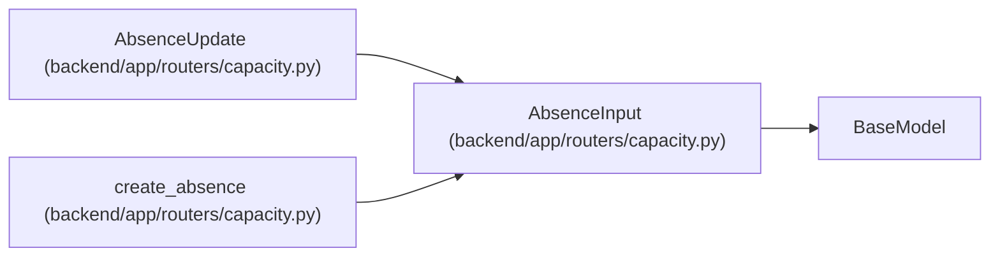

# AbsenceInput

**Location:** `backend/app/routers/capacity.py:22`
**Kind:** Pydantic model
**Bases:** `BaseModel`
**Module:** [routers_capacity](../modules/routers_capacity.md)

## Description

_Auto-generated from `AbsenceInput` in `backend/app/routers/capacity.py`._

## Attributes

| Name | Type | Wire name | Required | Nullable | Default | Constraints | Examples | Description |
|------|------|-----------|----------|----------|---------|-------------|-------------|----------|
| `start_date` | `date` | `start_date` | Yes | No | — | — | — | — |
| `end_date` | `date` | `end_date` | Yes | No | — | — | — | — |

## Methods

*No public methods. Inherits from base classes.*

## Relationships

<!-- Auto-generated relationship summary. Do not edit by hand. -->

### Summary

| Module | Methods | Attributes |
|---|---:|---|
| [routers_capacity](../modules/routers_capacity.md) | 0 | `end_date`, `start_date` |

### Structure

| Kind | Entity | Module |
|---|---|---|
| Base | `BaseModel` | — |
| Subclass | `AbsenceUpdate` | [routers_capacity](../modules/routers_capacity.md) |

### References

| Reference | Kind | Source | Call sites |
|---|---|---|---:|
| `create_absence` | type_reference | [routers_capacity](../modules/routers_capacity.md) | — |
