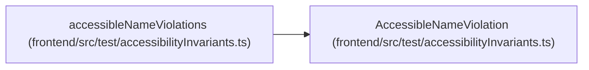

# AccessibleNameViolation

**Location:** `frontend/src/test/accessibilityInvariants.ts:16`
**Kind:** Class
**Bases:** —
**Module:** [accessibilityInvariants](../modules/accessibilityInvariants.md)

## Description

_Auto-generated from `AccessibleNameViolation` in `frontend/src/test/accessibilityInvariants.ts`._

## Attributes

| Name | Type | Required | Default | Description |
|------|------|----------|---------|-------------|
| `names` | `string[]` | Yes | — | — |
| `role` | `string` | Yes | — | — |

## Methods

*No public methods. Inherits from base classes.*

## Relationships

<!-- Auto-generated relationship summary. Do not edit by hand. -->

### Summary

| Module | Methods | Attributes |
|---|---:|---|
| [accessibilityInvariants](../modules/accessibilityInvariants.md) | 0 | `names`, `role` |

### References

| Reference | Kind | Source | Call sites |
|---|---|---|---:|
| `accessibleNameViolations` | type_reference | [accessibilityInvariants](../modules/accessibilityInvariants.md) | — |
