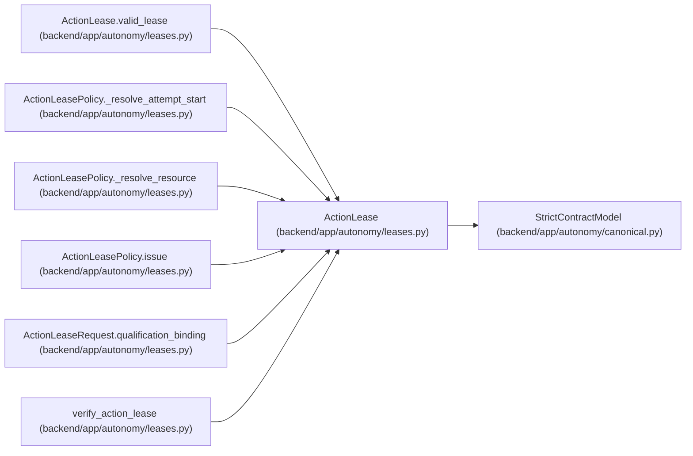

# ActionLease

**Location:** `backend/app/autonomy/leases.py:76`
**Kind:** Pydantic model
**Bases:** `StrictContractModel`
**Module:** [leases](../modules/leases.md)

## Description

_Auto-generated from `ActionLease` in `backend/app/autonomy/leases.py`._

## Validators

| Method | Scope | Fields | Mode | Options |
|--------|-------|--------|------|---------|
| `valid_lease` | model | — | after | — |

## Attributes

| Name | Type | Wire name | Required | Nullable | Default | Constraints | Examples | Description |
|------|------|-----------|----------|----------|---------|-------------|-------------|----------|
| `schema_version` | `Literal['workchord-action-lease-v1']` | `schema_version` | No | No | `'workchord-action-lease-v1'` | — | — | — |
| `lease_id` | `str` | `lease_id` | Yes | No | — | pattern=unknown (SHA256_PATTERN) | — | — |
| `run_id` | `str` | `run_id` | Yes | No | — | pattern=unknown (IDENTIFIER_PATTERN) | — | — |
| `task_id` | `str` | `task_id` | Yes | No | — | pattern=unknown (IDENTIFIER_PATTERN) | — | — |
| `stage_id` | `str` | `stage_id` | Yes | No | — | pattern=unknown (IDENTIFIER_PATTERN) | — | — |
| `action` | `str` | `action` | Yes | No | — | max_length=255; min_length=1 | — | — |
| `environment` | `Literal['ephemeral', 'rehearsal', 'production']` | `environment` | Yes | No | — | — | — | — |
| `destructive` | `bool` | `destructive` | Yes | No | — | — | — | — |
| `release_fingerprint` | `str` | `release_fingerprint` | Yes | No | — | pattern=unknown (SHA256_PATTERN) | — | — |
| `charter_digest` | `str` | `charter_digest` | Yes | No | — | pattern=unknown (SHA256_PATTERN) | — | — |
| `contract_manifest_digest` | `str` | `contract_manifest_digest` | Yes | No | — | pattern=unknown (SHA256_PATTERN) | — | — |
| `resource_logical_key` | `str` | `resource_logical_key` | Yes | No | — | pattern=unknown (IDENTIFIER_PATTERN) | — | — |
| `resource_ref` | `str` | `resource_ref` | Yes | No | — | max_length=2048; pattern=unknown (OPAQUE_REF_PATTERN) | — | — |
| `resource_generation` | `str` | `resource_generation` | Yes | No | — | max_length=255; min_length=1 | — | — |
| `topology_revision` | `int` | `topology_revision` | Yes | No | — | ge=1 | — | — |
| `attempt_id` | `int` | `attempt_id` | Yes | No | — | ge=1 | — | — |
| `attempt_start_digest` | `str` | `attempt_start_digest` | Yes | No | — | pattern=unknown (SHA256_PATTERN) | — | — |
| `attempt_start_sequence` | `int` | `attempt_start_sequence` | Yes | No | — | ge=1 | — | — |
| `ledger_head_at_issue` | `str` | `ledger_head_at_issue` | Yes | No | — | pattern=unknown (SHA256_PATTERN) | — | — |
| `issued_at` | `datetime` | `issued_at` | Yes | No | — | — | — | — |
| `expires_at` | `datetime` | `expires_at` | Yes | No | — | — | — | — |
| `maximum_calls` | `int` | `maximum_calls` | Yes | No | — | ge=1; le=100 | — | — |
| `budget_minor_units` | `int` | `budget_minor_units` | Yes | No | — | ge=0 | — | — |
| `nonce` | `str` | `nonce` | Yes | No | — | pattern=unknown (IDENTIFIER_PATTERN) | — | — |
| `lease_mode` | `Literal['bootstrap-revalidation', 'autonomous']` | `lease_mode` | Yes | No | — | — | — | — |
| `autonomy_qualified_report_digest` | `str \| None` | `autonomy_qualified_report_digest` | No | Yes | `None` | pattern=unknown (SHA256_PATTERN) | — | — |

## Methods

| Method | Signature | Decorators | Description |
|--------|-----------|------------|-------------|
| `valid_lease` | `() -> 'ActionLease'` | `@model_validator(mode='after')` | — |

## Relationships

<!-- Auto-generated relationship summary. Do not edit by hand. -->

### Summary

| Module | Methods | Attributes |
|---|---:|---|
| [leases](../modules/leases.md) | 1 | `action`, `attempt_id`, `attempt_start_digest`, `attempt_start_sequence`, `autonomy_qualified_report_digest`, `budget_minor_units`, `charter_digest`, `contract_manifest_digest`, `destructive`, `environment`, `expires_at`, `issued_at` |

### Structure

| Kind | Entity | Module |
|---|---|---|
| Base | `StrictContractModel` | [autonomy_canonical](../modules/autonomy_canonical.md) |

### References

| Reference | Kind | Source | Call sites |
|---|---|---|---:|
| `ActionLease.valid_lease` | type_reference | [leases](../modules/leases.md) | — |
| `ActionLeasePolicy._resolve_attempt_start` | type_reference | [leases](../modules/leases.md) | — |
| `ActionLeasePolicy._resolve_resource` | type_reference | [leases](../modules/leases.md) | — |
| `ActionLeasePolicy.issue` | call | [leases](../modules/leases.md) | 1 |
| `ActionLeasePolicy.issue` | type_reference | [leases](../modules/leases.md) | — |
| `ActionLeaseRequest.qualification_binding` | type_reference | [leases](../modules/leases.md) | — |
| `verify_action_lease` | type_reference | [leases](../modules/leases.md) | — |
