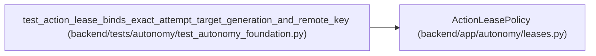

# ActionLeasePolicy

**Location:** `backend/app/autonomy/leases.py:132`
**Kind:** Class
**Bases:** —
**Module:** [leases](../modules/leases.md)

## Description

Non-generative issuer that cannot invent authority or attempt ancestry.

## Attributes

*No annotated attributes found.*

## Methods

| Method | Signature | Decorators | Description |
|--------|-----------|------------|-------------|
| `__init__` | `(*, charter: AutonomyCharter, charter_digest: str, contract_manifest_digest: str, release_fingerprint: str, ledger_backend: AttemptLedgerBackend, signer: RemoteSigner, signing_key_ref: str, signing_subject: str = 'pg-action-policy', clock: Callable[[], datetime] = lambda: datetime.now(UTC)) -> None` | — | — |
| `issue` | `(request: ActionLeaseRequest) -> SignedActionLease` | — | — |
| `_resolve_resource` | `(request: ActionLeaseRequest) -> ExactResourceBinding` | — | — |
| `_resolve_attempt_start` | `(request: ActionLeaseRequest) -> tuple[AttemptLedgerRecord, str]` | — | — |

## Relationships

<!-- Auto-generated relationship summary. Do not edit by hand. -->

### Summary

| Module | Methods | Attributes |
|---|---:|---|
| [leases](../modules/leases.md) | 4 | — |

### References

| Reference | Kind | Source | Call sites |
|---|---|---|---:|
| `test_action_lease_binds_exact_attempt_target_generation_and_remote_key` | call | [test_autonomy_foundation](../modules/test_autonomy_foundation.md) | 1 |
