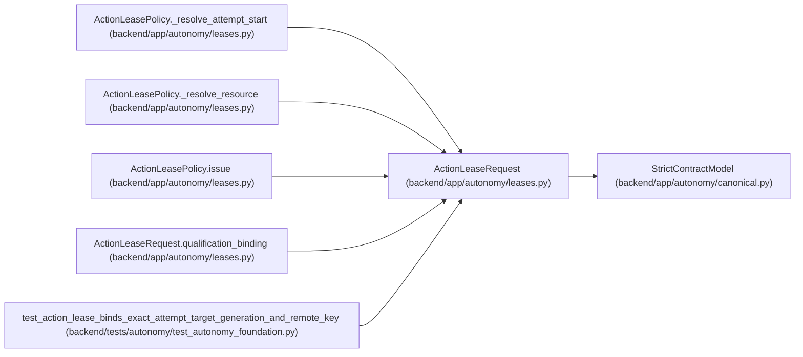

# ActionLeaseRequest

**Location:** `backend/app/autonomy/leases.py:33`
**Kind:** Pydantic model
**Bases:** `StrictContractModel`
**Module:** [leases](../modules/leases.md)

## Description

_Auto-generated from `ActionLeaseRequest` in `backend/app/autonomy/leases.py`._

## Validators

| Method | Scope | Fields | Mode | Options |
|--------|-------|--------|------|---------|
| `qualification_binding` | model | — | after | — |

## Attributes

| Name | Type | Wire name | Required | Nullable | Default | Constraints | Examples | Description |
|------|------|-----------|----------|----------|---------|-------------|-------------|----------|
| `run_id` | `str` | `run_id` | Yes | No | — | pattern=unknown (IDENTIFIER_PATTERN) | — | — |
| `task_id` | `str` | `task_id` | Yes | No | — | pattern=unknown (IDENTIFIER_PATTERN) | — | — |
| `stage_id` | `str` | `stage_id` | Yes | No | — | pattern=unknown (IDENTIFIER_PATTERN) | — | — |
| `action` | `str` | `action` | Yes | No | — | max_length=255; min_length=1 | — | — |
| `environment` | `Literal['ephemeral', 'rehearsal', 'production']` | `environment` | Yes | No | — | — | — | — |
| `destructive` | `bool` | `destructive` | No | No | `False` | — | — | — |
| `resource_logical_key` | `str` | `resource_logical_key` | Yes | No | — | pattern=unknown (IDENTIFIER_PATTERN) | — | — |
| `resource_ref` | `str` | `resource_ref` | Yes | No | — | max_length=2048; pattern=unknown (OPAQUE_REF_PATTERN) | — | — |
| `resource_generation` | `str` | `resource_generation` | Yes | No | — | max_length=255; min_length=1 | — | — |
| `topology_revision` | `int` | `topology_revision` | Yes | No | — | ge=1 | — | — |
| `attempt_id` | `int` | `attempt_id` | Yes | No | — | ge=1 | — | — |
| `attempt_start_digest` | `str` | `attempt_start_digest` | Yes | No | — | pattern=unknown (SHA256_PATTERN) | — | — |
| `attempt_start_sequence` | `int` | `attempt_start_sequence` | Yes | No | — | ge=1 | — | — |
| `ledger_head_at_request` | `str` | `ledger_head_at_request` | Yes | No | — | pattern=unknown (SHA256_PATTERN) | — | — |
| `requested_ttl_seconds` | `int` | `requested_ttl_seconds` | Yes | No | — | ge=1; le=3600 | — | — |
| `maximum_calls` | `int` | `maximum_calls` | Yes | No | — | ge=1; le=100 | — | — |
| `budget_minor_units` | `int` | `budget_minor_units` | Yes | No | — | ge=0 | — | — |
| `nonce` | `str` | `nonce` | Yes | No | — | pattern=unknown (IDENTIFIER_PATTERN) | — | — |
| `lease_mode` | `Literal['bootstrap-revalidation', 'autonomous']` | `lease_mode` | Yes | No | — | — | — | — |
| `autonomy_qualified_report_digest` | `str \| None` | `autonomy_qualified_report_digest` | No | Yes | `None` | pattern=unknown (SHA256_PATTERN) | — | — |

## Methods

| Method | Signature | Decorators | Description |
|--------|-----------|------------|-------------|
| `qualification_binding` | `() -> 'ActionLeaseRequest'` | `@model_validator(mode='after')` | — |

## Relationships

<!-- Auto-generated relationship summary. Do not edit by hand. -->

### Summary

| Module | Methods | Attributes |
|---|---:|---|
| [leases](../modules/leases.md) | 1 | `action`, `attempt_id`, `attempt_start_digest`, `attempt_start_sequence`, `autonomy_qualified_report_digest`, `budget_minor_units`, `destructive`, `environment`, `lease_mode`, `ledger_head_at_request`, `maximum_calls`, `nonce` |

### Structure

| Kind | Entity | Module |
|---|---|---|
| Base | `StrictContractModel` | [autonomy_canonical](../modules/autonomy_canonical.md) |

### References

| Reference | Kind | Source | Call sites |
|---|---|---|---:|
| `ActionLeasePolicy._resolve_attempt_start` | type_reference | [leases](../modules/leases.md) | — |
| `ActionLeasePolicy._resolve_resource` | type_reference | [leases](../modules/leases.md) | — |
| `ActionLeasePolicy.issue` | type_reference | [leases](../modules/leases.md) | — |
| `ActionLeaseRequest.qualification_binding` | type_reference | [leases](../modules/leases.md) | — |
| `test_action_lease_binds_exact_attempt_target_generation_and_remote_key` | call | [test_autonomy_foundation](../modules/test_autonomy_foundation.md) | 2 |
