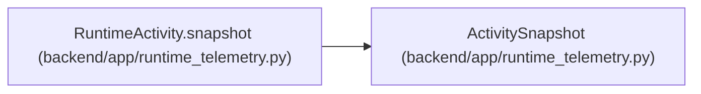

# ActivitySnapshot

**Location:** `backend/app/runtime_telemetry.py:137`
**Kind:** Class
**Bases:** —
**Module:** [runtime_telemetry](../modules/runtime_telemetry.md)

**Decorators:** `@dataclass(frozen=True)`

## Description

_Auto-generated from `ActivitySnapshot` in `backend/app/runtime_telemetry.py`._

## Attributes

| Name | Type | Default | Description |
|------|------|---------|-------------|
| `active_requests` | `int` | *required* | — |
| `active_mutations` | `int` | *required* | — |
| `active_transactions` | `int` | *required* | — |
| `checked_out_connections` | `int` | *required* | — |
| `worker_running` | `bool` | *required* | — |
| `worker_in_flight` | `int` | *required* | — |
| `worker_last_success_monotonic` | `float \| None` | *required* | — |

## Methods

*No public methods. Inherits from base classes.*

## Relationships

<!-- Auto-generated relationship summary. Do not edit by hand. -->

### Summary

| Module | Methods | Attributes |
|---|---:|---|
| [runtime_telemetry](../modules/runtime_telemetry.md) | 0 | `active_mutations`, `active_requests`, `active_transactions`, `checked_out_connections`, `worker_in_flight`, `worker_last_success_monotonic`, `worker_running` |

### References

| Reference | Kind | Source | Call sites |
|---|---|---|---:|
| `RuntimeActivity.snapshot` | call | [runtime_telemetry](../modules/runtime_telemetry.md) | 1 |
| `RuntimeActivity.snapshot` | type_reference | [runtime_telemetry](../modules/runtime_telemetry.md) | — |
