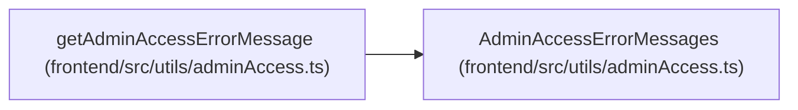

# AdminAccessErrorMessages

**Location:** `frontend/src/utils/adminAccess.ts:6`
**Kind:** Class
**Bases:** —
**Module:** [adminAccess](../modules/adminAccess.md)

## Description

_Auto-generated from `AdminAccessErrorMessages` in `frontend/src/utils/adminAccess.ts`._

## Attributes

| Name | Type | Required | Default | Description |
|------|------|----------|---------|-------------|
| `missingOrInvalid` | `string` | Yes | — | — |
| `backendNotConfigured` | `string` | Yes | — | — |
| `fallback` | `string` | Yes | — | — |

## Methods

*No public methods. Inherits from base classes.*

## Relationships

<!-- Auto-generated relationship summary. Do not edit by hand. -->

### Summary

| Module | Methods | Attributes |
|---|---:|---|
| [adminAccess](../modules/adminAccess.md) | 0 | `backendNotConfigured`, `fallback`, `missingOrInvalid` |

### References

| Reference | Kind | Source | Call sites |
|---|---|---|---:|
| `getAdminAccessErrorMessage` | type_reference | [adminAccess](../modules/adminAccess.md) | — |
