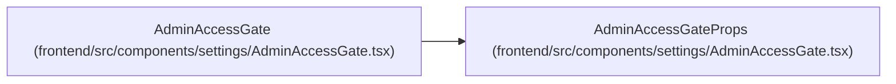

# AdminAccessGateProps

**Location:** `frontend/src/components/settings/AdminAccessGate.tsx:7`
**Kind:** Class
**Bases:** —
**Module:** [AdminAccessGate](../modules/AdminAccessGate.md)

## Description

_Auto-generated from `AdminAccessGateProps` in `frontend/src/components/settings/AdminAccessGate.tsx`._

## Attributes

| Name | Type | Required | Default | Description |
|------|------|----------|---------|-------------|
| `children` | `ReactNode` | Yes | — | — |
| `showPanel` | `boolean` | No | — | — |
| `recovery` | `ReactNode` | No | — | — |
| `accessGranted` | `boolean` | No | — | — |
| `headingLevel` | `2 \| 3` | No | — | — |

## Methods

*No public methods. Inherits from base classes.*

## Relationships

<!-- Auto-generated relationship summary. Do not edit by hand. -->

### Summary

| Module | Methods | Attributes |
|---|---:|---|
| [AdminAccessGate](../modules/AdminAccessGate.md) | 0 | `accessGranted`, `children`, `headingLevel`, `recovery`, `showPanel` |

### References

| Reference | Kind | Source | Call sites |
|---|---|---|---:|
| `AdminAccessGate` | type_reference | [AdminAccessGate](../modules/AdminAccessGate.md) | — |
