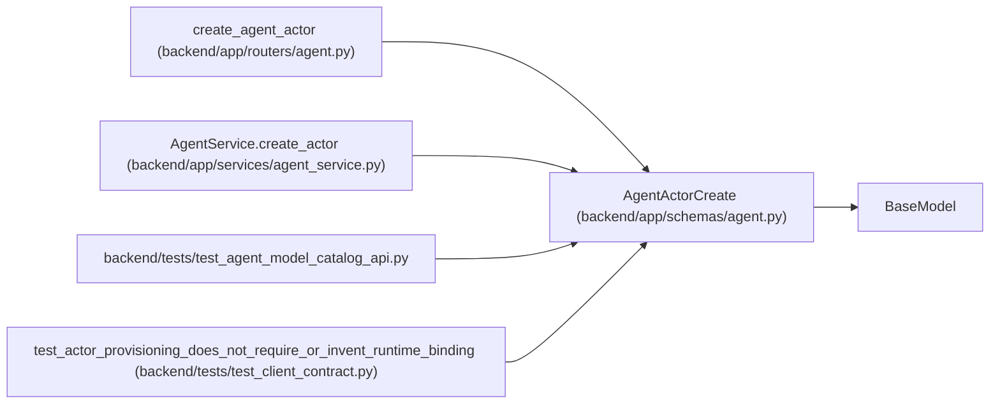

# AgentActorCreate

**Location:** `backend/app/schemas/agent.py:145`
**Kind:** Pydantic model
**Bases:** `BaseModel`
**Module:** [schemas_agent](../modules/schemas_agent.md)

## Description

Request for creating an agent actor.

## Model Configuration

| Setting | Value | Source |
|---------|-------|--------|
| `extra` | `'forbid'` | model_config |

## Validators

| Method | Scope | Fields | Mode | Options |
|--------|-------|--------|------|---------|
| `validate_scopes` | field | scopes | after | — |

## Attributes

| Name | Type | Wire name | Required | Nullable | Default | Constraints | Examples | Description |
|------|------|-----------|----------|----------|---------|-------------|-------------|----------|
| `name` | `str` | `name` | Yes | No | — | min_length=1; max_length=100 | — | — |
| `display_name` | `str` | `display_name` | Yes | No | — | min_length=1; max_length=255 | — | — |
| `scopes` | `list[str]` | `scopes` | No | No | factory: `list` | max_length=unknown (len(SUPPORTED_AGENT_SCOPES)) | — | — |
| `enabled` | `bool` | `enabled` | No | No | `True` | — | — | — |
| `role` | `Literal['pm', 'worker', 'verifier']` | `role` | No | No | `'worker'` | — | — | — |
| `profile_id` | `Optional[int]` | `profile_id` | No | Yes | `None` | — | — | — |
| `work_policy` | `Literal['assigned_only']` | `work_policy` | No | No | `'assigned_only'` | — | — | — |
| `max_parallel_work` | `Literal[1]` | `max_parallel_work` | No | No | `1` | — | — | — |
| `model_binding` | `Optional[AgentActorModelBindingCreate]` | `model_binding` | No | Yes | `None` | — | — | — |

## Methods

| Method | Signature | Decorators | Description |
|--------|-----------|------------|-------------|
| `validate_scopes` | `(value: list[str]) -> list[str]` | `@field_validator('scopes')`, `@classmethod` | — |

## Relationships

<!-- Auto-generated relationship summary. Do not edit by hand. -->

### Summary

| Module | Methods | Attributes |
|---|---:|---|
| [schemas_agent](../modules/schemas_agent.md) | 1 | `display_name`, `enabled`, `max_parallel_work`, `model_binding`, `name`, `profile_id`, `role`, `scopes`, `work_policy` |

### Structure

| Kind | Entity | Module |
|---|---|---|
| Base | `BaseModel` | — |

### References

| Reference | Kind | Source | Call sites |
|---|---|---|---:|
| `create_agent_actor` | type_reference | [routers_agent](../modules/routers_agent.md) | — |
| `AgentService.create_actor` | type_reference | [agent_service](../modules/agent_service.md) | — |
| `test_agent_model_catalog_api` | import | [test_agent_model_catalog_api](../modules/test_agent_model_catalog_api.md) | — |
| `test_actor_provisioning_does_not_require_or_invent_runtime_binding` | call | [test_client_contract](../modules/test_client_contract.md) | 1 |
