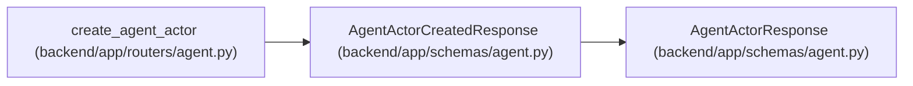

# AgentActorCreatedResponse

**Location:** `backend/app/schemas/agent.py:226`
**Kind:** Pydantic model
**Bases:** `AgentActorResponse`
**Module:** [schemas_agent](../modules/schemas_agent.md)

## Description

Agent actor creation response including the one-time API key.

## Attributes

| Name | Type | Wire name | Required | Nullable | Default | Constraints | Examples | Description |
|------|------|-----------|----------|----------|---------|-------------|-------------|----------|
| `api_key` | `str` | `api_key` | Yes | No | — | — | — | — |
| `model_binding_id` | `Optional[int]` | `model_binding_id` | No | Yes | `None` | — | — | — |
| `model_binding_revision` | `Optional[int]` | `model_binding_revision` | No | Yes | `None` | — | — | — |
| `model_catalog_key` | `Optional[str]` | `model_catalog_key` | No | Yes | `None` | — | — | — |

## Methods

*No public methods. Inherits from base classes.*

## Relationships

<!-- Auto-generated relationship summary. Do not edit by hand. -->

### Summary

| Module | Methods | Attributes |
|---|---:|---|
| [schemas_agent](../modules/schemas_agent.md) | 0 | `api_key`, `model_binding_id`, `model_binding_revision`, `model_catalog_key` |

### Structure

| Kind | Entity | Module |
|---|---|---|
| Base | `AgentActorResponse` | [schemas_agent](../modules/schemas_agent.md) |

### References

| Reference | Kind | Source | Call sites |
|---|---|---|---:|
| `create_agent_actor` | call | [routers_agent](../modules/routers_agent.md) | 1 |
| `create_agent_actor` | type_reference | [routers_agent](../modules/routers_agent.md) | — |
