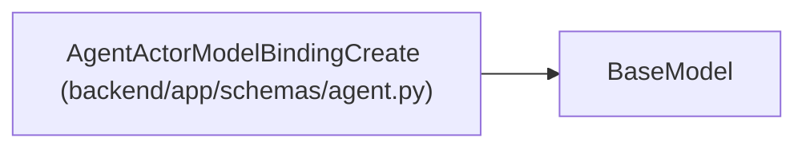

# AgentActorModelBindingCreate

**Location:** `backend/app/schemas/agent.py:107`
**Kind:** Pydantic model
**Bases:** `BaseModel`
**Module:** [schemas_agent](../modules/schemas_agent.md)

## Description

Secret-free model binding optionally created with a new actor.

## Model Configuration

| Setting | Value | Source |
|---------|-------|--------|
| `extra` | `'forbid'` | model_config |

## Validators

| Method | Scope | Fields | Mode | Options |
|--------|-------|--------|------|---------|
| `normalize_catalog_key` | field | model_catalog_key | after | — |
| `normalize_tags` | field | tool_tags, data_policy_tags | after | — |

## Attributes

| Name | Type | Wire name | Required | Nullable | Default | Constraints | Examples | Description |
|------|------|-----------|----------|----------|---------|-------------|-------------|----------|
| `model_catalog_key` | `str` | `model_catalog_key` | Yes | No | — | min_length=1; max_length=120 | — | — |
| `is_default` | `bool` | `is_default` | No | No | `True` | — | — | — |
| `tool_tags` | `list[str]` | `tool_tags` | No | No | factory: `list` | max_length=32 | — | — |
| `data_policy_tags` | `list[str]` | `data_policy_tags` | No | No | factory: `list` | max_length=32 | — | — |

## Methods

| Method | Signature | Decorators | Description |
|--------|-----------|------------|-------------|
| `normalize_catalog_key` | `(value: str) -> str` | `@field_validator('model_catalog_key')`, `@classmethod` | — |
| `normalize_tags` | `(values: list[str]) -> list[str]` | `@field_validator('tool_tags', 'data_policy_tags')`, `@classmethod` | — |

## Relationships

<!-- Auto-generated relationship summary. Do not edit by hand. -->

### Summary

| Module | Methods | Attributes |
|---|---:|---|
| [schemas_agent](../modules/schemas_agent.md) | 2 | `data_policy_tags`, `is_default`, `model_catalog_key`, `tool_tags` |

### Structure

| Kind | Entity | Module |
|---|---|---|
| Base | `BaseModel` | — |
