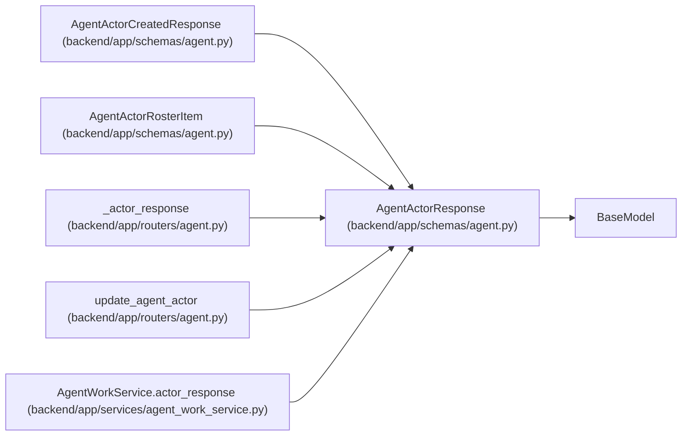

# AgentActorResponse

**Location:** `backend/app/schemas/agent.py:209`
**Kind:** Pydantic model
**Bases:** `BaseModel`
**Module:** [schemas_agent](../modules/schemas_agent.md)

## Description

Agent actor response.

## Attributes

| Name | Type | Wire name | Required | Nullable | Default | Constraints | Examples | Description |
|------|------|-----------|----------|----------|---------|-------------|-------------|----------|
| `id` | `int` | `id` | Yes | No | — | — | — | — |
| `name` | `str` | `name` | Yes | No | — | — | — | — |
| `display_name` | `str` | `display_name` | Yes | No | — | — | — | — |
| `scopes` | `list[str]` | `scopes` | No | No | `[]` | — | — | — |
| `enabled` | `bool` | `enabled` | Yes | No | — | — | — | — |
| `lifecycle_state` | `Literal['active', 'onboarding', 'disabled']` | `lifecycle_state` | No | No | `'active'` | — | — | — |
| `role` | `str` | `role` | No | No | `'worker'` | — | — | — |
| `profile_id` | `Optional[int]` | `profile_id` | No | Yes | `None` | — | — | — |
| `work_policy` | `str` | `work_policy` | No | No | `'assigned_only'` | — | — | — |
| `max_parallel_work` | `int` | `max_parallel_work` | No | No | `1` | — | — | — |
| `queue_revision` | `int` | `queue_revision` | No | No | `1` | — | — | — |
| `created_at` | `datetime` | `created_at` | Yes | No | — | — | — | — |
| `last_seen_at` | `Optional[datetime]` | `last_seen_at` | No | Yes | `None` | — | — | — |

## Methods

*No public methods. Inherits from base classes.*

## Relationships

<!-- Auto-generated relationship summary. Do not edit by hand. -->

### Summary

| Module | Methods | Attributes |
|---|---:|---|
| [schemas_agent](../modules/schemas_agent.md) | 0 | `created_at`, `display_name`, `enabled`, `id`, `last_seen_at`, `lifecycle_state`, `max_parallel_work`, `name`, `profile_id`, `queue_revision`, `role`, `scopes` |

### Structure

| Kind | Entity | Module |
|---|---|---|
| Base | `BaseModel` | — |
| Subclass | `AgentActorCreatedResponse` | [schemas_agent](../modules/schemas_agent.md) |
| Subclass | `AgentActorRosterItem` | [schemas_agent](../modules/schemas_agent.md) |

### References

| Reference | Kind | Source | Call sites |
|---|---|---|---:|
| `_actor_response` | call | [routers_agent](../modules/routers_agent.md) | 1 |
| `_actor_response` | type_reference | [routers_agent](../modules/routers_agent.md) | — |
| `update_agent_actor` | type_reference | [routers_agent](../modules/routers_agent.md) | — |
| `AgentWorkService.actor_response` | call | [agent_work_service](../modules/agent_work_service.md) | 1 |
| `AgentWorkService.actor_response` | type_reference | [agent_work_service](../modules/agent_work_service.md) | — |
