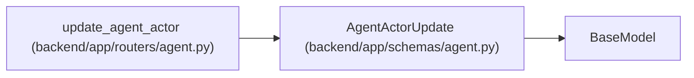

# AgentActorUpdate

**Location:** `backend/app/schemas/agent.py:168`
**Kind:** Pydantic model
**Bases:** `BaseModel`
**Module:** [schemas_agent](../modules/schemas_agent.md)

## Description

Administrative update for a provisioned actor.

## Validators

| Method | Scope | Fields | Mode | Options |
|--------|-------|--------|------|---------|
| `validate_scopes` | field | scopes | after | — |
| `reject_null_for_non_nullable_fields` | model | — | after | — |

## Attributes

| Name | Type | Wire name | Required | Nullable | Default | Constraints | Examples | Description |
|------|------|-----------|----------|----------|---------|-------------|-------------|----------|
| `display_name` | `Optional[str]` | `display_name` | No | Yes | `None` | min_length=1; max_length=255 | — | — |
| `scopes` | `Optional[list[str]]` | `scopes` | No | Yes | `None` | max_length=unknown (len(SUPPORTED_AGENT_SCOPES)) | — | — |
| `enabled` | `Optional[bool]` | `enabled` | No | Yes | `None` | — | — | — |
| `role` | `Optional[Literal['pm', 'worker', 'verifier']]` | `role` | No | Yes | `None` | — | — | — |
| `profile_id` | `Optional[int]` | `profile_id` | No | Yes | `None` | — | — | — |
| `work_policy` | `Optional[Literal['assigned_only']]` | `work_policy` | No | Yes | `None` | — | — | — |
| `max_parallel_work` | `Optional[Literal[1]]` | `max_parallel_work` | No | Yes | `None` | — | — | — |

## Methods

| Method | Signature | Decorators | Description |
|--------|-----------|------------|-------------|
| `validate_scopes` | `(value: Optional[list[str]]) -> Optional[list[str]]` | `@field_validator('scopes')`, `@classmethod` | — |
| `reject_null_for_non_nullable_fields` | `()` | `@model_validator(mode='after')` | Use [] to clear scopes; explicit null is invalid for required columns. |

## Relationships

<!-- Auto-generated relationship summary. Do not edit by hand. -->

### Summary

| Module | Methods | Attributes |
|---|---:|---|
| [schemas_agent](../modules/schemas_agent.md) | 2 | `display_name`, `enabled`, `max_parallel_work`, `profile_id`, `role`, `scopes`, `work_policy` |

### Structure

| Kind | Entity | Module |
|---|---|---|
| Base | `BaseModel` | — |

### References

| Reference | Kind | Source | Call sites |
|---|---|---|---:|
| `update_agent_actor` | type_reference | [routers_agent](../modules/routers_agent.md) | — |
