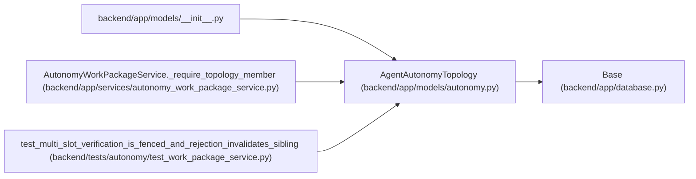

# AgentAutonomyTopology

**Location:** `backend/app/models/autonomy.py:25`
**Kind:** Class
**Bases:** `Base`
**Module:** [models_autonomy](../modules/models_autonomy.md)

## Description

Applied secret-free topology projection; external receipts stay authoritative.

## Attributes

| Name | Type | Default | Description |
|------|------|---------|-------------|
| `id` | `Mapped[int]` | `mapped_column(Integer, primary_key=True, autoincrement=True)` | — |
| `topology_key` | `Mapped[str]` | `mapped_column(String(100), unique=True, nullable=False)` | — |
| `revision` | `Mapped[int]` | `mapped_column(Integer, default=1, nullable=False)` | — |
| `manifest_digest` | `Mapped[str]` | `mapped_column(String(64), nullable=False)` | — |
| `charter_digest` | `Mapped[str]` | `mapped_column(String(64), nullable=False)` | — |
| `primary_actor_id` | `Mapped[Optional[int]]` | `mapped_column(Integer, ForeignKey('agent_actors.id', ondelete='RESTRICT'), nullable=True, unique=True)` | — |
| `state` | `Mapped[str]` | `mapped_column(String(30), default='planned', nullable=False)` | — |
| `external_journal_revision` | `Mapped[int]` | `mapped_column(Integer, default=0, nullable=False)` | — |
| `external_journal_head_digest` | `Mapped[str]` | `mapped_column(String(64), default='0' * 64, nullable=False)` | — |
| `applied_receipt_digest` | `Mapped[Optional[str]]` | `mapped_column(String(64), nullable=True)` | — |
| `blocker_codes` | `Mapped[str]` | `mapped_column(Text, default='[]', nullable=False)` | — |
| `created_at` | `Mapped[datetime]` | `mapped_column(UTCDateTime(), default=utc_now, nullable=False)` | — |
| `updated_at` | `Mapped[datetime]` | `mapped_column(UTCDateTime(), default=utc_now, onupdate=utc_now, nullable=False)` | — |
| `members` | `Mapped[list['AgentAutonomyTopologyMember']]` | `relationship('AgentAutonomyTopologyMember', back_populates='topology', passive_deletes=True)` | — |

## Methods

*No public methods. Inherits from base classes.*

## Relationships

<!-- Auto-generated relationship summary. Do not edit by hand. -->

### Summary

| Module | Methods | Attributes |
|---|---:|---|
| [models_autonomy](../modules/models_autonomy.md) | 0 | `applied_receipt_digest`, `blocker_codes`, `charter_digest`, `created_at`, `external_journal_head_digest`, `external_journal_revision`, `id`, `manifest_digest`, `members`, `primary_actor_id`, `revision`, `state` |

### Structure

| Kind | Entity | Module |
|---|---|---|
| Base | `Base` | [app_database](../modules/app_database.md) |

### References

| Reference | Kind | Source | Call sites |
|---|---|---|---:|
| `__init__` | import | [models___init__](../modules/models___init__.md) | — |
| `AutonomyWorkPackageService._require_topology_member` | type_reference | [autonomy_work_package_service](../modules/autonomy_work_package_service.md) | — |
| `test_multi_slot_verification_is_fenced_and_rejection_invalidates_sibling` | call | [test_work_package_service](../modules/test_work_package_service.md) | 1 |
