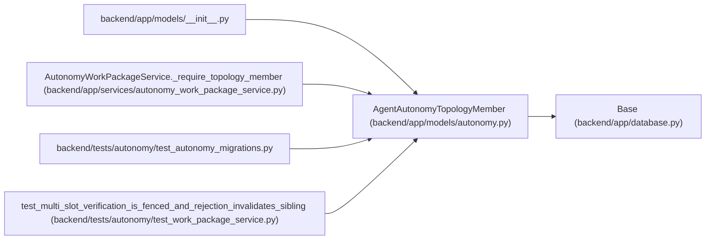

# AgentAutonomyTopologyMember

**Location:** `backend/app/models/autonomy.py:71`
**Kind:** Class
**Bases:** `Base`
**Module:** [models_autonomy](../modules/models_autonomy.md)

## Description

Stable logical-key to actor mapping and non-secret runtime readiness.

## Attributes

| Name | Type | Default | Description |
|------|------|---------|-------------|
| `id` | `Mapped[int]` | `mapped_column(Integer, primary_key=True, autoincrement=True)` | — |
| `topology_id` | `Mapped[int]` | `mapped_column(Integer, ForeignKey('agent_autonomy_topologies.id', ondelete='RESTRICT'), nullable=False)` | — |
| `logical_key` | `Mapped[str]` | `mapped_column(String(100), nullable=False)` | — |
| `actor_id` | `Mapped[Optional[int]]` | `mapped_column(Integer, ForeignKey('agent_actors.id', ondelete='RESTRICT'), nullable=True)` | — |
| `object_revision` | `Mapped[int]` | `mapped_column(Integer, default=1, nullable=False)` | — |
| `lifecycle_state` | `Mapped[str]` | `mapped_column(String(40), default='desired', nullable=False)` | — |
| `desired_member_digest` | `Mapped[str]` | `mapped_column(String(64), nullable=False)` | — |
| `independence_group` | `Mapped[str]` | `mapped_column(String(100), nullable=False)` | — |
| `role_package_checksum` | `Mapped[str]` | `mapped_column(String(64), nullable=False)` | — |
| `external_identity_binding_digest` | `Mapped[str]` | `mapped_column(String(64), nullable=False)` | — |
| `runtime_attestation_digest` | `Mapped[Optional[str]]` | `mapped_column(String(64), nullable=True)` | — |
| `credential_delivery_receipt_digest` | `Mapped[Optional[str]]` | `mapped_column(String(64), nullable=True)` | — |
| `runtime_acknowledgement_digest` | `Mapped[Optional[str]]` | `mapped_column(String(64), nullable=True)` | — |
| `created_at` | `Mapped[datetime]` | `mapped_column(UTCDateTime(), default=utc_now, nullable=False)` | — |
| `updated_at` | `Mapped[datetime]` | `mapped_column(UTCDateTime(), default=utc_now, onupdate=utc_now, nullable=False)` | — |
| `topology` | `Mapped[AgentAutonomyTopology]` | `relationship('AgentAutonomyTopology', back_populates='members')` | — |

## Methods

*No public methods. Inherits from base classes.*

## Relationships

<!-- Auto-generated relationship summary. Do not edit by hand. -->

### Summary

| Module | Methods | Attributes |
|---|---:|---|
| [models_autonomy](../modules/models_autonomy.md) | 0 | `actor_id`, `created_at`, `credential_delivery_receipt_digest`, `desired_member_digest`, `external_identity_binding_digest`, `id`, `independence_group`, `lifecycle_state`, `logical_key`, `object_revision`, `role_package_checksum`, `runtime_acknowledgement_digest` |

### Structure

| Kind | Entity | Module |
|---|---|---|
| Base | `Base` | [app_database](../modules/app_database.md) |

### References

| Reference | Kind | Source | Call sites |
|---|---|---|---:|
| `__init__` | import | [models___init__](../modules/models___init__.md) | — |
| `AutonomyWorkPackageService._require_topology_member` | type_reference | [autonomy_work_package_service](../modules/autonomy_work_package_service.md) | — |
| `test_autonomy_migrations` | import | [test_autonomy_migrations](../modules/test_autonomy_migrations.md) | — |
| `test_multi_slot_verification_is_fenced_and_rejection_invalidates_sibling` | call | [test_work_package_service](../modules/test_work_package_service.md) | 1 |
