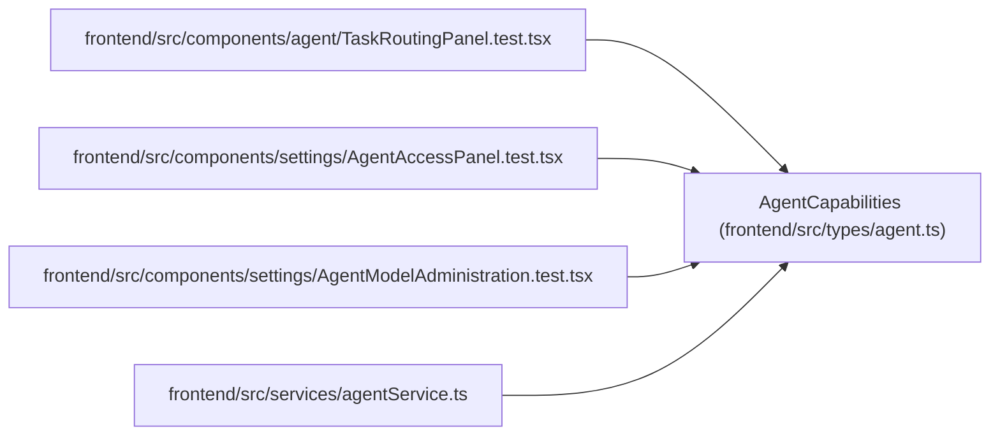

# AgentCapabilities

**Location:** `frontend/src/types/agent.ts:144`
**Kind:** Class
**Bases:** —
**Module:** [types_agent](../modules/types_agent.md)

## Description

_Auto-generated from `AgentCapabilities` in `frontend/src/types/agent.ts`._

## Attributes

| Name | Type | Required | Default | Description |
|------|------|----------|---------|-------------|
| `server_version` | `string` | Yes | — | — |
| `api_contract` | `string` | Yes | — | — |
| `actor` | `AgentActor` | Yes | — | — |
| `scopes` | `string[]` | Yes | — | — |
| `lease_limits` | `Record<string, number>` | Yes | — | — |
| `features` | `string[]` | Yes | — | — |
| `model_aware_routing` | `ModelAwareRoutingStatus` | Yes | — | — |
| `recommended_skills` | `Record<string, string>` | Yes | — | — |
| `lifecycle_actions` | `string[]` | Yes | — | — |
| `skill_catalog_version` | `string \| null` | Yes | — | — |
| `skill_catalog_url` | `string \| null` | Yes | — | — |
| `skill_discovery_url` | `string \| null` | Yes | — | — |

## Methods

*No public methods. Inherits from base classes.*

## Relationships

<!-- Auto-generated relationship summary. Do not edit by hand. -->

### Summary

| Module | Methods | Attributes |
|---|---:|---|
| [types_agent](../modules/types_agent.md) | 0 | `actor`, `api_contract`, `features`, `lease_limits`, `lifecycle_actions`, `model_aware_routing`, `recommended_skills`, `scopes`, `server_version`, `skill_catalog_url`, `skill_catalog_version`, `skill_discovery_url` |

### References

| Reference | Kind | Source | Call sites |
|---|---|---|---:|
| `TaskRoutingPanel.test` | import | [TaskRoutingPanel.test](../modules/TaskRoutingPanel.test.md) | — |
| `AgentAccessPanel.test` | import | [AgentAccessPanel.test](../modules/AgentAccessPanel.test.md) | — |
| `AgentModelAdministration.test` | import | [AgentModelAdministration.test](../modules/AgentModelAdministration.test.md) | — |
| `agentService` | import | [agentService](../modules/agentService.md) | — |
