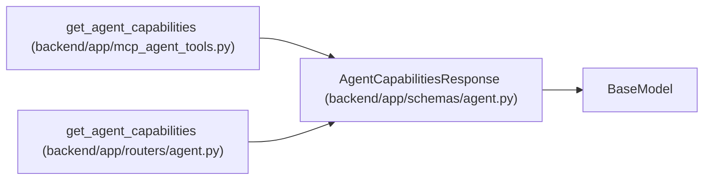

# AgentCapabilitiesResponse

**Location:** `backend/app/schemas/agent.py:687`
**Kind:** Pydantic model
**Bases:** `BaseModel`
**Module:** [schemas_agent](../modules/schemas_agent.md)

## Description

Authenticated REST/MCP compatibility handshake with shared readiness semantics. Actor/model configuration and revision-bound self-report are distinct from concrete-task eligibility, provider/runtime availability and independent model attestation. Lease and role limits remain authoritative.

## Attributes

| Name | Type | Wire name | Required | Nullable | Default | Constraints | Examples | Description |
|------|------|-----------|----------|----------|---------|-------------|-------------|----------|
| `server_version` | `str` | `server_version` | Yes | No | — | — | — | — |
| `api_contract` | `str` | `api_contract` | Yes | No | — | — | — | — |
| `actor` | `AgentActorResponse` | `actor` | Yes | No | — | — | — | — |
| `scopes` | `list[str]` | `scopes` | Yes | No | — | — | — | — |
| `lease_limits` | `dict[str, int]` | `lease_limits` | Yes | No | — | — | — | — |
| `features` | `list[str]` | `features` | Yes | No | — | — | — | — |
| `recommended_skills` | `dict[str, str]` | `recommended_skills` | Yes | No | — | — | — | — |
| `lifecycle_actions` | `list[str]` | `lifecycle_actions` | No | No | factory: `list` | — | — | — |
| `skill_catalog_version` | `Optional[str]` | `skill_catalog_version` | No | Yes | `None` | — | — | — |
| `skill_catalog_url` | `Optional[str]` | `skill_catalog_url` | No | Yes | `None` | — | — | — |
| `skill_discovery_url` | `Optional[str]` | `skill_discovery_url` | No | Yes | `None` | — | — | — |
| `model_aware_routing` | `AgentRoutingRolloutStatusResponse` | `model_aware_routing` | Yes | No | — | — | — | — |
| `readiness_semantics` | `dict[str, str]` | `readiness_semantics` | No | No | factory: `lambda: {'configuration': 'actor_and_model_metadata', 'acknowledgement': 'exact_revision_bound_runtime_self_report', 'task_eligibility': 'requires_current_task_and_fenced_work_decision', 'runtime_availability': 'unknown_without_observation', 'model_attestation': 'not_independently_attested'}` | — | — | — |

## Methods

*No public methods. Inherits from base classes.*

## Relationships

<!-- Auto-generated relationship summary. Do not edit by hand. -->

### Summary

| Module | Methods | Attributes |
|---|---:|---|
| [schemas_agent](../modules/schemas_agent.md) | 0 | `actor`, `api_contract`, `features`, `lease_limits`, `lifecycle_actions`, `model_aware_routing`, `readiness_semantics`, `recommended_skills`, `scopes`, `server_version`, `skill_catalog_url`, `skill_catalog_version` |

### Structure

| Kind | Entity | Module |
|---|---|---|
| Base | `BaseModel` | — |

### References

| Reference | Kind | Source | Call sites |
|---|---|---|---:|
| `get_agent_capabilities` | call | [mcp_agent_tools](../modules/mcp_agent_tools.md) | 1 |
| `get_agent_capabilities` | call | [routers_agent](../modules/routers_agent.md) | 1 |
| `get_agent_capabilities` | type_reference | [routers_agent](../modules/routers_agent.md) | — |
