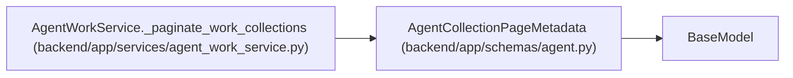

# AgentCollectionPageMetadata

**Location:** `backend/app/schemas/agent.py:793`
**Kind:** Pydantic model
**Bases:** `BaseModel`
**Module:** [schemas_agent](../modules/schemas_agent.md)

## Description

Per-collection counts for compound assigned-work pages.

## Attributes

| Name | Type | Wire name | Required | Nullable | Default | Constraints | Examples | Description |
|------|------|-----------|----------|----------|---------|-------------|-------------|----------|
| `returned` | `int` | `returned` | Yes | No | — | ge=0 | — | — |
| `has_more` | `bool` | `has_more` | No | No | `False` | — | — | — |

## Methods

*No public methods. Inherits from base classes.*

## Relationships

<!-- Auto-generated relationship summary. Do not edit by hand. -->

### Summary

| Module | Methods | Attributes |
|---|---:|---|
| [schemas_agent](../modules/schemas_agent.md) | 0 | `has_more`, `returned` |

### Structure

| Kind | Entity | Module |
|---|---|---|
| Base | `BaseModel` | — |

### References

| Reference | Kind | Source | Call sites |
|---|---|---|---:|
| `AgentWorkService._paginate_work_collections` | call | [agent_work_service](../modules/agent_work_service.md) | 2 |
