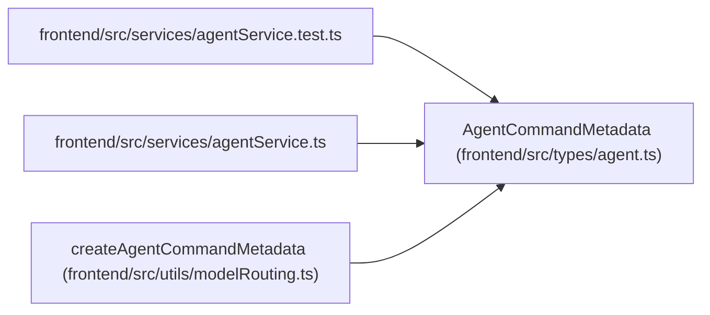

# AgentCommandMetadata

**Location:** `frontend/src/types/agent.ts:94`
**Kind:** Class
**Bases:** —
**Module:** [types_agent](../modules/types_agent.md)

## Description

_Auto-generated from `AgentCommandMetadata` in `frontend/src/types/agent.ts`._

## Attributes

| Name | Type | Required | Default | Description |
|------|------|----------|---------|-------------|
| `idempotencyKey` | `string` | Yes | — | — |
| `rationale` | `string` | Yes | — | — |
| `correlationId` | `string` | Yes | — | — |

## Methods

*No public methods. Inherits from base classes.*

## Relationships

<!-- Auto-generated relationship summary. Do not edit by hand. -->

### Summary

| Module | Methods | Attributes |
|---|---:|---|
| [types_agent](../modules/types_agent.md) | 0 | `correlationId`, `idempotencyKey`, `rationale` |

### References

| Reference | Kind | Source | Call sites |
|---|---|---|---:|
| `agentService.test` | import | [agentService.test](../modules/agentService.test.md) | — |
| `agentService` | import | [agentService](../modules/agentService.md) | — |
| `createAgentCommandMetadata` | type_reference | [modelRouting](../modules/modelRouting.md) | — |
