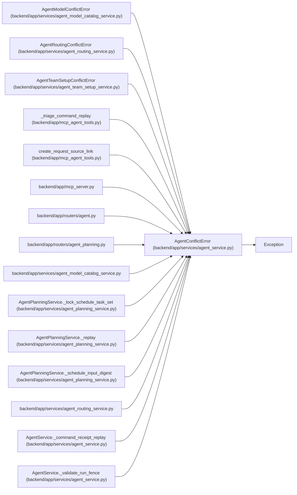

# AgentConflictError

**Location:** `backend/app/services/agent_service.py:54`
**Kind:** Class
**Bases:** `Exception`
**Module:** [agent_service](../modules/agent_service.md)

## Description

Raised when an agent operation conflicts with current task state.

## Attributes

*No annotated attributes found.*

## Methods

*No public methods. Inherits from base classes.*

## Relationships

<!-- Auto-generated relationship summary. Do not edit by hand. -->

### Summary

| Module | Methods | Attributes |
|---|---:|---|
| [agent_service](../modules/agent_service.md) | 0 | — |

### Structure

| Kind | Entity | Module |
|---|---|---|
| Base | `Exception` | — |
| Subclass | `AgentModelConflictError` | [agent_model_catalog_service](../modules/agent_model_catalog_service.md) |
| Subclass | `AgentRoutingConflictError` | [agent_routing_service](../modules/agent_routing_service.md) |
| Subclass | `AgentTeamSetupConflictError` | [agent_team_setup_service](../modules/agent_team_setup_service.md) |

### References

| Reference | Kind | Source | Call sites |
|---|---|---|---:|
| `_triage_command_replay` | call | [mcp_agent_tools](../modules/mcp_agent_tools.md) | 3 |
| `create_request_source_link` | call | [mcp_agent_tools](../modules/mcp_agent_tools.md) | 3 |
| `mcp_server` | import | [mcp_server](../modules/mcp_server.md) | — |
| `agent` | import | [routers_agent](../modules/routers_agent.md) | — |
| `agent_planning` | import | [routers_agent_planning](../modules/routers_agent_planning.md) | — |
| `agent_model_catalog_service` | import | [agent_model_catalog_service](../modules/agent_model_catalog_service.md) | — |
| `AgentPlanningService._lock_schedule_task_set` | call | [agent_planning_service](../modules/agent_planning_service.md) | 2 |
| `AgentPlanningService._replay` | call | [agent_planning_service](../modules/agent_planning_service.md) | 2 |
| `AgentPlanningService._schedule_input_digest` | call | [agent_planning_service](../modules/agent_planning_service.md) | 1 |
| `agent_routing_service` | import | [agent_routing_service](../modules/agent_routing_service.md) | — |
| `AgentService._command_receipt_replay` | call | [agent_service](../modules/agent_service.md) | 3 |
| `AgentService._validate_run_fence` | call | [agent_service](../modules/agent_service.md) | 1 |

> References: showing 12 of 50 logical references; 38 omitted by the 12-row generated summary limit.
