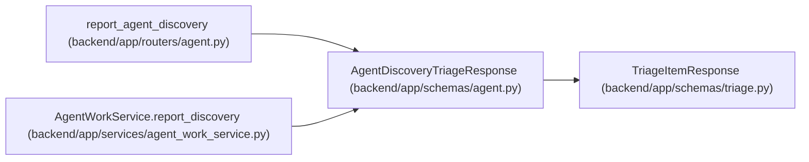

# AgentDiscoveryTriageResponse

**Location:** `backend/app/schemas/agent.py:1138`
**Kind:** Pydantic model
**Bases:** `TriageItemResponse`
**Module:** [schemas_agent](../modules/schemas_agent.md)

## Description

Created discovery Triage item with source linkage metadata.

## Attributes

*No annotated attributes found.*

## Methods

*No public methods. Inherits from base classes.*

## Relationships

<!-- Auto-generated relationship summary. Do not edit by hand. -->

### Summary

| Module | Methods | Attributes |
|---|---:|---|
| [schemas_agent](../modules/schemas_agent.md) | 0 | — |

### Structure

| Kind | Entity | Module |
|---|---|---|
| Base | `TriageItemResponse` | [schemas_triage](../modules/schemas_triage.md) |

### References

| Reference | Kind | Source | Call sites |
|---|---|---|---:|
| `report_agent_discovery` | type_reference | [routers_agent](../modules/routers_agent.md) | — |
| `AgentWorkService.report_discovery` | type_reference | [agent_work_service](../modules/agent_work_service.md) | — |
