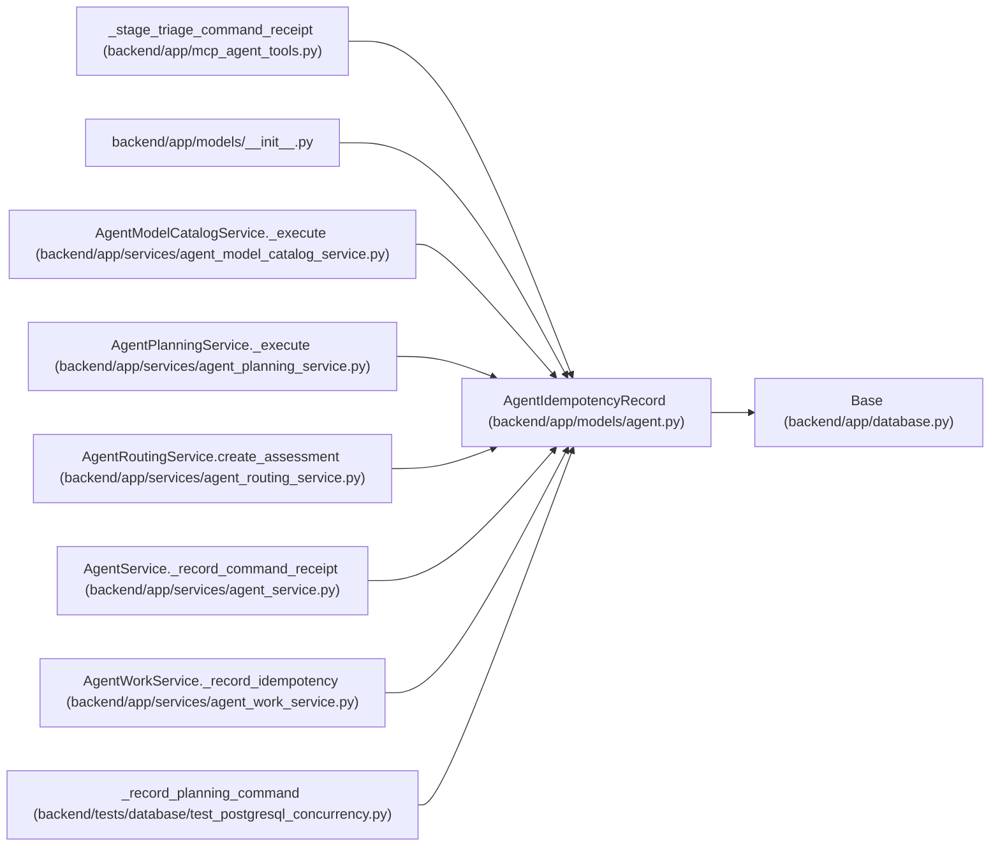

# AgentIdempotencyRecord

**Location:** `backend/app/models/agent.py:955`
**Kind:** Class
**Bases:** `Base`
**Module:** [models_agent](../modules/models_agent.md)

## Description

Replay-safe record for agent and PM mutations.

## Attributes

| Name | Type | Default | Description |
|------|------|---------|-------------|
| `id` | `Mapped[int]` | `mapped_column(Integer, primary_key=True, autoincrement=True)` | — |
| `actor_id` | `Mapped[int]` | `mapped_column(Integer, ForeignKey('agent_actors.id', ondelete='CASCADE'), nullable=False, index=True)` | — |
| `operation` | `Mapped[str]` | `mapped_column(String(100), nullable=False)` | — |
| `target_type` | `Mapped[str]` | `mapped_column(String(50), nullable=False)` | — |
| `target_id` | `Mapped[int]` | `mapped_column(Integer, nullable=False)` | — |
| `idempotency_key` | `Mapped[str]` | `mapped_column(String(255), nullable=False)` | — |
| `request_hash` | `Mapped[str]` | `mapped_column(String(64), nullable=False)` | — |
| `response_payload` | `Mapped[str]` | `mapped_column(Text, default='{}', nullable=False)` | — |
| `created_at` | `Mapped[datetime]` | `mapped_column(UTCDateTime(), default=utc_now, nullable=False, index=True)` | — |

## Methods

*No public methods. Inherits from base classes.*

## Relationships

<!-- Auto-generated relationship summary. Do not edit by hand. -->

### Summary

| Module | Methods | Attributes |
|---|---:|---|
| [models_agent](../modules/models_agent.md) | 0 | `actor_id`, `created_at`, `id`, `idempotency_key`, `operation`, `request_hash`, `response_payload`, `target_id`, `target_type` |

### Structure

| Kind | Entity | Module |
|---|---|---|
| Base | `Base` | [app_database](../modules/app_database.md) |

### References

| Reference | Kind | Source | Call sites |
|---|---|---|---:|
| `_stage_triage_command_receipt` | call | [mcp_agent_tools](../modules/mcp_agent_tools.md) | 1 |
| `__init__` | import | [models___init__](../modules/models___init__.md) | — |
| `AgentModelCatalogService._execute` | call | [agent_model_catalog_service](../modules/agent_model_catalog_service.md) | 1 |
| `AgentPlanningService._execute` | call | [agent_planning_service](../modules/agent_planning_service.md) | 1 |
| `AgentRoutingService.create_assessment` | call | [agent_routing_service](../modules/agent_routing_service.md) | 1 |
| `AgentService._record_command_receipt` | call | [agent_service](../modules/agent_service.md) | 1 |
| `AgentWorkService._record_idempotency` | call | [agent_work_service](../modules/agent_work_service.md) | 1 |
| `_record_planning_command` | call | [test_postgresql_concurrency](../modules/test_postgresql_concurrency.md) | 1 |
