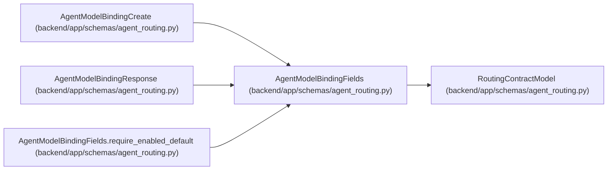

# AgentModelBindingFields

**Location:** `backend/app/schemas/agent_routing.py:373`
**Kind:** Pydantic model
**Bases:** `RoutingContractModel`
**Module:** [agent_routing](../modules/agent_routing.md)

## Description

Versioned runtime binding owned by one exact actor.

## Validators

| Method | Scope | Fields | Mode | Options |
|--------|-------|--------|------|---------|
| `validate_tool_tags` | field | tool_tags | after | — |
| `validate_data_policy_tags` | field | data_policy_tags | after | — |
| `require_enabled_default` | model | — | after | — |

## Attributes

| Name | Type | Wire name | Required | Nullable | Default | Constraints | Examples | Description |
|------|------|-----------|----------|----------|---------|-------------|-------------|----------|
| `actor_id` | `int` | `actor_id` | Yes | No | — | ge=1 | — | — |
| `model_catalog_id` | `int` | `model_catalog_id` | Yes | No | — | ge=1 | — | — |
| `is_default` | `bool` | `is_default` | No | No | `False` | — | — | — |
| `enabled` | `bool` | `enabled` | No | No | `True` | — | — | — |
| `tool_tags` | `list[str]` | `tool_tags` | No | No | factory: `list` | — | — | — |
| `data_policy_tags` | `list[str]` | `data_policy_tags` | No | No | factory: `list` | — | — | — |
| `revision` | `PositiveRevision` | `revision` | No | No | `1` | — | — | — |

## Methods

| Method | Signature | Decorators | Description |
|--------|-----------|------------|-------------|
| `validate_tool_tags` | `(value: list[str]) -> list[str]` | `@field_validator('tool_tags')`, `@classmethod` | — |
| `validate_data_policy_tags` | `(value: list[str]) -> list[str]` | `@field_validator('data_policy_tags')`, `@classmethod` | — |
| `require_enabled_default` | `() -> 'AgentModelBindingFields'` | `@model_validator(mode='after')` | — |

## Relationships

<!-- Auto-generated relationship summary. Do not edit by hand. -->

### Summary

| Module | Methods | Attributes |
|---|---:|---|
| [agent_routing](../modules/agent_routing.md) | 3 | `actor_id`, `data_policy_tags`, `enabled`, `is_default`, `model_catalog_id`, `revision`, `tool_tags` |

### Structure

| Kind | Entity | Module |
|---|---|---|
| Base | `RoutingContractModel` | [agent_routing](../modules/agent_routing.md) |
| Subclass | `AgentModelBindingCreate` | [agent_routing](../modules/agent_routing.md) |
| Subclass | `AgentModelBindingResponse` | [agent_routing](../modules/agent_routing.md) |

### References

| Reference | Kind | Source | Call sites |
|---|---|---|---:|
| `AgentModelBindingFields.require_enabled_default` | type_reference | [agent_routing](../modules/agent_routing.md) | — |
