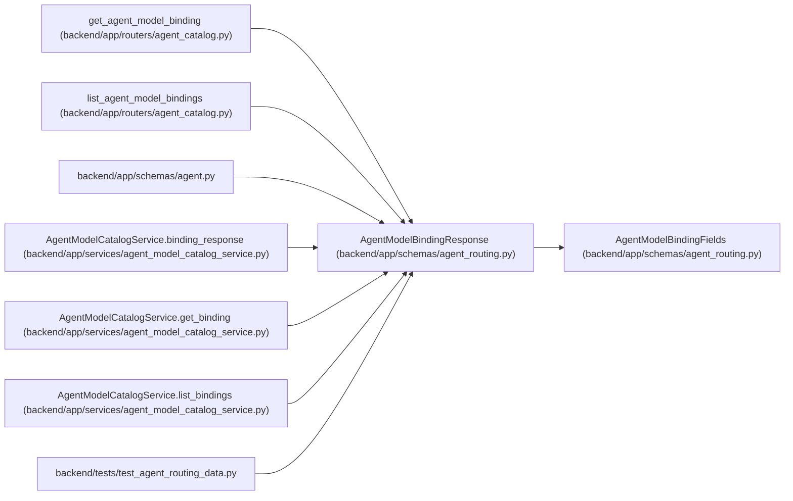

# AgentModelBindingResponse

**Location:** `backend/app/schemas/agent_routing.py:473`
**Kind:** Pydantic model
**Bases:** `AgentModelBindingFields`
**Module:** [agent_routing](../modules/agent_routing.md)

## Description

Persisted binding projection.

## Attributes

| Name | Type | Wire name | Required | Nullable | Default | Constraints | Examples | Description |
|------|------|-----------|----------|----------|---------|-------------|-------------|----------|
| `id` | `int` | `id` | Yes | No | — | — | — | — |
| `model_catalog_key` | `str \| None` | `model_catalog_key` | No | Yes | `None` | — | — | — |
| `selectable` | `bool` | `selectable` | No | No | `False` | — | — | — |
| `model_catalog` | `AgentModelCatalogResponse \| None` | `model_catalog` | No | Yes | `None` | — | — | — |
| `live_assignment_count` | `int` | `live_assignment_count` | No | No | `0` | — | — | — |
| `historical_assignment_count` | `int` | `historical_assignment_count` | No | No | `0` | — | — | — |
| `run_reference_count` | `int` | `run_reference_count` | No | No | `0` | — | — | — |
| `created_at` | `datetime` | `created_at` | Yes | No | — | — | — | — |
| `updated_at` | `datetime` | `updated_at` | Yes | No | — | — | — | — |

## Methods

*No public methods. Inherits from base classes.*

## Relationships

<!-- Auto-generated relationship summary. Do not edit by hand. -->

### Summary

| Module | Methods | Attributes |
|---|---:|---|
| [agent_routing](../modules/agent_routing.md) | 0 | `created_at`, `historical_assignment_count`, `id`, `live_assignment_count`, `model_catalog`, `model_catalog_key`, `run_reference_count`, `selectable`, `updated_at` |

### Structure

| Kind | Entity | Module |
|---|---|---|
| Base | `AgentModelBindingFields` | [agent_routing](../modules/agent_routing.md) |

### References

| Reference | Kind | Source | Call sites |
|---|---|---|---:|
| `get_agent_model_binding` | type_reference | [agent_catalog](../modules/agent_catalog.md) | — |
| `list_agent_model_bindings` | type_reference | [agent_catalog](../modules/agent_catalog.md) | — |
| `agent` | import | [schemas_agent](../modules/schemas_agent.md) | — |
| `AgentModelCatalogService.binding_response` | call | [agent_model_catalog_service](../modules/agent_model_catalog_service.md) | 1 |
| `AgentModelCatalogService.binding_response` | type_reference | [agent_model_catalog_service](../modules/agent_model_catalog_service.md) | — |
| `AgentModelCatalogService.get_binding` | type_reference | [agent_model_catalog_service](../modules/agent_model_catalog_service.md) | — |
| `AgentModelCatalogService.list_bindings` | type_reference | [agent_model_catalog_service](../modules/agent_model_catalog_service.md) | — |
| `test_agent_routing_data` | import | [test_agent_routing_data](../modules/test_agent_routing_data.md) | — |
