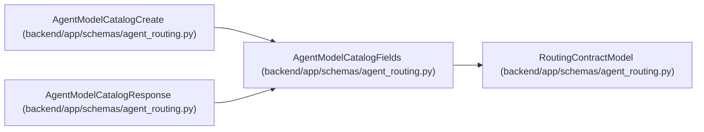

# AgentModelCatalogFields

**Location:** `backend/app/schemas/agent_routing.py:228`
**Kind:** Pydantic model
**Bases:** `RoutingContractModel`
**Module:** [agent_routing](../modules/agent_routing.md)

## Description

Secret-free provider-neutral model catalog fields.

## Validators

| Method | Scope | Fields | Mode | Options |
|--------|-------|--------|------|---------|
| `normalize_catalog_key` | field | key | before | — |
| `require_integer_reasoning_tier` | field | reasoning_tier | before | — |
| `strip_nonempty_text` | field | provider, configured_model_alias | after | — |
| `validate_modality_tags` | field | modality_tags | after | — |

## Attributes

| Name | Type | Wire name | Required | Nullable | Default | Constraints | Examples | Description |
|------|------|-----------|----------|----------|---------|-------------|-------------|----------|
| `key` | `RoutingKey` | `key` | Yes | No | — | — | — | — |
| `provider` | `str` | `provider` | Yes | No | — | min_length=1; max_length=120 | — | — |
| `configured_model_alias` | `str` | `configured_model_alias` | Yes | No | — | min_length=1; max_length=255 | — | — |
| `reasoning_tier` | `ReasoningTier` | `reasoning_tier` | Yes | No | — | — | — | — |
| `context_tier` | `ModelContextTier` | `context_tier` | Yes | No | — | — | — | — |
| `modality_tags` | `list[str]` | `modality_tags` | No | No | factory: `lambda: ['text']` | — | — | — |
| `cost_tier` | `ModelCostTier` | `cost_tier` | Yes | No | — | — | — | — |
| `latency_tier` | `ModelLatencyTier` | `latency_tier` | Yes | No | — | — | — | — |
| `enabled` | `bool` | `enabled` | No | No | `True` | — | — | — |
| `revision` | `PositiveRevision` | `revision` | No | No | `1` | — | — | — |
| `last_verified_at` | `datetime \| None` | `last_verified_at` | No | Yes | `None` | — | — | — |

## Methods

| Method | Signature | Decorators | Description |
|--------|-----------|------------|-------------|
| `normalize_catalog_key` | `(value: Any) -> Any` | `@field_validator('key', mode='before')`, `@classmethod` | — |
| `require_integer_reasoning_tier` | `(value: Any) -> Any` | `@field_validator('reasoning_tier', mode='before')`, `@classmethod` | — |
| `strip_nonempty_text` | `(value: str) -> str` | `@field_validator('provider', 'configured_model_alias')`, `@classmethod` | — |
| `validate_modality_tags` | `(value: list[str]) -> list[str]` | `@field_validator('modality_tags')`, `@classmethod` | — |

## Relationships

<!-- Auto-generated relationship summary. Do not edit by hand. -->

### Summary

| Module | Methods | Attributes |
|---|---:|---|
| [agent_routing](../modules/agent_routing.md) | 4 | `configured_model_alias`, `context_tier`, `cost_tier`, `enabled`, `key`, `last_verified_at`, `latency_tier`, `modality_tags`, `provider`, `reasoning_tier`, `revision` |

### Structure

| Kind | Entity | Module |
|---|---|---|
| Base | `RoutingContractModel` | [agent_routing](../modules/agent_routing.md) |
| Subclass | `AgentModelCatalogCreate` | [agent_routing](../modules/agent_routing.md) |
| Subclass | `AgentModelCatalogResponse` | [agent_routing](../modules/agent_routing.md) |
