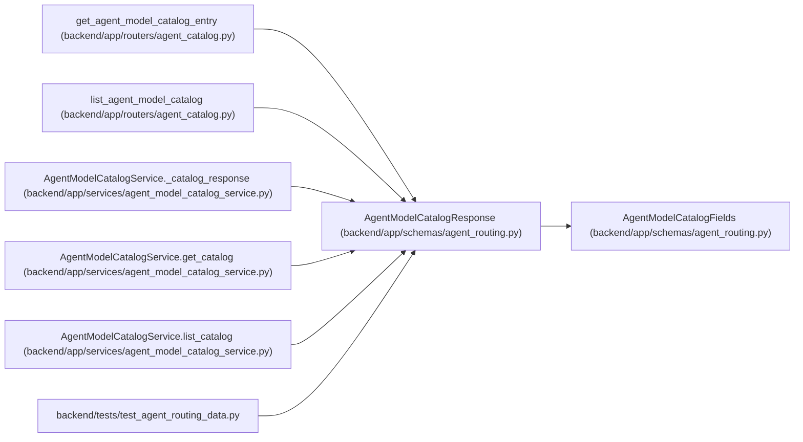

# AgentModelCatalogResponse

**Location:** `backend/app/schemas/agent_routing.py:365`
**Kind:** Pydantic model
**Bases:** `AgentModelCatalogFields`
**Module:** [agent_routing](../modules/agent_routing.md)

## Description

Persisted catalog projection.

## Attributes

| Name | Type | Wire name | Required | Nullable | Default | Constraints | Examples | Description |
|------|------|-----------|----------|----------|---------|-------------|-------------|----------|
| `id` | `int` | `id` | Yes | No | — | — | — | — |
| `created_at` | `datetime` | `created_at` | Yes | No | — | — | — | — |
| `updated_at` | `datetime` | `updated_at` | Yes | No | — | — | — | — |

## Methods

*No public methods. Inherits from base classes.*

## Relationships

<!-- Auto-generated relationship summary. Do not edit by hand. -->

### Summary

| Module | Methods | Attributes |
|---|---:|---|
| [agent_routing](../modules/agent_routing.md) | 0 | `created_at`, `id`, `updated_at` |

### Structure

| Kind | Entity | Module |
|---|---|---|
| Base | `AgentModelCatalogFields` | [agent_routing](../modules/agent_routing.md) |

### References

| Reference | Kind | Source | Call sites |
|---|---|---|---:|
| `get_agent_model_catalog_entry` | type_reference | [agent_catalog](../modules/agent_catalog.md) | — |
| `list_agent_model_catalog` | type_reference | [agent_catalog](../modules/agent_catalog.md) | — |
| `AgentModelCatalogService._catalog_response` | type_reference | [agent_model_catalog_service](../modules/agent_model_catalog_service.md) | — |
| `AgentModelCatalogService.get_catalog` | type_reference | [agent_model_catalog_service](../modules/agent_model_catalog_service.md) | — |
| `AgentModelCatalogService.list_catalog` | type_reference | [agent_model_catalog_service](../modules/agent_model_catalog_service.md) | — |
| `test_agent_routing_data` | import | [test_agent_routing_data](../modules/test_agent_routing_data.md) | — |
