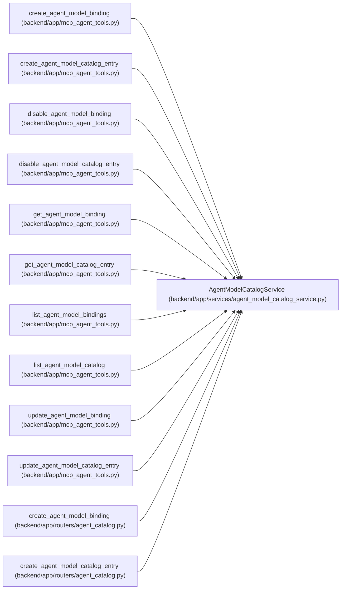

# AgentModelCatalogService

**Location:** `backend/app/services/agent_model_catalog_service.py:84`
**Kind:** Class
**Bases:** —
**Module:** [agent_model_catalog_service](../modules/agent_model_catalog_service.md)

## Description

Expose secret-free reads and replay-safe admin model mutations.

## Attributes

*No annotated attributes found.*

## Methods

| Method | Signature | Decorators | Description |
|--------|-----------|------------|-------------|
| `__init__` | `(db: AsyncSession)` | — | — |
| `_require_read` | `(actor: AgentActor) -> None` | `@staticmethod` | — |
| `_request_hash` | `(payload: dict[str, Any]) -> str` | `@staticmethod` | — |
| `_audited_request` | `(data: Any, command: AgentPlanningCommandContext) -> dict[str, Any]` | `@staticmethod` | — |
| `_replay` | *(async)* `(*, actor_id: int, operation: str, target_type: str, idempotency_target_id: int, idempotency_key: str, request_payload: dict[str, Any]) -> AgentModelMutationReceipt \| None` | — | — |
| `_execute` | *(async)* `(*, actor: AgentActor, operation: str, target_type: str, idempotency_target_id: int, command: AgentPlanningCommandContext, request_payload: dict[str, Any], mutate: Mutation) -> AgentModelMutationReceipt` | — | — |
| `_catalog_entry` | *(async)* `(*, catalog_id: int \| None = None, catalog_key: str \| None = None, for_update: bool = False) -> AgentModelCatalogEntry \| None` | — | — |
| `_binding` | *(async)* `(binding_id: int, *, for_update: bool = False) -> AgentModelBinding \| None` | — | — |
| `_catalog_bindings` | *(async)* `(catalog_id: int, *, for_update: bool = False) -> list[AgentModelBinding]` | — | — |
| `_locked_binding` | *(async)* `(binding_id: int) -> AgentModelBinding \| None` | — | — |
| `_catalog_response` | `(catalog: AgentModelCatalogEntry) -> AgentModelCatalogResponse` | `@staticmethod` | — |
| `_binding_reference_counts` | *(async)* `(binding_ids: list[int]) -> dict[int, tuple[int, int, int]]` | — | — |
| `binding_response` | `(binding: AgentModelBinding, *, reference_counts: tuple[int, int, int] = (0, 0, 0)) -> AgentModelBindingResponse` | — | — |
| `list_catalog` | *(async)* `(actor: AgentActor, *, include_disabled: bool = False) -> list[AgentModelCatalogResponse]` | — | List bounded provider-neutral model declarations. |
| `get_catalog` | *(async)* `(actor: AgentActor, catalog_key: str) -> AgentModelCatalogResponse` | — | Read one secret-free catalog entry by stable key. |
| `list_bindings` | *(async)* `(actor: AgentActor, *, actor_id: int \| None = None, include_disabled: bool = False) -> list[AgentModelBindingResponse]` | — | List bounded actor binding evidence, including audit-only rows on request. |
| `get_binding` | *(async)* `(actor: AgentActor, binding_id: int) -> AgentModelBindingResponse` | — | Read one binding, including disabled historical evidence. |
| `_live_assignments` | *(async)* `(binding_ids: list[int]) -> tuple[list[AgentTaskAssignment], dict[int, AgentActor]]` | — | — |
| `_invalidation_events` | *(async)* `(*, assignments: list[AgentTaskAssignment], principal: AgentActor, command: AgentPlanningCommandContext, reason_code: str, binding_revisions: dict[int, int], locked_actors: dict[int, AgentActor]) -> list[TaskEvent]` | — | — |
| `_mutation_audit_event` | *(async)* `(*, principal: AgentActor, command: AgentPlanningCommandContext, operation: str, target_type: str, target_id: int, authoritative_revision: int, invalidated_assignment_ids: list[int]) -> TaskEvent` | — | — |
| `_raise_revision_conflict` | `(resource: str, resource_id: int, *, expected: int, current: int) -> None` | `@staticmethod` | — |
| `_require_reconciliation` | `(assignments: list[AgentTaskAssignment], *, reconcile: bool) -> None` | `@staticmethod` | — |
| `create_catalog` | *(async)* `(actor: AgentActor, data: AgentModelCatalogCreate, *, command: AgentPlanningCommandContext) -> AgentModelMutationReceipt` | — | Create one stable model declaration with an exact durable receipt. |
| `update_catalog` | *(async)* `(catalog_id: int, actor: AgentActor, data: AgentModelCatalogUpdate, *, command: AgentPlanningCommandContext) -> AgentModelMutationReceipt` | — | Update one catalog entry and invalidate dependent live decisions. |
| `disable_catalog` | *(async)* `(catalog_id: int, actor: AgentActor, data: AgentModelCatalogDisable, *, command: AgentPlanningCommandContext) -> AgentModelMutationReceipt` | — | Soft-disable a catalog entry while preserving all audit references. |
| `create_binding` | *(async)* `(actor: AgentActor, data: AgentModelBindingCreate, *, command: AgentPlanningCommandContext) -> AgentModelMutationReceipt` | — | Create one actor-owned runtime binding. |
| `_require_default_slot` | *(async)* `(actor_id: int, *, exclude_binding_id: int \| None = None) -> None` | — | — |
| `update_binding` | *(async)* `(binding_id: int, actor: AgentActor, data: AgentModelBindingUpdate, *, command: AgentPlanningCommandContext) -> AgentModelMutationReceipt` | — | Update one binding behind an optimistic revision fence. |
| `disable_binding` | *(async)* `(binding_id: int, actor: AgentActor, data: AgentModelBindingDisable, *, command: AgentPlanningCommandContext) -> AgentModelMutationReceipt` | — | Soft-disable a binding only after explicit live-work reconciliation. |

## Relationships

<!-- Auto-generated relationship summary. Do not edit by hand. -->

### Summary

| Module | Methods | Attributes |
|---|---:|---|
| [agent_model_catalog_service](../modules/agent_model_catalog_service.md) | 29 | — |

### References

| Reference | Kind | Source | Call sites |
|---|---|---|---:|
| `create_agent_model_binding` | call | [mcp_agent_tools](../modules/mcp_agent_tools.md) | 1 |
| `create_agent_model_catalog_entry` | call | [mcp_agent_tools](../modules/mcp_agent_tools.md) | 1 |
| `disable_agent_model_binding` | call | [mcp_agent_tools](../modules/mcp_agent_tools.md) | 1 |
| `disable_agent_model_catalog_entry` | call | [mcp_agent_tools](../modules/mcp_agent_tools.md) | 1 |
| `get_agent_model_binding` | call | [mcp_agent_tools](../modules/mcp_agent_tools.md) | 1 |
| `get_agent_model_catalog_entry` | call | [mcp_agent_tools](../modules/mcp_agent_tools.md) | 1 |
| `list_agent_model_bindings` | call | [mcp_agent_tools](../modules/mcp_agent_tools.md) | 1 |
| `list_agent_model_catalog` | call | [mcp_agent_tools](../modules/mcp_agent_tools.md) | 1 |
| `update_agent_model_binding` | call | [mcp_agent_tools](../modules/mcp_agent_tools.md) | 1 |
| `update_agent_model_catalog_entry` | call | [mcp_agent_tools](../modules/mcp_agent_tools.md) | 1 |
| `create_agent_model_binding` | type_reference | [agent_catalog](../modules/agent_catalog.md) | — |
| `create_agent_model_catalog_entry` | type_reference | [agent_catalog](../modules/agent_catalog.md) | — |

> References: showing 12 of 25 logical references; 13 omitted by the 12-row generated summary limit.
