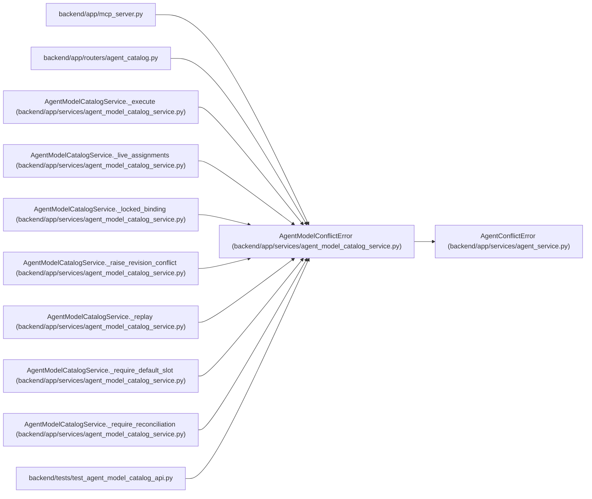

# AgentModelConflictError

**Location:** `backend/app/services/agent_model_catalog_service.py:52`
**Kind:** Class
**Bases:** `AgentConflictError`
**Module:** [agent_model_catalog_service](../modules/agent_model_catalog_service.md)

## Description

Stable model-control conflict shared by REST and MCP.

## Attributes

*No annotated attributes found.*

## Methods

| Method | Signature | Decorators | Description |
|--------|-----------|------------|-------------|
| `__init__` | `(code: str, message: str, **context: Any)` | — | — |
| `detail` | `() -> dict[str, Any]` | — | — |

## Relationships

<!-- Auto-generated relationship summary. Do not edit by hand. -->

### Summary

| Module | Methods | Attributes |
|---|---:|---|
| [agent_model_catalog_service](../modules/agent_model_catalog_service.md) | 2 | — |

### Structure

| Kind | Entity | Module |
|---|---|---|
| Base | `AgentConflictError` | [agent_service](../modules/agent_service.md) |

### References

| Reference | Kind | Source | Call sites |
|---|---|---|---:|
| `mcp_server` | import | [mcp_server](../modules/mcp_server.md) | — |
| `agent_catalog` | import | [agent_catalog](../modules/agent_catalog.md) | — |
| `AgentModelCatalogService._execute` | call | [agent_model_catalog_service](../modules/agent_model_catalog_service.md) | 1 |
| `AgentModelCatalogService._live_assignments` | call | [agent_model_catalog_service](../modules/agent_model_catalog_service.md) | 1 |
| `AgentModelCatalogService._locked_binding` | call | [agent_model_catalog_service](../modules/agent_model_catalog_service.md) | 2 |
| `AgentModelCatalogService._raise_revision_conflict` | call | [agent_model_catalog_service](../modules/agent_model_catalog_service.md) | 1 |
| `AgentModelCatalogService._replay` | call | [agent_model_catalog_service](../modules/agent_model_catalog_service.md) | 2 |
| `AgentModelCatalogService._require_default_slot` | call | [agent_model_catalog_service](../modules/agent_model_catalog_service.md) | 1 |
| `AgentModelCatalogService._require_reconciliation` | call | [agent_model_catalog_service](../modules/agent_model_catalog_service.md) | 1 |
| `test_agent_model_catalog_api` | import | [test_agent_model_catalog_api](../modules/test_agent_model_catalog_api.md) | — |
