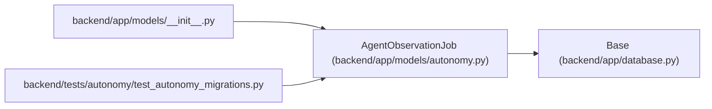

# AgentObservationJob

**Location:** `backend/app/models/autonomy.py:310`
**Kind:** Class
**Bases:** `Base`
**Module:** [models_autonomy](../modules/models_autonomy.md)

## Description

Restart-safe bounded observation/retention job projection.

## Attributes

| Name | Type | Default | Description |
|------|------|---------|-------------|
| `id` | `Mapped[int]` | `mapped_column(Integer, primary_key=True, autoincrement=True)` | — |
| `job_key` | `Mapped[str]` | `mapped_column(String(255), nullable=False)` | — |
| `job_version` | `Mapped[int]` | `mapped_column(Integer, nullable=False)` | — |
| `package_id` | `Mapped[Optional[int]]` | `mapped_column(Integer, ForeignKey('agent_work_packages.id', ondelete='RESTRICT'), nullable=True)` | — |
| `observation_kind` | `Mapped[str]` | `mapped_column(String(100), nullable=False)` | — |
| `state` | `Mapped[str]` | `mapped_column(String(30), default='planned', nullable=False)` | — |
| `policy_digest` | `Mapped[str]` | `mapped_column(String(64), nullable=False)` | — |
| `trusted_clock_ref_digest` | `Mapped[str]` | `mapped_column(String(64), nullable=False)` | — |
| `minimum_elapsed_seconds` | `Mapped[int]` | `mapped_column(Integer, nullable=False)` | — |
| `starts_at` | `Mapped[datetime]` | `mapped_column(UTCDateTime(), nullable=False)` | — |
| `due_at` | `Mapped[datetime]` | `mapped_column(UTCDateTime(), nullable=False)` | — |
| `valid_until` | `Mapped[datetime]` | `mapped_column(UTCDateTime(), nullable=False)` | — |
| `checkpoint_digest` | `Mapped[Optional[str]]` | `mapped_column(String(64), nullable=True)` | — |
| `credential_lineage_digest` | `Mapped[str]` | `mapped_column(String(64), nullable=False)` | — |
| `result_evidence_digest` | `Mapped[Optional[str]]` | `mapped_column(String(64), nullable=True)` | — |
| `external_journal_revision` | `Mapped[int]` | `mapped_column(Integer, default=0, nullable=False)` | — |
| `external_journal_head_digest` | `Mapped[str]` | `mapped_column(String(64), default='0' * 64, nullable=False)` | — |
| `created_at` | `Mapped[datetime]` | `mapped_column(UTCDateTime(), default=utc_now, nullable=False)` | — |
| `updated_at` | `Mapped[datetime]` | `mapped_column(UTCDateTime(), default=utc_now, onupdate=utc_now, nullable=False)` | — |

## Methods

*No public methods. Inherits from base classes.*

## Relationships

<!-- Auto-generated relationship summary. Do not edit by hand. -->

### Summary

| Module | Methods | Attributes |
|---|---:|---|
| [models_autonomy](../modules/models_autonomy.md) | 0 | `checkpoint_digest`, `created_at`, `credential_lineage_digest`, `due_at`, `external_journal_head_digest`, `external_journal_revision`, `id`, `job_key`, `job_version`, `minimum_elapsed_seconds`, `observation_kind`, `package_id` |

### Structure

| Kind | Entity | Module |
|---|---|---|
| Base | `Base` | [app_database](../modules/app_database.md) |

### References

| Reference | Kind | Source | Call sites |
|---|---|---|---:|
| `__init__` | import | [models___init__](../modules/models___init__.md) | — |
| `test_autonomy_migrations` | import | [test_autonomy_migrations](../modules/test_autonomy_migrations.md) | — |
