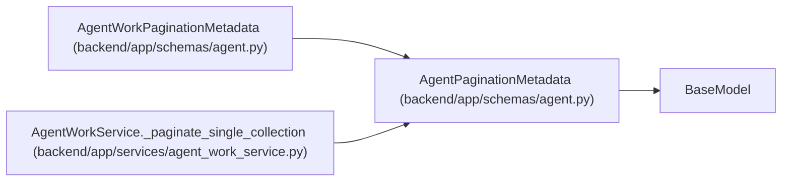

# AgentPaginationMetadata

**Location:** `backend/app/schemas/agent.py:799`
**Kind:** Pydantic model
**Bases:** `BaseModel`
**Module:** [schemas_agent](../modules/schemas_agent.md)

## Description

Opaque snapshot-bound pagination metadata shared by REST and MCP.

## Attributes

| Name | Type | Wire name | Required | Nullable | Default | Constraints | Examples | Description |
|------|------|-----------|----------|----------|---------|-------------|-------------|----------|
| `snapshot_revision` | `str` | `snapshot_revision` | Yes | No | — | — | — | — |
| `page_size` | `int` | `page_size` | Yes | No | — | ge=1; le=200 | — | — |
| `returned` | `int` | `returned` | Yes | No | — | ge=0 | — | — |
| `has_more` | `bool` | `has_more` | No | No | `False` | — | — | — |
| `next_cursor` | `Optional[str]` | `next_cursor` | No | Yes | `None` | — | — | — |

## Methods

*No public methods. Inherits from base classes.*

## Relationships

<!-- Auto-generated relationship summary. Do not edit by hand. -->

### Summary

| Module | Methods | Attributes |
|---|---:|---|
| [schemas_agent](../modules/schemas_agent.md) | 0 | `has_more`, `next_cursor`, `page_size`, `returned`, `snapshot_revision` |

### Structure

| Kind | Entity | Module |
|---|---|---|
| Base | `BaseModel` | — |
| Subclass | `AgentWorkPaginationMetadata` | [schemas_agent](../modules/schemas_agent.md) |

### References

| Reference | Kind | Source | Call sites |
|---|---|---|---:|
| `AgentWorkService._paginate_single_collection` | call | [agent_work_service](../modules/agent_work_service.md) | 1 |
| `AgentWorkService._paginate_single_collection` | type_reference | [agent_work_service](../modules/agent_work_service.md) | — |
