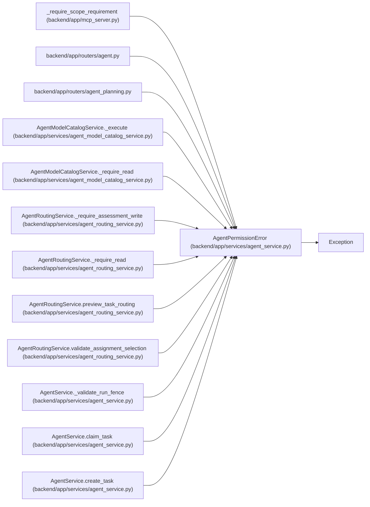

# AgentPermissionError

**Location:** `backend/app/services/agent_service.py:58`
**Kind:** Class
**Bases:** `Exception`
**Module:** [agent_service](../modules/agent_service.md)

## Description

Raised when an agent lacks a required scope.

## Attributes

*No annotated attributes found.*

## Methods

*No public methods. Inherits from base classes.*

## Relationships

<!-- Auto-generated relationship summary. Do not edit by hand. -->

### Summary

| Module | Methods | Attributes |
|---|---:|---|
| [agent_service](../modules/agent_service.md) | 0 | — |

### Structure

| Kind | Entity | Module |
|---|---|---|
| Base | `Exception` | — |

### References

| Reference | Kind | Source | Call sites |
|---|---|---|---:|
| `_require_scope_requirement` | call | [mcp_server](../modules/mcp_server.md) | 1 |
| `agent` | import | [routers_agent](../modules/routers_agent.md) | — |
| `agent_planning` | import | [routers_agent_planning](../modules/routers_agent_planning.md) | — |
| `AgentModelCatalogService._execute` | call | [agent_model_catalog_service](../modules/agent_model_catalog_service.md) | 1 |
| `AgentModelCatalogService._require_read` | call | [agent_model_catalog_service](../modules/agent_model_catalog_service.md) | 1 |
| `AgentRoutingService._require_assessment_write` | call | [agent_routing_service](../modules/agent_routing_service.md) | 2 |
| `AgentRoutingService._require_read` | call | [agent_routing_service](../modules/agent_routing_service.md) | 1 |
| `AgentRoutingService.preview_task_routing` | call | [agent_routing_service](../modules/agent_routing_service.md) | 1 |
| `AgentRoutingService.validate_assignment_selection` | call | [agent_routing_service](../modules/agent_routing_service.md) | 1 |
| `AgentService._validate_run_fence` | call | [agent_service](../modules/agent_service.md) | 1 |
| `AgentService.claim_task` | call | [agent_service](../modules/agent_service.md) | 1 |
| `AgentService.create_task` | call | [agent_service](../modules/agent_service.md) | 1 |

> References: showing 12 of 37 logical references; 25 omitted by the 12-row generated summary limit.
