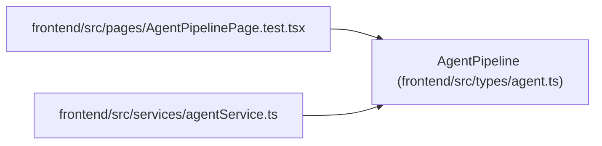

# AgentPipeline

**Location:** `frontend/src/types/agent.ts:606`
**Kind:** Class
**Bases:** —
**Module:** [types_agent](../modules/types_agent.md)

## Description

_Auto-generated from `AgentPipeline` in `frontend/src/types/agent.ts`._

## Attributes

| Name | Type | Default | Description |
|------|------|---------|-------------|
| `needs_definition` | `Task[]` | *required* | — |
| `ready_for_agent` | `Task[]` | *required* | — |
| `definition_ready_unassigned` | `Task[]` | *required* | — |
| `assigned_waiting` | `Task[]` | *required* | — |
| `start_ready` | `Task[]` | *required* | — |
| `executing` | `Task[]` | *required* | — |
| `verification_required` | `Task[]` | *required* | — |
| `recovery_required` | `Task[]` | *required* | — |

## Methods

*No public methods. Inherits from base classes.*

## Relationships

<!-- Auto-generated relationship summary. Do not edit by hand. -->

### Summary

| Module | Methods | Attributes |
|---|---:|---|
| [types_agent](../modules/types_agent.md) | 0 | `assigned_waiting`, `definition_ready_unassigned`, `executing`, `needs_definition`, `ready_for_agent`, `recovery_required`, `start_ready`, `verification_required` |

### References

| Reference | Kind | Source | Call sites |
|---|---|---|---:|
| `AgentPipelinePage.test` | import | [AgentPipelinePage.test](../modules/AgentPipelinePage.test.md) | — |
| `agentService` | import | [agentService](../modules/agentService.md) | — |
