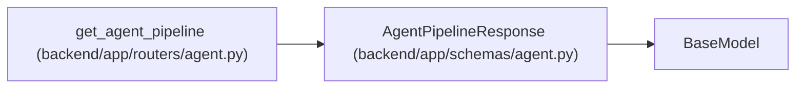

# AgentPipelineResponse

**Location:** `backend/app/schemas/agent.py:475`
**Kind:** Pydantic model
**Bases:** `BaseModel`
**Module:** [schemas_agent](../modules/schemas_agent.md)

## Description

Segmented task list representing the agent supervision pipeline board.

## Attributes

| Name | Type | Wire name | Required | Nullable | Default | Constraints | Examples | Description |
|------|------|-----------|----------|----------|---------|-------------|-------------|----------|
| `needs_definition` | `list[TaskResponse]` | `needs_definition` | Yes | No | — | — | — | — |
| `ready_for_agent` | `list[TaskResponse]` | `ready_for_agent` | Yes | No | — | — | — | — |
| `definition_ready_unassigned` | `list[TaskResponse]` | `definition_ready_unassigned` | No | No | `[]` | — | — | — |
| `assigned_waiting` | `list[TaskResponse]` | `assigned_waiting` | No | No | `[]` | — | — | — |
| `start_ready` | `list[TaskResponse]` | `start_ready` | No | No | `[]` | — | — | — |
| `executing` | `list[TaskResponse]` | `executing` | Yes | No | — | — | — | — |
| `verification_required` | `list[TaskResponse]` | `verification_required` | Yes | No | — | — | — | — |
| `recovery_required` | `list[TaskResponse]` | `recovery_required` | No | No | `[]` | — | — | — |

## Methods

*No public methods. Inherits from base classes.*

## Relationships

<!-- Auto-generated relationship summary. Do not edit by hand. -->

### Summary

| Module | Methods | Attributes |
|---|---:|---|
| [schemas_agent](../modules/schemas_agent.md) | 0 | `assigned_waiting`, `definition_ready_unassigned`, `executing`, `needs_definition`, `ready_for_agent`, `recovery_required`, `start_ready`, `verification_required` |

### Structure

| Kind | Entity | Module |
|---|---|---|
| Base | `BaseModel` | — |

### References

| Reference | Kind | Source | Call sites |
|---|---|---|---:|
| `get_agent_pipeline` | call | [routers_agent](../modules/routers_agent.md) | 1 |
| `get_agent_pipeline` | type_reference | [routers_agent](../modules/routers_agent.md) | — |
