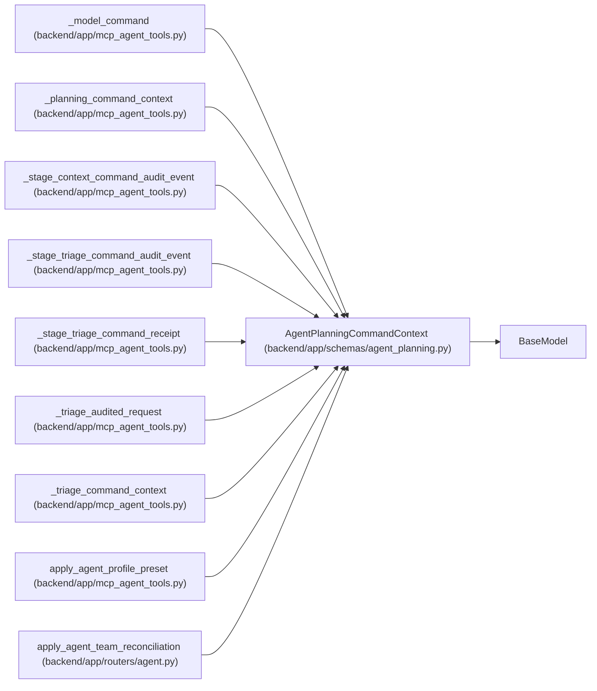

# AgentPlanningCommandContext

**Location:** `backend/app/schemas/agent_planning.py:9`
**Kind:** Pydantic model
**Bases:** `BaseModel`
**Module:** [schemas_agent_planning](../modules/schemas_agent_planning.md)

## Description

Required audit metadata carried by every PM setup command.

## Model Configuration

| Setting | Value | Source |
|---------|-------|--------|
| `extra` | `'forbid'` | model_config |

## Validators

| Method | Scope | Fields | Mode | Options |
|--------|-------|--------|------|---------|
| `validate_log_safe_text` | field | idempotency_key, rationale, correlation_id | after | — |

## Attributes

| Name | Type | Wire name | Required | Nullable | Default | Constraints | Examples | Description |
|------|------|-----------|----------|----------|---------|-------------|-------------|----------|
| `idempotency_key` | `str` | `idempotency_key` | Yes | No | — | min_length=1; max_length=255 | — | — |
| `rationale` | `str` | `rationale` | Yes | No | — | min_length=1; max_length=2000 | — | — |
| `correlation_id` | `str` | `correlation_id` | Yes | No | — | min_length=1; max_length=255 | — | — |

## Methods

| Method | Signature | Decorators | Description |
|--------|-----------|------------|-------------|
| `validate_log_safe_text` | `(value: str) -> str` | `@field_validator('idempotency_key', 'rationale', 'correlation_id')`, `@classmethod` | Reject outer whitespace and control characters in audit metadata. |

## Relationships

<!-- Auto-generated relationship summary. Do not edit by hand. -->

### Summary

| Module | Methods | Attributes |
|---|---:|---|
| [schemas_agent_planning](../modules/schemas_agent_planning.md) | 1 | `correlation_id`, `idempotency_key`, `rationale` |

### Structure

| Kind | Entity | Module |
|---|---|---|
| Base | `BaseModel` | — |

### References

| Reference | Kind | Source | Call sites |
|---|---|---|---:|
| `_model_command` | call | [mcp_agent_tools](../modules/mcp_agent_tools.md) | 1 |
| `_model_command` | type_reference | [mcp_agent_tools](../modules/mcp_agent_tools.md) | — |
| `_planning_command_context` | call | [mcp_agent_tools](../modules/mcp_agent_tools.md) | 1 |
| `_planning_command_context` | type_reference | [mcp_agent_tools](../modules/mcp_agent_tools.md) | — |
| `_stage_context_command_audit_event` | type_reference | [mcp_agent_tools](../modules/mcp_agent_tools.md) | — |
| `_stage_triage_command_audit_event` | type_reference | [mcp_agent_tools](../modules/mcp_agent_tools.md) | — |
| `_stage_triage_command_receipt` | type_reference | [mcp_agent_tools](../modules/mcp_agent_tools.md) | — |
| `_triage_audited_request` | type_reference | [mcp_agent_tools](../modules/mcp_agent_tools.md) | — |
| `_triage_command_context` | call | [mcp_agent_tools](../modules/mcp_agent_tools.md) | 1 |
| `_triage_command_context` | type_reference | [mcp_agent_tools](../modules/mcp_agent_tools.md) | — |
| `apply_agent_profile_preset` | call | [mcp_agent_tools](../modules/mcp_agent_tools.md) | 1 |
| `apply_agent_team_reconciliation` | call | [routers_agent](../modules/routers_agent.md) | 1 |

> References: showing 12 of 92 logical references; 80 omitted by the 12-row generated summary limit.
