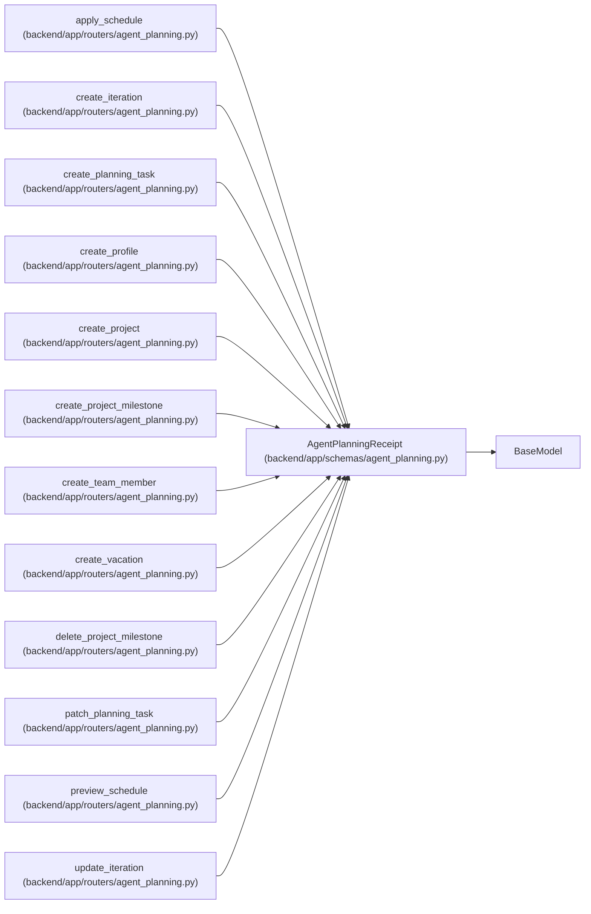

# AgentPlanningReceipt

**Location:** `backend/app/schemas/agent_planning.py:31`
**Kind:** Pydantic model
**Bases:** `BaseModel`
**Module:** [schemas_agent_planning](../modules/schemas_agent_planning.md)

## Description

Exact durable response stored for one PM setup mutation.

## Model Configuration

| Setting | Value | Source |
|---------|-------|--------|
| `extra` | `'forbid'` | model_config |

## Attributes

| Name | Type | Wire name | Required | Nullable | Default | Constraints | Examples | Description |
|------|------|-----------|----------|----------|---------|-------------|-------------|----------|
| `operation` | `str` | `operation` | Yes | No | — | — | — | — |
| `actor_id` | `int` | `actor_id` | Yes | No | — | — | — | — |
| `target_type` | `str` | `target_type` | Yes | No | — | — | — | — |
| `target_id` | `int` | `target_id` | Yes | No | — | — | — | — |
| `idempotency_key` | `str` | `idempotency_key` | Yes | No | — | — | — | — |
| `rationale` | `str` | `rationale` | Yes | No | — | — | — | — |
| `correlation_id` | `str` | `correlation_id` | Yes | No | — | — | — | — |
| `result` | `dict[str, Any]` | `result` | Yes | No | — | — | — | — |

## Methods

*No public methods. Inherits from base classes.*

## Relationships

<!-- Auto-generated relationship summary. Do not edit by hand. -->

### Summary

| Module | Methods | Attributes |
|---|---:|---|
| [schemas_agent_planning](../modules/schemas_agent_planning.md) | 0 | `actor_id`, `correlation_id`, `idempotency_key`, `operation`, `rationale`, `result`, `target_id`, `target_type` |

### Structure

| Kind | Entity | Module |
|---|---|---|
| Base | `BaseModel` | — |

### References

| Reference | Kind | Source | Call sites |
|---|---|---|---:|
| `apply_schedule` | type_reference | [routers_agent_planning](../modules/routers_agent_planning.md) | — |
| `create_iteration` | type_reference | [routers_agent_planning](../modules/routers_agent_planning.md) | — |
| `create_planning_task` | type_reference | [routers_agent_planning](../modules/routers_agent_planning.md) | — |
| `create_profile` | type_reference | [routers_agent_planning](../modules/routers_agent_planning.md) | — |
| `create_project` | type_reference | [routers_agent_planning](../modules/routers_agent_planning.md) | — |
| `create_project_milestone` | type_reference | [routers_agent_planning](../modules/routers_agent_planning.md) | — |
| `create_team_member` | type_reference | [routers_agent_planning](../modules/routers_agent_planning.md) | — |
| `create_vacation` | type_reference | [routers_agent_planning](../modules/routers_agent_planning.md) | — |
| `delete_project_milestone` | type_reference | [routers_agent_planning](../modules/routers_agent_planning.md) | — |
| `patch_planning_task` | type_reference | [routers_agent_planning](../modules/routers_agent_planning.md) | — |
| `preview_schedule` | type_reference | [routers_agent_planning](../modules/routers_agent_planning.md) | — |
| `update_iteration` | type_reference | [routers_agent_planning](../modules/routers_agent_planning.md) | — |

> References: showing 12 of 38 logical references; 26 omitted by the 12-row generated summary limit.
