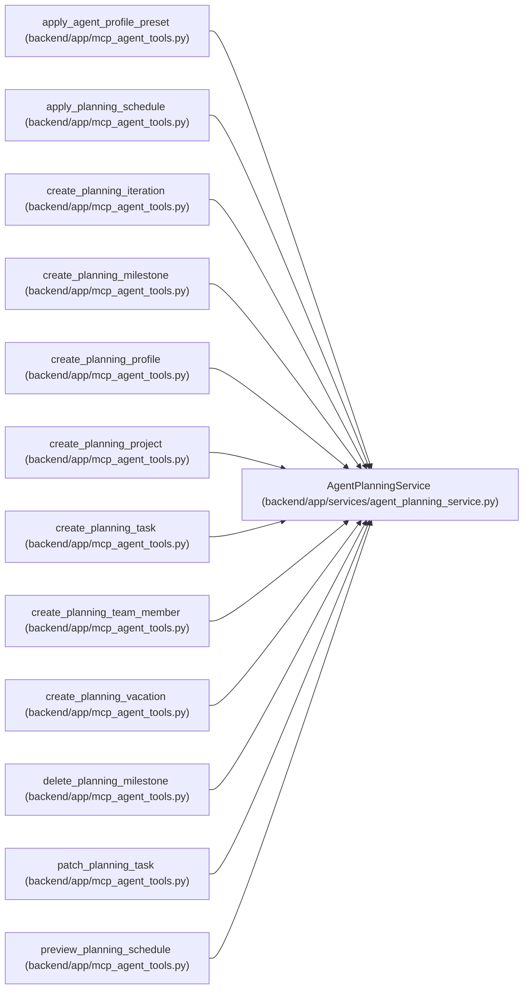

# AgentPlanningService

**Location:** `backend/app/services/agent_planning_service.py:78`
**Kind:** Class
**Bases:** —
**Module:** [agent_planning_service](../modules/agent_planning_service.md)

## Description

Expose bounded PM setup commands without bypassing domain services.

Composed planning mutations share one transaction and retain exact durable mutation receipts. Schedule preview has an explicit rollback owner and a transient receipt with original input versions; apply validates the observed task set and input digest. A preview cannot publish snapshots, idempotency records or outbound work.

## Attributes

*No annotated attributes found.*

## Methods

| Method | Signature | Decorators | Description |
|--------|-----------|------------|-------------|
| `__init__` | `(db: AsyncSession)` | — | — |
| `_request_hash` | `(payload: dict[str, Any]) -> str` | `@staticmethod` | — |
| `_replay` | *(async)* `(*, actor: AgentActor, operation: str, target_type: str, idempotency_target_id: int, idempotency_key: str, request_payload: dict[str, Any]) -> AgentPlanningReceipt \| None` | — | — |
| `_execute` | *(async)* `(*, actor: AgentActor, scope: str, operation: str, target_type: str, idempotency_target_id: int, command: AgentPlanningCommandContext, request_payload: dict[str, Any], mutate: Mutation) -> AgentPlanningReceipt` | `@atomic_command` | — |
| `create_project` | *(async)* `(actor: AgentActor, data: ProjectCreate, *, command: AgentPlanningCommandContext) -> AgentPlanningReceipt` | — | — |
| `update_project` | *(async)* `(project_id: int, actor: AgentActor, data: ProjectUpdate, *, command: AgentPlanningCommandContext) -> AgentPlanningReceipt` | — | — |
| `create_milestone` | *(async)* `(project_id: int, actor: AgentActor, data: ProjectMilestoneCreateRequest, *, command: AgentPlanningCommandContext) -> AgentPlanningReceipt` | — | Create one project milestone with an exact planning receipt. |
| `update_milestone` | *(async)* `(project_id: int, milestone_id: int, actor: AgentActor, data: ProjectMilestoneUpdate, *, command: AgentPlanningCommandContext) -> AgentPlanningReceipt` | — | Update one project-scoped milestone with exact replay semantics. |
| `delete_milestone` | *(async)* `(project_id: int, milestone_id: int, actor: AgentActor, *, command: AgentPlanningCommandContext) -> AgentPlanningReceipt` | — | Delete one project-scoped milestone and preserve its exact result. |
| `create_task` | *(async)* `(iteration_id: int, actor: AgentActor, data: AgentTaskCreate, *, command: AgentPlanningCommandContext) -> AgentPlanningReceipt` | — | Create one decomposed task with a complete planning audit context. |
| `patch_task` | *(async)* `(task_id: int, actor: AgentActor, data: AgentTaskPatch, *, command: AgentPlanningCommandContext) -> AgentPlanningReceipt` | — | Patch decomposition fields under optimistic version and exact replay. |
| `create_iteration` | *(async)* `(actor: AgentActor, data: IterationCreate, *, command: AgentPlanningCommandContext) -> AgentPlanningReceipt` | — | — |
| `update_iteration` | *(async)* `(iteration_id: int, actor: AgentActor, data: IterationUpdate, *, command: AgentPlanningCommandContext) -> AgentPlanningReceipt` | — | — |
| `create_profile` | *(async)* `(actor: AgentActor, data: TeamMemberProfileCreate, *, command: AgentPlanningCommandContext) -> AgentPlanningReceipt` | — | — |
| `update_profile` | *(async)* `(profile_id: int, actor: AgentActor, data: TeamMemberProfileUpdate, *, command: AgentPlanningCommandContext) -> AgentPlanningReceipt` | — | — |
| `apply_profile_preset` | *(async)* `(preset_key: str, actor: AgentActor, *, command: AgentPlanningCommandContext) -> AgentPlanningReceipt` | — | — |
| `create_team_member` | *(async)* `(iteration_id: int, actor: AgentActor, data: TeamMemberCreate, *, command: AgentPlanningCommandContext) -> AgentPlanningReceipt` | — | — |
| `update_team_member` | *(async)* `(member_id: int, actor: AgentActor, data: TeamMemberUpdate, *, command: AgentPlanningCommandContext) -> AgentPlanningReceipt` | — | — |
| `create_vacation` | *(async)* `(member_id: int, actor: AgentActor, data: VacationCreate, *, command: AgentPlanningCommandContext) -> AgentPlanningReceipt` | — | — |
| `update_vacation` | *(async)* `(vacation_id: int, actor: AgentActor, data: VacationUpdate, *, command: AgentPlanningCommandContext) -> AgentPlanningReceipt` | — | — |
| `_iteration_tasks_for_update` | *(async)* `(iteration_id: int) -> list[Task]` | — | — |
| `_require_iteration_for_update` | *(async)* `(iteration_id: int) -> Iteration` | — | Lock the schedule aggregate root for preview/apply serialization. |
| `_lock_schedule_task_set` | *(async)* `(iteration_id: int) -> None` | — | Lock only the mutable rows in one scheduling aggregate. |
| `_schedule_task_states` | `(tasks: list[Task]) -> list[AgentScheduleTaskState]` | `@staticmethod` | — |
| `_canonical_digest` | `(payload: dict[str, Any]) -> str` | `@staticmethod` | Return a deterministic SHA-256 digest for one JSON-safe payload. |
| `_scheduling_rules_digest` | `() -> str` | — | Return the digest of the rules currently used by the scheduler. |
| `_schedule_input_digest` | *(async)* `(iteration_id: int, *, schedule_output_overrides: Mapping[int, tuple[Any, Any, Any]] \| None = None) -> tuple[str, str]` | — | Hash every mutable input consumed by ``SchedulerService``. |
| `_schedule_result_payload` | `(schedule: Any, tasks: list[Task], input_digest: str) -> dict[str, Any]` | `@staticmethod` | — |
| `preview_schedule` | *(async)* `(iteration_id: int, actor: AgentActor, *, command: AgentPlanningCommandContext) -> AgentPlanningReceipt` | `@preview_command` | — |
| `apply_schedule` | *(async)* `(iteration_id: int, actor: AgentActor, data: AgentScheduleCommand, *, command: AgentPlanningCommandContext) -> AgentPlanningReceipt` | — | — |

## Relationships

<!-- Auto-generated relationship summary. Do not edit by hand. -->

### Summary

| Module | Methods | Attributes |
|---|---:|---|
| [agent_planning_service](../modules/agent_planning_service.md) | 30 | — |

### References

| Reference | Kind | Source | Call sites |
|---|---|---|---:|
| `apply_agent_profile_preset` | call | [mcp_agent_tools](../modules/mcp_agent_tools.md) | 1 |
| `apply_planning_schedule` | call | [mcp_agent_tools](../modules/mcp_agent_tools.md) | 1 |
| `create_planning_iteration` | call | [mcp_agent_tools](../modules/mcp_agent_tools.md) | 1 |
| `create_planning_milestone` | call | [mcp_agent_tools](../modules/mcp_agent_tools.md) | 1 |
| `create_planning_profile` | call | [mcp_agent_tools](../modules/mcp_agent_tools.md) | 1 |
| `create_planning_project` | call | [mcp_agent_tools](../modules/mcp_agent_tools.md) | 1 |
| `create_planning_task` | call | [mcp_agent_tools](../modules/mcp_agent_tools.md) | 1 |
| `create_planning_team_member` | call | [mcp_agent_tools](../modules/mcp_agent_tools.md) | 1 |
| `create_planning_vacation` | call | [mcp_agent_tools](../modules/mcp_agent_tools.md) | 1 |
| `delete_planning_milestone` | call | [mcp_agent_tools](../modules/mcp_agent_tools.md) | 1 |
| `patch_planning_task` | call | [mcp_agent_tools](../modules/mcp_agent_tools.md) | 1 |
| `preview_planning_schedule` | call | [mcp_agent_tools](../modules/mcp_agent_tools.md) | 1 |

> References: showing 12 of 40 logical references; 28 omitted by the 12-row generated summary limit.
