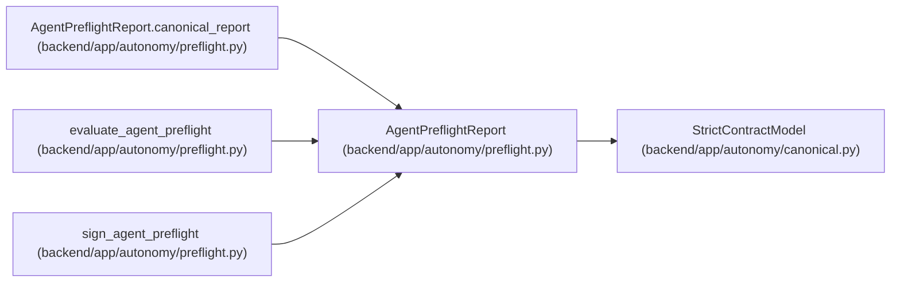

# AgentPreflightReport

**Location:** `backend/app/autonomy/preflight.py:93`
**Kind:** Pydantic model
**Bases:** `StrictContractModel`
**Module:** [preflight](../modules/preflight.md)

## Description

_Auto-generated from `AgentPreflightReport` in `backend/app/autonomy/preflight.py`._

## Validators

| Method | Scope | Fields | Mode | Options |
|--------|-------|--------|------|---------|
| `canonical_report` | model | — | after | — |

## Attributes

| Name | Type | Wire name | Required | Nullable | Default | Constraints | Examples | Description |
|------|------|-----------|----------|----------|---------|-------------|-------------|----------|
| `schema_version` | `Literal['workchord-postgresql-agent-preflight-v1']` | `schema_version` | No | No | `'workchord-postgresql-agent-preflight-v1'` | — | — | — |
| `evaluated_at` | `datetime` | `evaluated_at` | Yes | No | — | — | — | — |
| `release_fingerprint` | `str` | `release_fingerprint` | Yes | No | — | pattern=unknown (SHA256_PATTERN) | — | — |
| `contract_manifest_digest` | `str` | `contract_manifest_digest` | Yes | No | — | pattern=unknown (SHA256_PATTERN) | — | — |
| `autonomy_state` | `AutonomyState` | `autonomy_state` | Yes | No | — | — | — | — |
| `program_decision` | `ProgramDecision` | `program_decision` | Yes | No | — | — | — | — |
| `predicates` | `tuple[PreflightPredicateResult, ...]` | `predicates` | Yes | No | — | — | — | — |
| `advertised_features` | `tuple[str, ...]` | `advertised_features` | Yes | No | — | — | — | — |
| `report_digest` | `str` | `report_digest` | Yes | No | — | pattern=unknown (SHA256_PATTERN) | — | — |

## Methods

| Method | Signature | Decorators | Description |
|--------|-----------|------------|-------------|
| `canonical_report` | `() -> 'AgentPreflightReport'` | `@model_validator(mode='after')` | — |

## Relationships

<!-- Auto-generated relationship summary. Do not edit by hand. -->

### Summary

| Module | Methods | Attributes |
|---|---:|---|
| [preflight](../modules/preflight.md) | 1 | `advertised_features`, `autonomy_state`, `contract_manifest_digest`, `evaluated_at`, `predicates`, `program_decision`, `release_fingerprint`, `report_digest`, `schema_version` |

### Structure

| Kind | Entity | Module |
|---|---|---|
| Base | `StrictContractModel` | [autonomy_canonical](../modules/autonomy_canonical.md) |

### References

| Reference | Kind | Source | Call sites |
|---|---|---|---:|
| `AgentPreflightReport.canonical_report` | type_reference | [preflight](../modules/preflight.md) | — |
| `evaluate_agent_preflight` | call | [preflight](../modules/preflight.md) | 1 |
| `evaluate_agent_preflight` | type_reference | [preflight](../modules/preflight.md) | — |
| `sign_agent_preflight` | type_reference | [preflight](../modules/preflight.md) | — |
