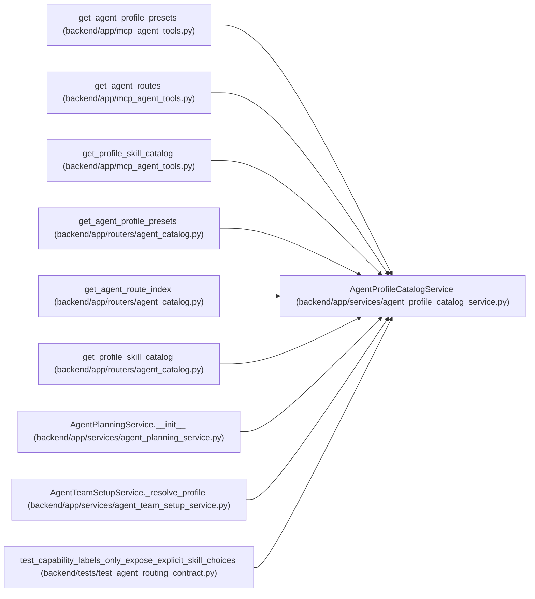

# AgentProfileCatalogService

**Location:** `backend/app/services/agent_profile_catalog_service.py:276`
**Kind:** Class
**Bases:** —
**Module:** [agent_profile_catalog_service](../modules/agent_profile_catalog_service.md)

## Description

Expose and apply stable capability/profile presets without granting permissions.

## Attributes

*No annotated attributes found.*

## Methods

| Method | Signature | Decorators | Description |
|--------|-----------|------------|-------------|
| `__init__` | `(db: AsyncSession)` | — | — |
| `catalog` | `() -> list[dict[str, Any]]` | — | — |
| `capability_label_skill_map` | `() -> dict[str, list[str]]` | — | Expose coarse readiness labels as explicit precise-skill choices. |
| `presets` | `() -> list[dict[str, Any]]` | — | — |
| `routes` | `() -> list[dict[str, Any]]` | — | — |
| `apply_preset` | *(async)* `(preset_key: str, *, commit: bool = True) -> TeamMemberProfile` | — | — |

## Relationships

<!-- Auto-generated relationship summary. Do not edit by hand. -->

### Summary

| Module | Methods | Attributes |
|---|---:|---|
| [agent_profile_catalog_service](../modules/agent_profile_catalog_service.md) | 6 | — |

### References

| Reference | Kind | Source | Call sites |
|---|---|---|---:|
| `get_agent_profile_presets` | call | [mcp_agent_tools](../modules/mcp_agent_tools.md) | 1 |
| `get_agent_routes` | call | [mcp_agent_tools](../modules/mcp_agent_tools.md) | 1 |
| `get_profile_skill_catalog` | call | [mcp_agent_tools](../modules/mcp_agent_tools.md) | 1 |
| `get_agent_profile_presets` | call | [agent_catalog](../modules/agent_catalog.md) | 1 |
| `get_agent_route_index` | call | [agent_catalog](../modules/agent_catalog.md) | 1 |
| `get_profile_skill_catalog` | call | [agent_catalog](../modules/agent_catalog.md) | 1 |
| `AgentPlanningService.__init__` | call | [agent_planning_service](../modules/agent_planning_service.md) | 1 |
| `AgentTeamSetupService._resolve_profile` | call | [agent_team_setup_service](../modules/agent_team_setup_service.md) | 1 |
| `test_capability_labels_only_expose_explicit_skill_choices` | call | [test_agent_routing_contract](../modules/test_agent_routing_contract.md) | 1 |
