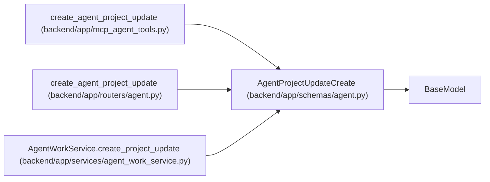

# AgentProjectUpdateCreate

**Location:** `backend/app/schemas/agent.py:1072`
**Kind:** Pydantic model
**Bases:** `BaseModel`
**Module:** [schemas_agent](../modules/schemas_agent.md)

## Description

Agent-authored append-only project status report.

## Model Configuration

| Setting | Value | Source |
|---------|-------|--------|
| `extra` | `'forbid'` | model_config |

## Validators

| Method | Scope | Fields | Mode | Options |
|--------|-------|--------|------|---------|
| `validate_evidence_size` | field | evidence | after | — |

## Attributes

| Name | Type | Wire name | Required | Nullable | Default | Constraints | Examples | Description |
|------|------|-----------|----------|----------|---------|-------------|-------------|----------|
| `health` | `ProjectHealth` | `health` | Yes | No | — | — | — | — |
| `summary` | `str` | `summary` | Yes | No | — | min_length=1; max_length=unknown (MAX_AGENT_TEXT_LENGTH) | — | — |
| `progress_text` | `Optional[str]` | `progress_text` | No | Yes | `None` | max_length=unknown (MAX_AGENT_TEXT_LENGTH) | — | — |
| `risks_text` | `Optional[str]` | `risks_text` | No | Yes | `None` | max_length=unknown (MAX_AGENT_TEXT_LENGTH) | — | — |
| `decisions_text` | `Optional[str]` | `decisions_text` | No | Yes | `None` | max_length=unknown (MAX_AGENT_TEXT_LENGTH) | — | — |
| `next_steps_text` | `Optional[str]` | `next_steps_text` | No | Yes | `None` | max_length=unknown (MAX_AGENT_TEXT_LENGTH) | — | — |
| `evidence` | `dict[str, Any]` | `evidence` | No | No | factory: `dict` | max_length=unknown (MAX_AGENT_JSON_FIELDS) | — | — |
| `correlation_id` | `Optional[str]` | `correlation_id` | No | Yes | `None` | max_length=255 | — | — |

## Methods

| Method | Signature | Decorators | Description |
|--------|-----------|------------|-------------|
| `validate_evidence_size` | `(value: dict[str, Any]) -> dict[str, Any]` | `@field_validator('evidence')`, `@classmethod` | — |

## Relationships

<!-- Auto-generated relationship summary. Do not edit by hand. -->

### Summary

| Module | Methods | Attributes |
|---|---:|---|
| [schemas_agent](../modules/schemas_agent.md) | 1 | `correlation_id`, `decisions_text`, `evidence`, `health`, `next_steps_text`, `progress_text`, `risks_text`, `summary` |

### Structure

| Kind | Entity | Module |
|---|---|---|
| Base | `BaseModel` | — |

### References

| Reference | Kind | Source | Call sites |
|---|---|---|---:|
| `create_agent_project_update` | call | [mcp_agent_tools](../modules/mcp_agent_tools.md) | 1 |
| `create_agent_project_update` | type_reference | [routers_agent](../modules/routers_agent.md) | — |
| `AgentWorkService.create_project_update` | type_reference | [agent_work_service](../modules/agent_work_service.md) | — |
