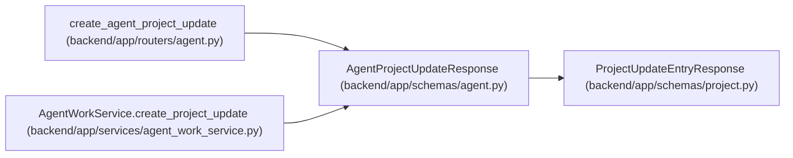

# AgentProjectUpdateResponse

**Location:** `backend/app/schemas/agent.py:1087`
**Kind:** Pydantic model
**Bases:** `ProjectUpdateEntryResponse`
**Module:** [schemas_agent](../modules/schemas_agent.md)

## Description

Agent project-update response with attribution and evidence.

## Attributes

*No annotated attributes found.*

## Methods

*No public methods. Inherits from base classes.*

## Relationships

<!-- Auto-generated relationship summary. Do not edit by hand. -->

### Summary

| Module | Methods | Attributes |
|---|---:|---|
| [schemas_agent](../modules/schemas_agent.md) | 0 | — |

### Structure

| Kind | Entity | Module |
|---|---|---|
| Base | `ProjectUpdateEntryResponse` | [schemas_project](../modules/schemas_project.md) |

### References

| Reference | Kind | Source | Call sites |
|---|---|---|---:|
| `create_agent_project_update` | type_reference | [routers_agent](../modules/routers_agent.md) | — |
| `AgentWorkService.create_project_update` | type_reference | [agent_work_service](../modules/agent_work_service.md) | — |
