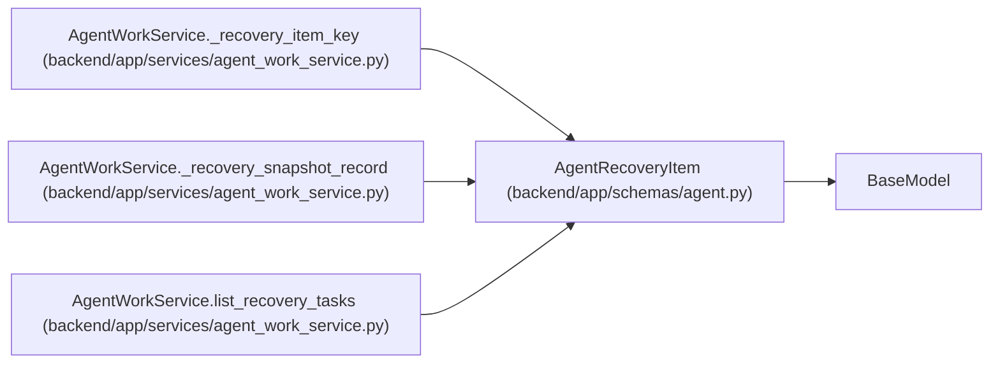

# AgentRecoveryItem

**Location:** `backend/app/schemas/agent.py:1021`
**Kind:** Pydantic model
**Bases:** `BaseModel`
**Module:** [schemas_agent](../modules/schemas_agent.md)

## Description

Typed PM recovery diagnosis and optimistic ownership tuple.

## Attributes

| Name | Type | Wire name | Required | Nullable | Default | Constraints | Examples | Description |
|------|------|-----------|----------|----------|---------|-------------|-------------|----------|
| `task` | `TaskResponse` | `task` | Yes | No | — | — | — | — |
| `recovery_codes` | `list[str]` | `recovery_codes` | Yes | No | — | min_length=1 | — | — |
| `live_assignments` | `list[AgentTaskAssignmentResponse]` | `live_assignments` | No | No | factory: `list` | — | — | — |
| `recent_runs` | `list[AgentRunResponse]` | `recent_runs` | No | No | factory: `list` | — | — | — |
| `running_run_ids` | `list[int]` | `running_run_ids` | No | No | factory: `list` | — | — | — |
| `claim_actor_id` | `Optional[int]` | `claim_actor_id` | No | Yes | `None` | — | — | — |
| `claim_present` | `bool` | `claim_present` | No | No | `False` | — | — | — |
| `claim_generation` | `int` | `claim_generation` | No | No | `0` | — | — | — |
| `claim_expires_at` | `Optional[datetime]` | `claim_expires_at` | No | Yes | `None` | — | — | — |
| `server_time` | `datetime` | `server_time` | Yes | No | — | — | — | — |

## Methods

*No public methods. Inherits from base classes.*

## Relationships

<!-- Auto-generated relationship summary. Do not edit by hand. -->

### Summary

| Module | Methods | Attributes |
|---|---:|---|
| [schemas_agent](../modules/schemas_agent.md) | 0 | `claim_actor_id`, `claim_expires_at`, `claim_generation`, `claim_present`, `live_assignments`, `recent_runs`, `recovery_codes`, `running_run_ids`, `server_time`, `task` |

### Structure

| Kind | Entity | Module |
|---|---|---|
| Base | `BaseModel` | — |

### References

| Reference | Kind | Source | Call sites |
|---|---|---|---:|
| `AgentWorkService._recovery_item_key` | type_reference | [agent_work_service](../modules/agent_work_service.md) | — |
| `AgentWorkService._recovery_snapshot_record` | type_reference | [agent_work_service](../modules/agent_work_service.md) | — |
| `AgentWorkService.list_recovery_tasks` | call | [agent_work_service](../modules/agent_work_service.md) | 1 |
