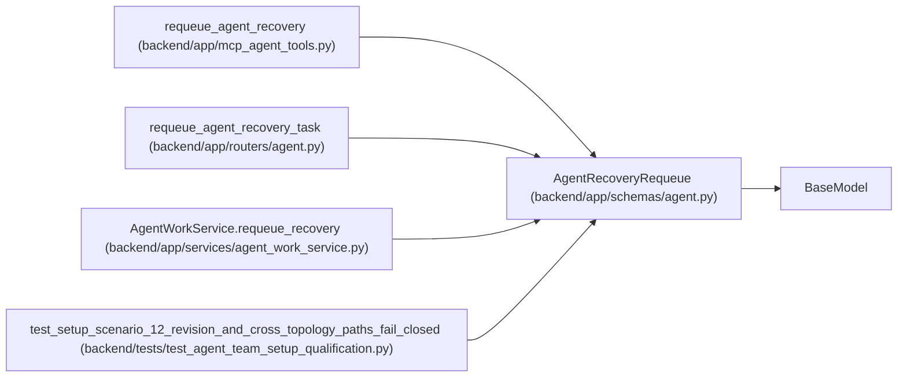

# AgentRecoveryRequeue

**Location:** `backend/app/schemas/agent.py:1007`
**Kind:** Pydantic model
**Bases:** `BaseModel`
**Module:** [schemas_agent](../modules/schemas_agent.md)

## Description

PM command to replace stale execution ownership with recovery work.

## Model Configuration

| Setting | Value | Source |
|---------|-------|--------|
| `extra` | `'forbid'` | model_config |

## Attributes

| Name | Type | Wire name | Required | Nullable | Default | Constraints | Examples | Description |
|------|------|-----------|----------|----------|---------|-------------|-------------|----------|
| `actor_id` | `int` | `actor_id` | Yes | No | — | — | — | — |
| `expected_task_version` | `int` | `expected_task_version` | Yes | No | — | ge=1 | — | — |
| `expected_live_assignment_ids` | `list[int]` | `expected_live_assignment_ids` | Yes | No | — | max_length=20 | — | — |
| `expected_running_run_ids` | `list[int]` | `expected_running_run_ids` | Yes | No | — | max_length=20 | — | — |
| `expected_claim_generation` | `int` | `expected_claim_generation` | Yes | No | — | ge=0 | — | — |
| `queue_rank` | `int` | `queue_rank` | No | No | `0` | ge=0 | — | — |
| `reason` | `str` | `reason` | Yes | No | — | min_length=1; max_length=unknown (MAX_AGENT_TEXT_LENGTH) | — | — |

## Methods

*No public methods. Inherits from base classes.*

## Relationships

<!-- Auto-generated relationship summary. Do not edit by hand. -->

### Summary

| Module | Methods | Attributes |
|---|---:|---|
| [schemas_agent](../modules/schemas_agent.md) | 0 | `actor_id`, `expected_claim_generation`, `expected_live_assignment_ids`, `expected_running_run_ids`, `expected_task_version`, `queue_rank`, `reason` |

### Structure

| Kind | Entity | Module |
|---|---|---|
| Base | `BaseModel` | — |

### References

| Reference | Kind | Source | Call sites |
|---|---|---|---:|
| `requeue_agent_recovery` | call | [mcp_agent_tools](../modules/mcp_agent_tools.md) | 1 |
| `requeue_agent_recovery_task` | type_reference | [routers_agent](../modules/routers_agent.md) | — |
| `AgentWorkService.requeue_recovery` | type_reference | [agent_work_service](../modules/agent_work_service.md) | — |
| `test_setup_scenario_12_revision_and_cross_topology_paths_fail_closed` | call | [test_agent_team_setup_qualification](../modules/test_agent_team_setup_qualification.md) | 1 |
