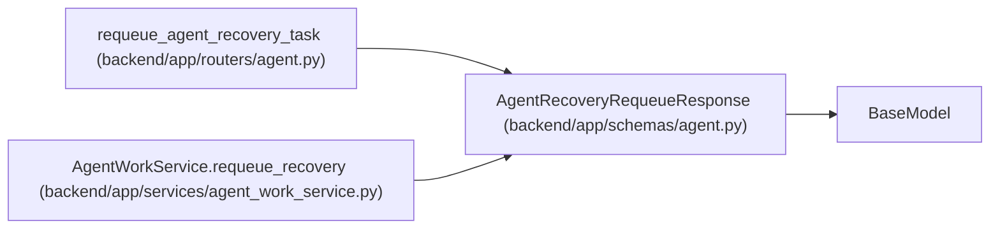

# AgentRecoveryRequeueResponse

**Location:** `backend/app/schemas/agent.py:1054`
**Kind:** Pydantic model
**Bases:** `BaseModel`
**Module:** [schemas_agent](../modules/schemas_agent.md)

## Description

Authoritative result of stale-work reconciliation and requeue.

## Attributes

| Name | Type | Wire name | Required | Nullable | Default | Constraints | Examples | Description |
|------|------|-----------|----------|----------|---------|-------------|-------------|----------|
| `task` | `TaskResponse` | `task` | Yes | No | — | — | — | — |
| `assignment` | `AgentTaskAssignmentResponse` | `assignment` | Yes | No | — | — | — | — |
| `cancelled_assignment_ids` | `list[int]` | `cancelled_assignment_ids` | No | No | factory: `list` | — | — | — |
| `cancelled_run_ids` | `list[int]` | `cancelled_run_ids` | No | No | factory: `list` | — | — | — |

## Methods

*No public methods. Inherits from base classes.*

## Relationships

<!-- Auto-generated relationship summary. Do not edit by hand. -->

### Summary

| Module | Methods | Attributes |
|---|---:|---|
| [schemas_agent](../modules/schemas_agent.md) | 0 | `assignment`, `cancelled_assignment_ids`, `cancelled_run_ids`, `task` |

### Structure

| Kind | Entity | Module |
|---|---|---|
| Base | `BaseModel` | — |

### References

| Reference | Kind | Source | Call sites |
|---|---|---|---:|
| `requeue_agent_recovery_task` | type_reference | [routers_agent](../modules/routers_agent.md) | — |
| `AgentWorkService.requeue_recovery` | call | [agent_work_service](../modules/agent_work_service.md) | 1 |
| `AgentWorkService.requeue_recovery` | type_reference | [agent_work_service](../modules/agent_work_service.md) | — |
