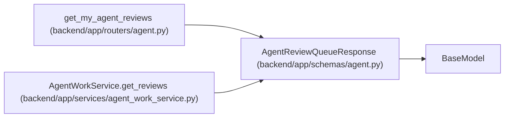

# AgentReviewQueueResponse

**Location:** `backend/app/schemas/agent.py:854`
**Kind:** Pydantic model
**Bases:** `BaseModel`
**Module:** [schemas_agent](../modules/schemas_agent.md)

## Description

Paginated verifier queue projection.

## Attributes

| Name | Type | Wire name | Required | Nullable | Default | Constraints | Examples | Description |
|------|------|-----------|----------|----------|---------|-------------|-------------|----------|
| `items` | `list[AgentWorkItem]` | `items` | No | No | factory: `list` | — | — | — |
| `pagination` | `AgentPaginationMetadata` | `pagination` | Yes | No | — | — | — | — |

## Methods

*No public methods. Inherits from base classes.*

## Relationships

<!-- Auto-generated relationship summary. Do not edit by hand. -->

### Summary

| Module | Methods | Attributes |
|---|---:|---|
| [schemas_agent](../modules/schemas_agent.md) | 0 | `items`, `pagination` |

### Structure

| Kind | Entity | Module |
|---|---|---|
| Base | `BaseModel` | — |

### References

| Reference | Kind | Source | Call sites |
|---|---|---|---:|
| `get_my_agent_reviews` | type_reference | [routers_agent](../modules/routers_agent.md) | — |
| `AgentWorkService.get_reviews` | call | [agent_work_service](../modules/agent_work_service.md) | 1 |
| `AgentWorkService.get_reviews` | type_reference | [agent_work_service](../modules/agent_work_service.md) | — |
