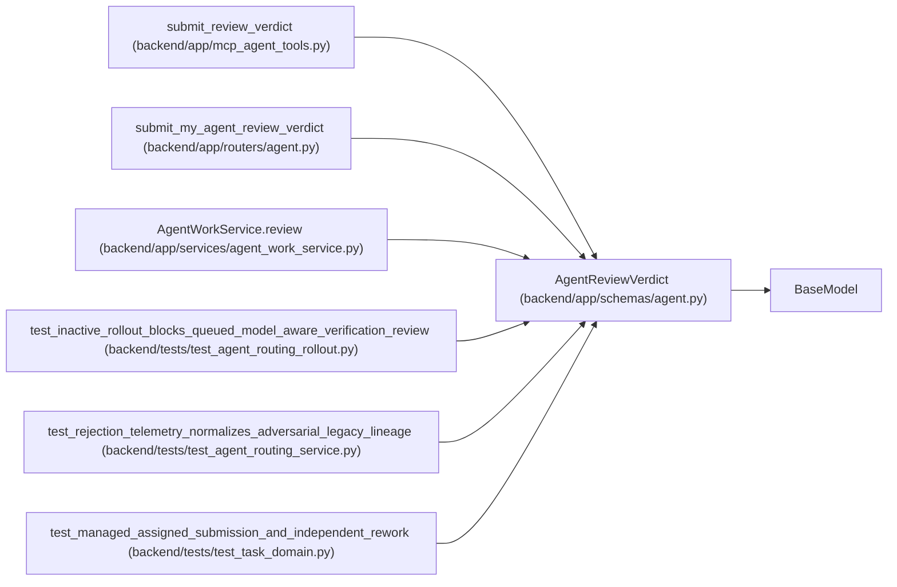

# AgentReviewVerdict

**Location:** `backend/app/schemas/agent.py:981`
**Kind:** Pydantic model
**Bases:** `BaseModel`
**Module:** [schemas_agent](../modules/schemas_agent.md)

## Description

Verifier-scoped pass or rejection command.

## Model Configuration

| Setting | Value | Source |
|---------|-------|--------|
| `extra` | `'forbid'` | model_config |

## Validators

| Method | Scope | Fields | Mode | Options |
|--------|-------|--------|------|---------|
| `validate_verification_packet` | model | — | after | — |

## Attributes

| Name | Type | Wire name | Required | Nullable | Default | Constraints | Examples | Description |
|------|------|-----------|----------|----------|---------|-------------|-------------|----------|
| `assignment_id` | `int` | `assignment_id` | Yes | No | — | — | — | — |
| `verdict` | `Literal['pass', 'reject']` | `verdict` | Yes | No | — | — | — | — |
| `expected_task_version` | `int` | `expected_task_version` | Yes | No | — | ge=1 | — | — |
| `evidence` | `dict[str, Any]` | `evidence` | Yes | No | — | max_length=100; min_length=1 | — | — |
| `reason` | `Optional[str]` | `reason` | No | Yes | `None` | max_length=4000 | — | — |
| `rework_actor_id` | `Optional[int]` | `rework_actor_id` | No | Yes | `None` | — | — | — |
| `rework_queue_rank` | `int` | `rework_queue_rank` | No | No | `0` | ge=0 | — | — |

## Methods

| Method | Signature | Decorators | Description |
|--------|-----------|------------|-------------|
| `validate_verification_packet` | `()` | `@model_validator(mode='after')` | Require bounded evidence and a reason for every rejection. |

## Relationships

<!-- Auto-generated relationship summary. Do not edit by hand. -->

### Summary

| Module | Methods | Attributes |
|---|---:|---|
| [schemas_agent](../modules/schemas_agent.md) | 1 | `assignment_id`, `evidence`, `expected_task_version`, `reason`, `rework_actor_id`, `rework_queue_rank`, `verdict` |

### Structure

| Kind | Entity | Module |
|---|---|---|
| Base | `BaseModel` | — |

### References

| Reference | Kind | Source | Call sites |
|---|---|---|---:|
| `submit_review_verdict` | call | [mcp_agent_tools](../modules/mcp_agent_tools.md) | 1 |
| `submit_my_agent_review_verdict` | type_reference | [routers_agent](../modules/routers_agent.md) | — |
| `AgentWorkService.review` | type_reference | [agent_work_service](../modules/agent_work_service.md) | — |
| `test_inactive_rollout_blocks_queued_model_aware_verification_review` | call | [test_agent_routing_rollout](../modules/test_agent_routing_rollout.md) | 1 |
| `test_rejection_telemetry_normalizes_adversarial_legacy_lineage` | call | [test_agent_routing_service](../modules/test_agent_routing_service.md) | 1 |
| `test_managed_assigned_submission_and_independent_rework` | call | [test_task_domain](../modules/test_task_domain.md) | 1 |
