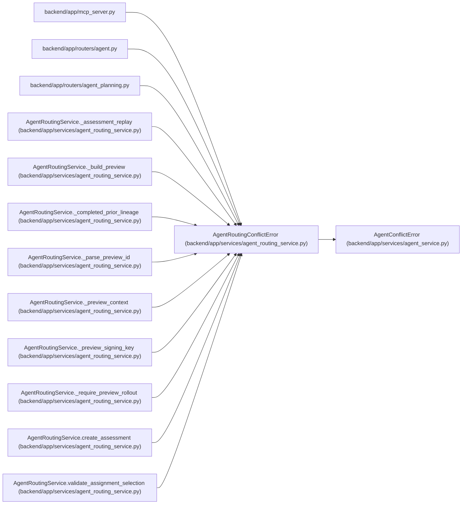

# AgentRoutingConflictError

**Location:** `backend/app/services/agent_routing_service.py:114`
**Kind:** Class
**Bases:** `AgentConflictError`
**Module:** [agent_routing_service](../modules/agent_routing_service.md)

## Description

Stable routing conflict shared by REST, MCP, and assignment commands.

## Attributes

*No annotated attributes found.*

## Methods

| Method | Signature | Decorators | Description |
|--------|-----------|------------|-------------|
| `__init__` | `(code: str, message: str, **context: Any)` | — | — |
| `detail` | `() -> dict[str, Any]` | — | Return the client-safe structured conflict envelope. |

## Relationships

<!-- Auto-generated relationship summary. Do not edit by hand. -->

### Summary

| Module | Methods | Attributes |
|---|---:|---|
| [agent_routing_service](../modules/agent_routing_service.md) | 2 | — |

### Structure

| Kind | Entity | Module |
|---|---|---|
| Base | `AgentConflictError` | [agent_service](../modules/agent_service.md) |

### References

| Reference | Kind | Source | Call sites |
|---|---|---|---:|
| `mcp_server` | import | [mcp_server](../modules/mcp_server.md) | — |
| `agent` | import | [routers_agent](../modules/routers_agent.md) | — |
| `agent_planning` | import | [routers_agent_planning](../modules/routers_agent_planning.md) | — |
| `AgentRoutingService._assessment_replay` | call | [agent_routing_service](../modules/agent_routing_service.md) | 2 |
| `AgentRoutingService._build_preview` | call | [agent_routing_service](../modules/agent_routing_service.md) | 4 |
| `AgentRoutingService._completed_prior_lineage` | call | [agent_routing_service](../modules/agent_routing_service.md) | 2 |
| `AgentRoutingService._parse_preview_id` | call | [agent_routing_service](../modules/agent_routing_service.md) | 3 |
| `AgentRoutingService._preview_context` | call | [agent_routing_service](../modules/agent_routing_service.md) | 1 |
| `AgentRoutingService._preview_signing_key` | call | [agent_routing_service](../modules/agent_routing_service.md) | 1 |
| `AgentRoutingService._require_preview_rollout` | call | [agent_routing_service](../modules/agent_routing_service.md) | 1 |
| `AgentRoutingService.create_assessment` | call | [agent_routing_service](../modules/agent_routing_service.md) | 3 |
| `AgentRoutingService.validate_assignment_selection` | call | [agent_routing_service](../modules/agent_routing_service.md) | 8 |

> References: showing 12 of 23 logical references; 11 omitted by the 12-row generated summary limit.
