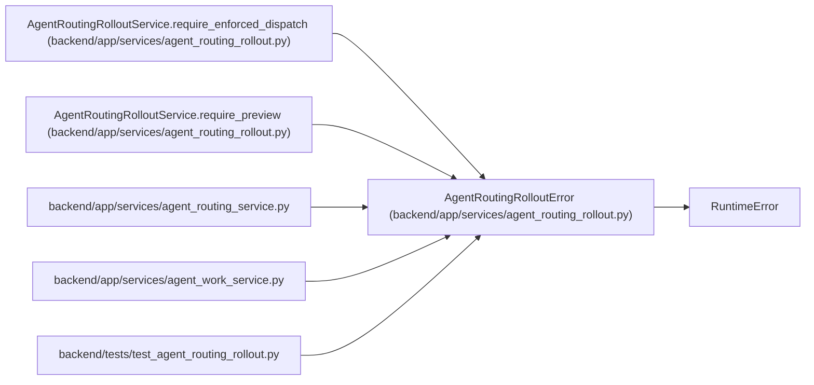

# AgentRoutingRolloutError

**Location:** `backend/app/services/agent_routing_rollout.py:225`
**Kind:** Class
**Bases:** `RuntimeError`
**Module:** [agent_routing_rollout](../modules/agent_routing_rollout.md)

## Description

Typed guard failure for preview or enforced dispatch.

## Attributes

*No annotated attributes found.*

## Methods

| Method | Signature | Decorators | Description |
|--------|-----------|------------|-------------|
| `__init__` | `(code: str, status: AgentRoutingRolloutStatus)` | — | — |

## Relationships

<!-- Auto-generated relationship summary. Do not edit by hand. -->

### Summary

| Module | Methods | Attributes |
|---|---:|---|
| [agent_routing_rollout](../modules/agent_routing_rollout.md) | 1 | — |

### Structure

| Kind | Entity | Module |
|---|---|---|
| Base | `RuntimeError` | — |

### References

| Reference | Kind | Source | Call sites |
|---|---|---|---:|
| `AgentRoutingRolloutService.require_enforced_dispatch` | call | [agent_routing_rollout](../modules/agent_routing_rollout.md) | 2 |
| `AgentRoutingRolloutService.require_preview` | call | [agent_routing_rollout](../modules/agent_routing_rollout.md) | 1 |
| `agent_routing_service` | import | [agent_routing_service](../modules/agent_routing_service.md) | — |
| `agent_work_service` | import | [agent_work_service](../modules/agent_work_service.md) | — |
| `test_agent_routing_rollout` | import | [test_agent_routing_rollout](../modules/test_agent_routing_rollout.md) | — |
