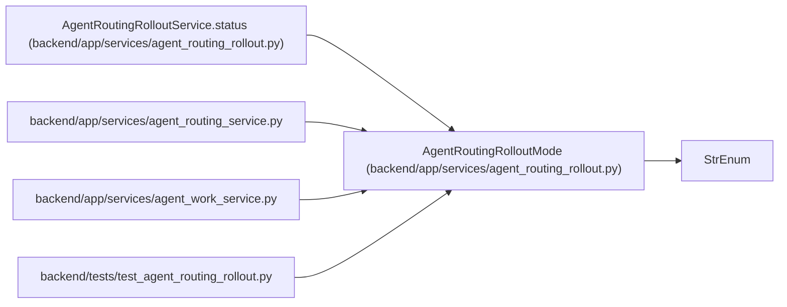

# AgentRoutingRolloutMode

**Location:** `backend/app/services/agent_routing_rollout.py:22`
**Kind:** Enum
**Bases:** `StrEnum`
**Module:** [agent_routing_rollout](../modules/agent_routing_rollout.md)

## Description

Deployment-owned model-aware routing rollout modes.

## Attributes

| Name | Declared value | Description |
|------|-------|-------------|
| `OFF` | `'off'` | — |
| `SHADOW` | `'shadow'` | — |
| `ENFORCED` | `'enforced'` | — |

## Methods

*No public methods. Inherits from base classes.*

## Relationships

<!-- Auto-generated relationship summary. Do not edit by hand. -->

### Summary

| Module | Methods | Attributes |
|---|---:|---|
| [agent_routing_rollout](../modules/agent_routing_rollout.md) | 0 | `ENFORCED`, `OFF`, `SHADOW` |

### Structure

| Kind | Entity | Module |
|---|---|---|
| Base | `StrEnum` | — |

### References

| Reference | Kind | Source | Call sites |
|---|---|---|---:|
| `AgentRoutingRolloutService.status` | call | [agent_routing_rollout](../modules/agent_routing_rollout.md) | 1 |
| `agent_routing_service` | import | [agent_routing_service](../modules/agent_routing_service.md) | — |
| `agent_work_service` | import | [agent_work_service](../modules/agent_work_service.md) | — |
| `test_agent_routing_rollout` | import | [test_agent_routing_rollout](../modules/test_agent_routing_rollout.md) | — |
